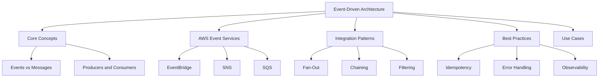
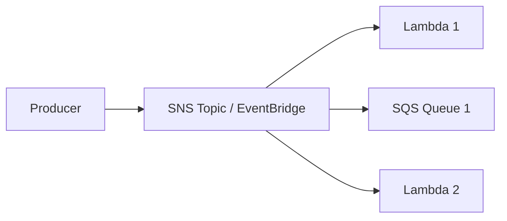

# Migration in progress
# Lesson 3: Event-Driven Architecture with AWS

Event-driven architecture (EDA) is a design pattern where components communicate through the production and consumption of events. An event is a significant change in state or occurrence. In AWS, EDA decouples services, enabling scalability, resilience, and agility. This lesson explores core EDA concepts, key AWS services for event routing and messaging, integration patterns, and best practices for building robust serverless systems.

## Core Concepts of Event-Driven Architecture

Understanding the fundamental building blocks of EDA is crucial before implementing it on AWS.

### Events vs Messages

- **Event**: A notification that something has happened. It is factual and past-tense. Example: "OrderPlaced". Events are often broadcast to multiple consumers.
- **Message**: A command or request to do something. It is imperative. Example: "ProcessOrder". Messages are typically point-to-point.
- In AWS, EventBridge handles events, while SQS/SNS handle messages, though the lines can blur in practice.

### Producers and Consumers

- **Producer (Publisher)**: The service that generates the event. It does not know who consumes the event. Examples: S3, DynamoDB, custom applications.
- **Consumer (Subscriber)**: The service that reacts to the event. It may be one or many services. Examples: Lambda, SQS, SNS topics.
- **Decoupling**: Producers and consumers are loosely coupled. Changes to one do not require changes to the other, as long as the event schema remains stable.

### Event Schema

- Defines the structure of the event data.
- Includes metadata like source, time, and detail-type.
- Consistency in schema is vital for reliable consumption.
- AWS EventBridge Schema Registry helps manage and version schemas.

> [!Important]
> **Events are immutable facts**: Once an event is emitted, it cannot be changed. Consumers interpret the event based on its schema. This immutability supports auditability and replayability.

## AWS Event Services

AWS provides three primary services for building event-driven architectures, each with distinct characteristics.

### Amazon EventBridge

- Serverless event bus service.
- Connects application data from your apps, SaaS, and AWS services.
- Default event bus receives events from AWS services.
- Custom event buses for your own applications.
- Partner event buses for third-party SaaS applications.
- Supports rule-based filtering and routing.
- Ideal for cross-service integration and SaaS integrations.

### Amazon SNS (Simple Notification Service)

- Pub/sub messaging service.
- Pushes messages to subscribers immediately.
- Subscribers can be Lambda, SQS, HTTP/S, email, SMS.
- Fan-out pattern: one message to many subscribers.
- No built-in message retention or buffering.
- Best for real-time notifications and broadcasting.

### Amazon SQS (Simple Queue Service)

- Message queuing service.
- Stores messages until consumed.
- Two types: Standard (best-effort ordering, high throughput) and FIFO (strict ordering, exactly-once processing).
- Decouples producers and consumers temporally.
- Buffers spikes in traffic.
- Best for asynchronous task processing and workload leveling.

| Feature | EventBridge | SNS | SQS |
|---|---|---|---|
| Pattern | Event Bus | Pub/Sub | Queue |
| Delivery | Push (via Rules) | Push | Pull |
| Retention | Up to 7 days (Archive) | None | Up to 14 days |
| Ordering | No guarantee | No guarantee | FIFO option available |
| Filtering | Rich content-based | Basic attribute | No native filtering |
| Primary Use | Integration, Routing | Broadcasting | Buffering, Task Queue |

> [!Tip]
> **Choose the right service for the job**: Use EventBridge for routing events between services and SaaS. Use SNS for fan-out notifications. Use SQS for decoupling workers and buffering load. Often, you will use them together, such as SNS fan-out to multiple SQS queues.

## Integration Patterns

Common patterns for connecting services in an event-driven architecture.

### Fan-Out Pattern

- One producer sends a message/event to multiple consumers.
- Implemented using SNS topic with multiple subscriptions.
- Or EventBridge rule with multiple targets.
- Ensures all interested parties receive the event.
- Example: An "OrderCreated" event triggers inventory update, email notification, and analytics logging simultaneously.

### Chaining Pattern

- Output of one service becomes input of another.
- Can lead to tight coupling if not careful.
- Prefer event-based chaining over direct invocation.
- Example: S3 upload triggers Lambda, which puts event on EventBridge, which triggers another Lambda.
- Use Step Functions for complex multi-step workflows instead of long chains.

### Filtering Pattern

- Consumers only receive events they care about.
- EventBridge supports sophisticated JSON path filtering.
- Reduces unnecessary invocations and costs.
- Example: Only process orders from "US" region or with value > $100.

### Dead-Letter Queue (DLQ) Pattern

- Captures failed messages/events for later analysis.
- Configure DLQ for SNS subscriptions to SQS.
- Configure DLQ for Lambda asynchronous invocations.
- Essential for reliability and debugging.

## Best Practices

Building robust EDA requires attention to reliability, security, and maintainability.

### Idempotency

- Consumers may receive duplicate events due to retries.
- Design consumers to handle duplicates gracefully.
- Use unique event IDs to track processed events.
- Store processed IDs in DynamoDB with TTL.
- Check ID before processing; skip if already processed.

> [!Important]
> **Always assume at-least-once delivery**: Most AWS event sources provide at-least-once delivery. Your code must be idempotent to prevent side effects from duplicate processing. This is critical for financial transactions o