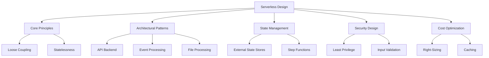
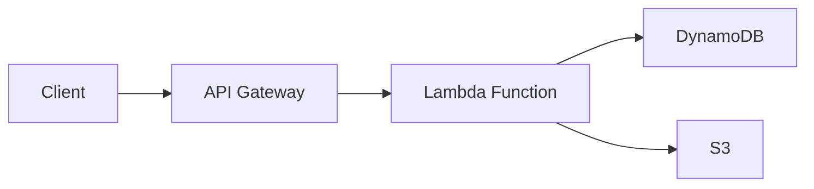
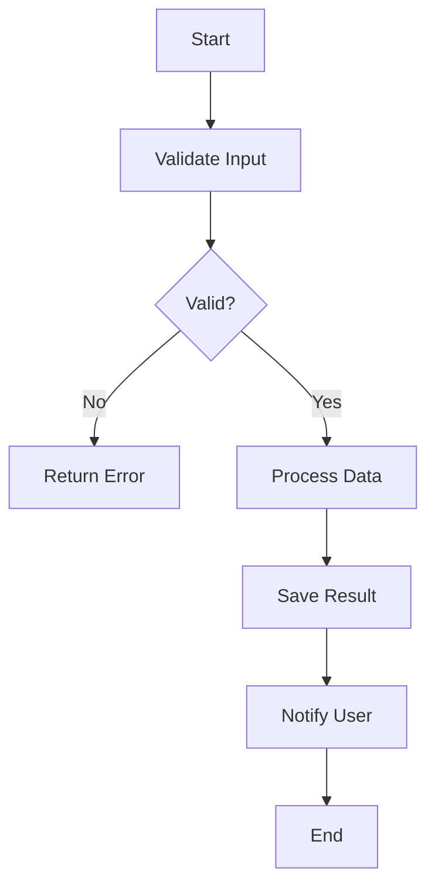

# Migration in progress
# Lesson 4: Designing Simple Serverless Applications

Designing serverless applications requires a shift from thinking about servers to thinking about events, state, and integration. This lesson covers the core design principles, common architectural patterns, state management strategies, and best practices for building robust, scalable, and cost-effective serverless applications on AWS. It emphasizes leveraging managed services to minimize operational overhead while maintaining reliability and security.

## Core Design Principles

Successful serverless applications adhere to specific design principles that maximize the benefits of the serverless model.

### Loose Coupling

- Services communicate through events or APIs without knowing internal details of each other.
- Changes to one service do not break others if interfaces remain stable.
- Use EventBridge, SNS, or SQS to decouple producers and consumers.
- Enables independent development, testing, and deployment.
- Improves resilience; failure in one component does not cascade immediately.

### Statelessness

- Lambda functions are stateless by design.
- Do not store data in local memory or /tmp between invocations.
- Store state in external services like DynamoDB, S3, or RDS.
- Allows horizontal scaling without session affinity issues.
- Simplifies deployment and rollback since no local state needs migration.

> [!Important]
> **Never rely on local state**: The execution environment may be reused, but this is not guaranteed. Always treat every invocation as fresh. Store all persistent data in external databases or storage services. This is fundamental to serverless scalability.

### Granularity

- Functions should do one thing well (Single Responsibility Principle).
- Small functions are easier to test, debug, and maintain.
- Avoid monolithic Lambda functions that handle multiple unrelated tasks.
- Balance granularity with performance; too many tiny functions can increase latency due to cold starts.
- Group related logic into cohesive units.

### Idempotency

- Design functions to produce the same result when called multiple times with the same input.
- Critical because event sources may deliver duplicates.
- Use unique identifiers to track processed events.
- Check state before performing actions (e.g., check if order already exists before creating).
- Prevents data corruption and duplicate side effects.

## Common Architectural Patterns

Several standard patterns emerge when building serverless applications. Understanding these helps in selecting the right structure for your use case.

### API Backend Pattern

- Expose business logic via HTTP APIs.
- API Gateway acts as the entry point.
- Lambda functions handle business logic.
- DynamoDB or RDS stores data.
- Suitable for web applications, mobile backends, and microservices.

- Use HTTP APIs for lower cost and latency if advanced features are not needed.
- Use REST APIs if you need request validation, caching, or usage plans.
- Implement authorization using Cognito, IAM, or custom Lambda authorizers.
- Return appropriate HTTP status codes and structured JSON responses.

### Event Processing Pattern

- React to events from AWS services or custom applications.
- S3 uploads trigger Lambda for image processing or data transformation.
- DynamoDB Streams trigger Lambda for change data capture.
- EventBridge routes events between services.
- Asynchronous and scalable.

- Use S3 event notifications for file-based workflows.
- Use DynamoDB Streams for real-time reaction to database changes.
- Use Kinesis or SQS for high-throughput stream processing.
- Implement error handling with DLQs for failed events.

### File Processing Pattern

- Upload files to S3.
- Trigger Lambda on object creation.
- Process file (convert format, extract metadata, validate).
- Store results in another S3 bucket or database.
- Notify users via SNS upon completion.

- Handle large files by splitting processing or using Step Functions.
- Use /tmp for temporary storage during processing.
- Implement retry logic for transient failures.
- Clean up temporary files to avoid disk space issues.

### Microservices Pattern

- Break application into small, independent services.
- Each service has its own database and API.
- Communicate via events or synchronous APIs.
- Deploy independently.
- Use API Gateway for external-facing APIs.
- Use EventBridge for internal service-to-service communication.

- Define clear boundaries between services.
- Avoid distributed transactions; use eventual consistency.
- Monitor each service independently.
- Use shared libraries or layers for common code.

## State Management Strategies

Since Lambda is stateless, managing state requires careful design.

### External Data Stores

- **DynamoDB**: Fast, scalable NoSQL database. Ideal for session data, user profiles, and high-throughput key-value lookups.
- **S3**: Object storage for large files, logs, and archival data.
- **RDS/Aurora**: Relational database for complex queries and transactions. Use Aurora Serverless for variable workloads.
- **ElastiCache**: In-memory cache for frequently accessed data. Reduces database load and latency.

### Passing State Between Steps

- **Input/Output**: Pass state as JSON payload between Lambda functions in a chain.
- **Limitations**: Payload size limits (6 MB for synchronous, 256 KB for asynchronous).
- **Best Practice**: Store large state in S3 or DynamoDB and pass references (keys/IDs) instead of full data.

### Orchestrating State with Step Functions

- AWS Step Functions manage state across multiple Lambda functions.
- Visual workflow definition using Amazon States Language.
- Handles retries, error catching, and parallel execution.
- Maintains execution history and state automatically.
- Ideal for complex multi-step processes that exceed Lambda timeout or require coordination.

> [!Tip]
> **Use Step Functions for long-running workflows**: If your process involves multiple steps, waits, or human