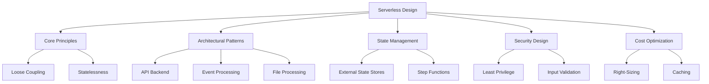
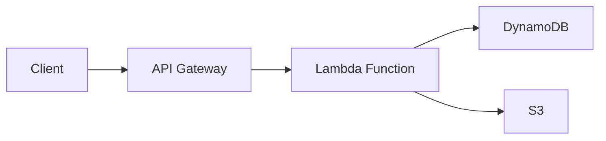
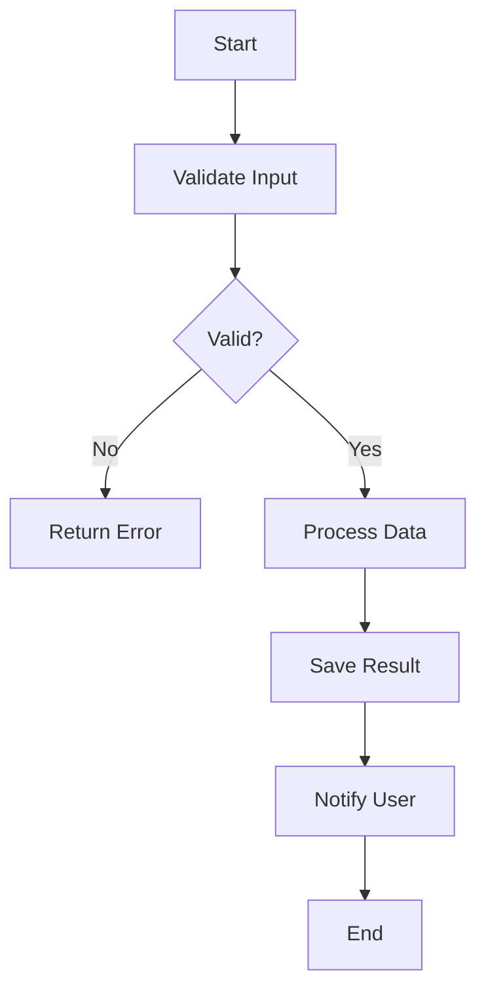

# Lesson 4: Designing Simple Serverless Applications

Designing serverless applications requires a shift from thinking about servers to thinking about events, state, and integration. This lesson covers the core design principles, common architectural patterns, state management strategies, and best practices for building robust, scalable, and cost-effective serverless applications on AWS. It emphasizes leveraging managed services to minimize operational overhead while maintaining reliability and security.

## Core Design Principles

Successful serverless applications adhere to specific design principles that maximize the benefits of the serverless model.

### Loose Coupling

- Services communicate through events or APIs without knowing internal details of each other.
- Changes to one service do not break others if interfaces remain stable.
- Use EventBridge, SNS, or SQS to decouple producers and consumers.
- Enables independent development, testing, and deployment.
- Improves resilience; failure in one component does not cascade immediately.

### Statelessness

- Lambda functions are stateless by design.
- Do not store data in local memory or /tmp between invocations.
- Store state in external services like DynamoDB, S3, or RDS.
- Allows horizontal scaling without session affinity issues.
- Simplifies deployment and rollback since no local state needs migration.

> [!Important]
> **Never rely on local state**: The execution environment may be reused, but this is not guaranteed. Always treat every invocation as fresh. Store all persistent data in external databases or storage services. This is fundamental to serverless scalability.

### Granularity

- Functions should do one thing well (Single Responsibility Principle).
- Small functions are easier to test, debug, and maintain.
- Avoid monolithic Lambda functions that handle multiple unrelated tasks.
- Balance granularity with performance; too many tiny functions can increase latency due to cold starts.
- Group related logic into cohesive units.

### Idempotency

- Design functions to produce the same result when called multiple times with the same input.
- Critical because event sources may deliver duplicates.
- Use unique identifiers to track processed events.
- Check state before performing actions (e.g., check if order already exists before creating).
- Prevents data corruption and duplicate side effects.

## Common Architectural Patterns

Several standard patterns emerge when building serverless applications. Understanding these helps in selecting the right structure for your use case.

### API Backend Pattern

- Expose business logic via HTTP APIs.
- API Gateway acts as the entry point.
- Lambda functions handle business logic.
- DynamoDB or RDS stores data.
- Suitable for web applications, mobile backends, and microservices.

- Use HTTP APIs for lower cost and latency if advanced features are not needed.
- Use REST APIs if you need request validation, caching, or usage plans.
- Implement authorization using Cognito, IAM, or custom Lambda authorizers.
- Return appropriate HTTP status codes and structured JSON responses.

### Event Processing Pattern

- React to events from AWS services or custom applications.
- S3 uploads trigger Lambda for image processing or data transformation.
- DynamoDB Streams trigger Lambda for change data capture.
- EventBridge routes events between services.
- Asynchronous and scalable.

- Use S3 event notifications for file-based workflows.
- Use DynamoDB Streams for real-time reaction to database changes.
- Use Kinesis or SQS for high-throughput stream processing.
- Implement error handling with DLQs for failed events.

### File Processing Pattern

- Upload files to S3.
- Trigger Lambda on object creation.
- Process file (convert format, extract metadata, validate).
- Store results in another S3 bucket or database.
- Notify users via SNS upon completion.

- Handle large files by splitting processing or using Step Functions.
- Use /tmp for temporary storage during processing.
- Implement retry logic for transient failures.
- Clean up temporary files to avoid disk space issues.

### Microservices Pattern

- Break application into small, independent services.
- Each service has its own database and API.
- Communicate via events or synchronous APIs.
- Deploy independently.
- Use API Gateway for external-facing APIs.
- Use EventBridge for internal service-to-service communication.

- Define clear boundaries between services.
- Avoid distributed transactions; use eventual consistency.
- Monitor each service independently.
- Use shared libraries or layers for common code.

## State Management Strategies

Since Lambda is stateless, managing state requires careful design.

### External Data Stores

- **DynamoDB**: Fast, scalable NoSQL database. Ideal for session data, user profiles, and high-throughput key-value lookups.
- **S3**: Object storage for large files, logs, and archival data.
- **RDS/Aurora**: Relational database for complex queries and transactions. Use Aurora Serverless for variable workloads.
- **ElastiCache**: In-memory cache for frequently accessed data. Reduces database load and latency.

### Passing State Between Steps

- **Input/Output**: Pass state as JSON payload between Lambda functions in a chain.
- **Limitations**: Payload size limits (6 MB for synchronous, 256 KB for asynchronous).
- **Best Practice**: Store large state in S3 or DynamoDB and pass references (keys/IDs) instead of full data.

### Orchestrating State with Step Functions

- AWS Step Functions manage state across multiple Lambda functions.
- Visual workflow definition using Amazon States Language.
- Handles retries, error catching, and parallel execution.
- Maintains execution history and state automatically.
- Ideal for complex multi-step processes that exceed Lambda timeout or require coordination.

> [!Tip]
> **Use Step Functions for long-running workflows**: If your process involves multiple steps, waits, or human approval, use Step Functions instead of chaining Lambda functions directly. It simplifies error handling, provides visibility, and avoids timeout limits.

## Security Design

Security in serverless shifts from network perimeter to identity and data.

### Least Privilege IAM Roles

- Each Lambda function should have its own execution role.
- Grant only permissions required for that specific function.
- Avoid wildcard actions or resources.
- Use conditions to restrict access further (e.g., by source IP or time).
- Regularly review and rotate permissions.

### Input Validation

- Validate all input at the entry point (API Gateway or function start).
- Reject malformed or unexpected data early.
- Use API Gateway request models and validators.
- Sanitize input to prevent injection attacks.
- Never trust client-side validation alone.

### Secrets Management

- Do not hardcode credentials or API keys in code.
- Use AWS Secrets Manager or Systems Manager Parameter Store.
- Retrieve secrets at initialization or cache them securely.
- Rotate secrets regularly.
- Encrypt environment variables using KMS if they contain sensitive data.

### Network Security

- Use VPC endpoints for private access to AWS services.
- Restrict Lambda VPC access to necessary subnets and security groups.
- Use API Gateway with WAF for public-facing APIs.
- Enable encryption at rest and in transit for all data stores.

## Cost Optimization

Serverless can be cost-effective, but poor design leads to unexpected bills.

### Right-Sizing Memory

- Higher memory increases CPU and reduces execution time.
- Find the sweet spot where cost per invocation is minimized.
- Use AWS Lambda Power Tuning tool to test different configurations.
- Monitor duration and adjust memory accordingly.

### Reducing Execution Time

- Optimize code performance.
- Initialize connections outside the handler.
- Use efficient libraries and algorithms.
- Minimize package size to reduce cold start time.
- Use Graviton2 processors for better price-performance.

### Caching

- Cache frequently accessed data in ElastiCache or DynamoDB DAX.
- Reduce repeated database queries.
- Cache API responses at API Gateway if data is static.
- Balance cache freshness with performance gains.

### Cleaning Up Resources

- Delete unused Lambda versions and aliases.
- Remove old log groups after retention period.
- Delete unused S3 buckets or lifecycle policies to archive data.
- Monitor unused provisioned concurrency.

### Monitoring Costs

- Use AWS Cost Explorer to track Lambda costs.
- Set billing alarms for unexpected spikes.
- Tag resources for cost allocation.
- Analyze cost per function to identify expensive outliers.

## Assessment Preparation

### Practice Questions

1. Explain why loose coupling is important in serverless architecture.
2. Why must Lambda functions be stateless? How do you manage state?
3. Describe the API Backend pattern and its components.
4. When should you use Step Functions instead of chaining Lambda functions?
5. What is idempotency and why is it critical in event-driven systems?
6. How do you secure secrets in a Lambda function?
7. Explain the concept of least privilege for Lambda execution roles.
8. How can you optimize Lambda costs through memory configuration?
9. What are the benefits of using API Gateway with Lambda?
10. Describe a scenario where you would use the File Processing pattern.

### Scenario Questions

**Scenario 1: User Registration API**
Build a serverless backend for user registration.

- Use API Gateway to expose POST /register endpoint.
- Lambda validates input (email format, password strength).
- Check if user exists in DynamoDB (idempotency).
- If new, hash password and save to DynamoDB.
- Send welcome email via SNS.
- Return success response to client.
- Use IAM role with least privilege for DynamoDB and SNS access.

**Scenario 2: Document Conversion Service**
Users upload PDFs, and the system converts them to text.

- User uploads PDF to S3 bucket.
- S3 event triggers Lambda function.
- Lambda downloads PDF to /tmp.
- Uses library to extract text.
- Saves text file to another S3 bucket.
- Updates DynamoDB record with status "Completed".
- Sends notification via SNS if conversion fails.
- Handle large files by checking size and rejecting if too big.

**Scenario 3: Order Processing Workflow**
An order goes through validation, payment, and inventory update.

- Use Step Functions to orchestrate the workflow.
- Step 1: Validate Order (Lambda).
- Step 2: Process Payment (Lambda calling external payment gateway).
- Step 3: Update Inventory (Lambda updating DynamoDB).
- Step 4: Send Confirmation (SNS).
- Step Functions handles retries if payment fails.
- DLQ captures failed executions for manual review.
- State passed between steps includes order ID and details.

**Scenario 4: Real-Time Dashboard Data**
A dashboard needs real-time updates from IoT devices.

- IoT devices send data to IoT Core.
- IoT Rule sends data to Kinesis Data Stream.
- Lambda processes batches from Kinesis.
- Aggregates data and writes to DynamoDB.
- Frontend polls API Gateway which reads from DynamoDB.
- Alternatively, use WebSocket API for push notifications.
- Ensure Lambda is sized for high throughput.

**Scenario 5: Legacy Data Migration**
Migrate data from an old SQL database to DynamoDB.

- Use Lambda to read batches from RDS.
- Transform data format.
- Write to DynamoDB.
- Use Step Functions to manage batch processing.
- Track progress in DynamoDB table.
- Handle errors by logging failed records to S3.
- Schedule Lambda via EventBridge Scheduler for nightly runs.

## Key Takeaways

- Design serverless applications around events, statelessness, and loose coupling.
- Use external services like DynamoDB and S3 for state management.
- Common patterns include API Backends, Event Processing, File Processing, and Microservices.
- Step Functions are ideal for orchestrating complex, multi-step workflows.
- Idempotency is essential to handle duplicate events safely.
- Secure applications using least privilege IAM roles, input validation, and Secrets Manager.
- Optimize costs by right-sizing memory, reducing execution time, and using caching.
- Validate input at the edge (API Gateway) to protect downstream services.
- Monitor costs and performance continuously to identify optimization opportunities.
- Choose the right pattern for the problem; do not force serverless where it does not fit.

> [!Important]
> **Start simple and evolve**: Begin with a single Lambda function and API Gateway. Add event-driven components as complexity grows. Use Step Functions when workflows become complex. Focus on business logic rather than infrastructure. Serverless design is iterative; refine your architecture based on actual usage patterns and feedback. Always prioritize security and idempotency from day one.
