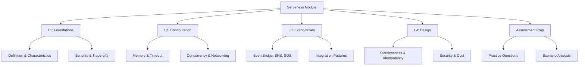

# Lesson 5: Summary and Assessment

This lesson consolidates the key concepts from the Serverless Computing on AWS module. It reviews the progression from foundational definitions to configuration details, architectural patterns, and design principles. The goal is to ensure you can select appropriate services, configure them correctly, and design robust applications that leverage the benefits of serverless while mitigating its trade-offs. This summary serves as a final review before the assessment.

## Module Recap

The module covered four distinct but interconnected areas of serverless computing on AWS.

### Lesson 1: Introduction to Serverless Computing

- Defined serverless as a model where the provider manages infrastructure.
- Identified five core characteristics: no server management, automatic scaling, pay-per-use, event-driven, and built-in availability.
- Compared EC2, Containers, and Lambda across control, operational overhead, and cost.
- Introduced the serverless spectrum from IaaS to fully managed services.
- Highlighted benefits like agility and cost efficiency for spiky workloads.
- Discussed trade-offs such as cold starts, runtime limits, and vendor lock-in.

### Lesson 2: Lambda Configuration

- Detailed core settings: memory (scales CPU), timeout (max 15 min), runtime, and handler.
- Explained execution environment: container lifecycle, /tmp storage, and initialization code.
- Covered concurrency controls: reserved (guaranteed capacity) and provisioned (eliminates cold starts).
- Discussed networking: default vs. VPC attachment and associated latency.
- Emphasized IAM best practices: least privilege execution roles.
- Reviewed triggers: synchronous, asynchronous, and poll-based.
- Introduced layers for code sharing and versioning/aliases for deployment safety.

### Lesson 3: Event-Driven Architecture with AWS

- Differentiated between events (facts) and messages (commands).
- Compared key services: EventBridge (routing/integration), SNS (fan-out), and SQS (buffering/queuing).
- Explained integration patterns: fan-out, chaining, filtering, and DLQs.
- Stressed the importance of idempotency due to at-least-once delivery.
- Covered observability with X-Ray and CloudWatch.
- Discussed schema management for reliable communication.

### Lesson 4: Designing Simple Serverless Applications

- Outlined core design principles: loose coupling, statelessness, granularity, and idempotency.
- Reviewed common patterns: API Backend, Event Processing, File Processing, and Microservices.
- Detailed state management strategies: external stores (DynamoDB, S3) and Step Functions for orchestration.
- Covered security design: input validation, secrets management, and least privilege.
- Provided cost optimization tips: right-sizing memory, caching, and monitoring usage.

## Key Concepts Matrix

A quick reference table connecting concepts across lessons.

| Concept | Lesson 1 | Lesson 2 | Lesson 3 | Lesson 4 |
|---|---|---|---|---|
| **Scaling** | Automatic, scale-to-zero | Concurrency limits, Provisioned Concurrency | Event sources scale independently | Design for horizontal scaling |
| **State** | Stateless by definition | /tmp is ephemeral | Events are immutable | Use DynamoDB/S3; Step Functions for workflow state |
| **Integration** | Managed services spectrum | Triggers and Permissions | EventBridge, SNS, SQS | Loose coupling via events |
| **Cost** | Pay-per-use, no idle cost | Memory/CPU trade-off | Cost per invocation/event | Right-sizing, caching, monitoring |
| **Reliability** | Built-in AZ replication | DLQs, Retries | DLQs, Idempotency | Error handling, Step Functions retries |

## Common Pitfalls and Mitigations

Understanding where things go wrong is as important as knowing how they work.

### Cold Start Latency

- **Pitfall**: Assuming Lambda is always fast. First invocation or after idle period is slow.
- **Mitigation**: Use Provisioned Concurrency for latency-sensitive paths. Keep packages small. Initialize connections outside handler. Use Graviton2.

### Timeout Errors

- **Pitfall**: Function runs longer than configured timeout (default 3s).
- **Mitigation**: Set timeout appropriately. Break long tasks into smaller steps using Step Functions. Use SQS for asynchronous processing.

### Throttling

- **Pitfall**: Exceeding account-level or reserved concurrency limits.
- **Mitigation**: Monitor concurrency metrics. Use Reserved Concurrency for critical functions. Request limit increases if needed. Handle 429 errors in clients.

### Duplicate Processing

- **Pitfall**: Processing the same event twice due to retries.
- **Mitigation**: Implement idempotency. Use unique IDs to track processed items. Check state before acting.

### Security Misconfiguration

- **Pitfall**: Overly permissive IAM roles or hardcoded secrets.
- **Mitigation**: Follow least privilege. Use Secrets Manager. Validate all input. Enable encryption.

### Cost Surprises

- **Pitfall**: Infinite loops, inefficient code, or over-provisioned memory.
- **Mitigation**: Set billing alarms. Optimize memory using Power Tuning. Clean up unused resources. Monitor DLQs for stuck loops.

## Assessment Preparation

### Practice Questions

1. Define serverless computing and list its five core characteristics.
2. How does memory allocation affect Lambda performance and cost?
3. What is the difference between Reserved Concurrency and Provisioned Concurrency?
4. When should you attach a Lambda function to a VPC?
5. Compare Amazon EventBridge, SNS, and SQS. When would you use each?
6. Why is idempotency critical in event-driven architectures?
7. Describe the Fan-Out pattern and how to implement it.
8. How do you manage state in a stateless Lambda function?
9. What are the benefits of using Step Functions for workflows?
10. List three strategies for optimizing Lambda costs.
11. Explain the principle of least privilege in the context of Lambda execution roles.
12. How do Layers help in Lambda development?

### Scenario Analysis

**Scenario 1: Real-Time Stock Price Alert**
Users subscribe to stock price alerts. When a price hits a threshold, send an SMS.

- **Design**:
  - Ingest stock data via Kinesis or EventBridge.
  - Lambda processes data and checks thresholds.
  - If threshold hit, publish to SNS topic.
  - SNS subscribes users via SMS.
- **Key Configurations**:
  - Lambda: Low memory, short timeout.
  - SNS: Fan-out to multiple subscribers.
  - Idempotency: Ensure duplicate price updates don't send duplicate SMS.

**Scenario 2: Video Transcoding Pipeline**
Users upload videos. System transcodes to multiple formats and stores in S3.

- **Design**:
  - Upload to S3 triggers Lambda.
  - Lambda starts Step Functions workflow.
  - Step Functions orchestrates multiple Lambda jobs for different formats.
  - Results stored in S3.
  - DynamoDB tracks job status.
- **Key Configurations**:
  - Step Functions: Manage long-running process.
  - Lambda: High memory for CPU-intensive transcoding.
  - S3: Event notifications.
  - DLQ: Handle failed transcoding jobs.

**Scenario 3: Internal Dashboard API**
Internal team needs an API to query sales data from DynamoDB.

- **Design**:
  - API Gateway (HTTP API) exposes endpoints.
  - Lambda queries DynamoDB.
  - Return JSON response.
- **Key Configurations**:
  - IAM: Restrict API access to internal network or specific IAM users.
  - Lambda: Right-size memory for query performance.
  - DynamoDB: Use GSI for efficient queries.
  - Caching: Enable API Gateway caching if data changes infrequently.

**Scenario 4: Legacy File Integration**
Legacy system drops CSV files in FTP. Need to load into Data Lake.

- **Design**:
  - Script moves files from FTP to S3.
  - S3 event triggers Lambda.
  - Lambda validates and transforms CSV.
  - Loads into DynamoDB or Redshift.
  - EventBridge notifies downstream systems.
- **Key Configurations**:
  - Lambda: Handle large files via streaming or split.
  - Error Handling: DLQ for bad files.
  - Security: Encrypt data at rest.

**Scenario 5: Multi-Step Order Fulfillment**
Order placed -> Charge Card -> Reserve Inventory -> Ship -> Notify.

- **Design**:
  - Step Functions orchestrates the entire flow.
  - Each step is a Lambda function.
  - Charge Card calls external payment gateway.
  - Reserve Inventory updates DynamoDB.
  - Ship triggers external shipping API.
  - Notify sends email via SNS.
- **Key Configurations**:
  - Step Functions: Handle retries and compensating transactions (e.g., refund if ship fails).
  - DLQ: Capture failed steps.
  - Idempotency: Critical for charging and inventory.

## Final Review Checklist

Before taking the assessment, ensure you can:

- [ ] Define serverless and explain its core characteristics.
- [ ] Compare serverless with EC2 and Containers.
- [ ] Configure Lambda memory, timeout, and concurrency.
- [ ] Explain the difference between cold and warm starts.
- [ ] Choose between EventBridge, SNS, and SQS for specific use cases.
- [ ] Design an idempotent Lambda function.
- [ ] Implement a Fan-Out pattern using SNS or EventBridge.
- [ ] Manage state using DynamoDB, S3, or Step Functions.
- [ ] Apply least privilege principles to IAM roles.
- [ ] Identify cost optimization opportunities in serverless designs.
- [ ] Troubleshoot common issues like throttling, timeouts, and duplicates.
- [ ] Select the right architectural pattern for a given business problem.

## Key Takeaways

- Serverless shifts responsibility from infrastructure to code and configuration.
- Lambda configuration balances performance (memory/CPU) with cost.
- Event-driven architecture decouples services using EventBridge, SNS, and SQS.
- Design principles like statelessness, idempotency, and loose coupling are non-negotiable.
- Step Functions are essential for complex, multi-step workflows.
- Security is implemented through IAM, input validation, and secrets management.
- Cost optimization requires continuous monitoring and right-sizing.
- Choose the right tool for the job: Lambda for compute, S3 for storage, DynamoDB for state, EventBridge for routing.
- Always design for failure: use DLQs, retries, and idempotency.
- Serverless is not a silver bullet; evaluate workload fit before adopting.

> [!Important]
> **Think in events and state**: The biggest mental shift in serverless is moving away from "how do I run this server?" to "what event triggers this action?" and "where is the state stored?". Master this mindset, and you will design robust, scalable, and cost-effective serverless applications. Focus on integration between managed services rather than writing custom infrastructure code.
