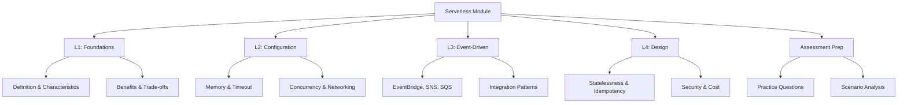

# Migration in progress
# Lesson 5: Summary and Assessment

This lesson consolidates the key concepts from the Serverless Computing on AWS module. It reviews the progression from foundational definitions to configuration details, architectural patterns, and design principles. The goal is to ensure you can select appropriate services, configure them correctly, and design robust applications that leverage the benefits of serverless while mitigating its trade-offs. This summary serves as a final review before the assessment.

## Module Recap

The module covered four distinct but interconnected areas of serverless computing on AWS.

### Lesson 1: Introduction to Serverless Computing

- Defined serverless as a model where the provider manages infrastructure.
- Identified five core characteristics: no server management, automatic scaling, pay-per-use, event-driven, and built-in availability.
- Compared EC2, Containers, and Lambda across control, operational overhead, and cost.
- Introduced the serverless spectrum from IaaS to fully managed services.
- Highlighted benefits like agility and cost efficiency for spiky workloads.
- Discussed trade-offs such as cold starts, runtime limits, and vendor lock-in.

### Lesson 2: Lambda Configuration

- Detailed core settings: memory (scales CPU), timeout (max 15 min), runtime, and handler.
- Explained execution environment: container lifecycle, /tmp storage, and initialization code.
- Covered concurrency controls: reserved (guaranteed capacity) and provisioned (eliminates cold starts).
- Discussed networking: default vs. VPC attachment and associated latency.
- Emphasized IAM best practices: least privilege execution roles.
- Reviewed triggers: synchronous, asynchronous, and poll-based.
- Introduced layers for code sharing and versioning/aliases for deployment safety.

### Lesson 3: Event-Driven Architecture with AWS

- Differentiated between events (facts) and messages (commands).
- Compared key services: EventBridge (routing/integration), SNS (fan-out), and SQS (buffering/queuing).
- Explained integration patterns: fan-out, chaining, filtering, and DLQs.
- Stressed the importance of idempotency due to at-least-once delivery.
- Covered observability with X-Ray and CloudWatch.
- Discussed schema management for reliable communication.

### Lesson 4: Designing Simple Serverless Applications

- Outlined core design principles: loose coupling, statelessness, granularity, and idempotency.
- Reviewed common patterns: API Backend, Event Processing, File Processing, and Microservices.
- Detailed state management strategies: external stores (DynamoDB, S3) and Step Functions for orchestration.
- Covered security design: input validation, secrets management, and least privilege.
- Provided cost optimization tips: right-sizing memory, caching, and monitoring usage.

## Key Concepts Matrix

A quick reference table connecting concepts across lessons.

| Concept | Lesson 1 | Lesson 2 | Lesson 3 | Lesson 4 |
|---|---|---|---|---|
| **Scaling** | Automatic, scale-to-zero | Concurrency limits, Provisioned Concurrency | Event sources scale independently | Design for horizontal scaling |
| **State** | Stateless by definition | /tmp is ephemeral | Events are immutable | Use DynamoDB/S3; Step Functions for workflow state |
| **Integration** | Managed services spectrum | Triggers and Permissions | EventBridge, SNS, SQS | Loose coupling via events |
| **Cost** | Pay-per-use, no idle cost | Memory/CPU trade-off | Cost per invocation/event | Right-sizing, caching, monitoring |
| **Reliability** | Built-in AZ replication | DLQs, Retries | DLQs, Idempotency | Error handling, Step Functions retries |

## Common Pitfalls and Mitigations

Understanding where things go wrong is as important as knowing how they work.

### Cold Start Latency

- **Pitfall**: Assuming Lambda is always fast. First invocation or after idle period is slow.
- **Mitigation**: Use Provisioned Concurrency for latency-sensitive paths. Keep packages small. Initialize connections outside handler. Use Graviton2.

### Timeout Errors

- **Pitfall**: Function runs longer than configured timeout (default 3s).
- **Mitigation**: Set timeout appropriately. Break long tasks into smaller steps using Step Functions. Use SQS for asynchronous processing.

### Throttling

- **Pitfall**: Exceeding account-level or reserved concurrency limits.
- **Mitigation**: Monitor concurrency metrics. Use Reserved Concurrency for critical functions. Request limit increases if needed. Handle 429 errors in clients.

### Duplicate Processing

- **Pitfall**: Processing the same event twice due to retries.
- **Mitigation**: Implement idempotency. Use unique IDs to track processed items. Check state before acting.

### Security Misconfiguration

- **Pitfall**: Overly permissive IAM roles or hardcoded secrets.
- **Mitigation**: Follow least privilege. Use Secrets Manager. Validate all input. Enable encryption.

### Cost Surprises

- **Pitfall**: Infinite loops, inefficient code, or over-provisioned memory.
- **Mitigation**: