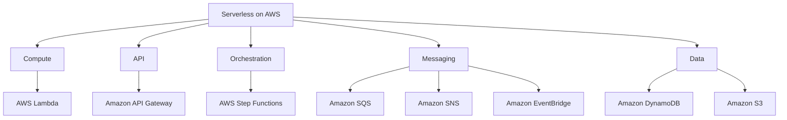
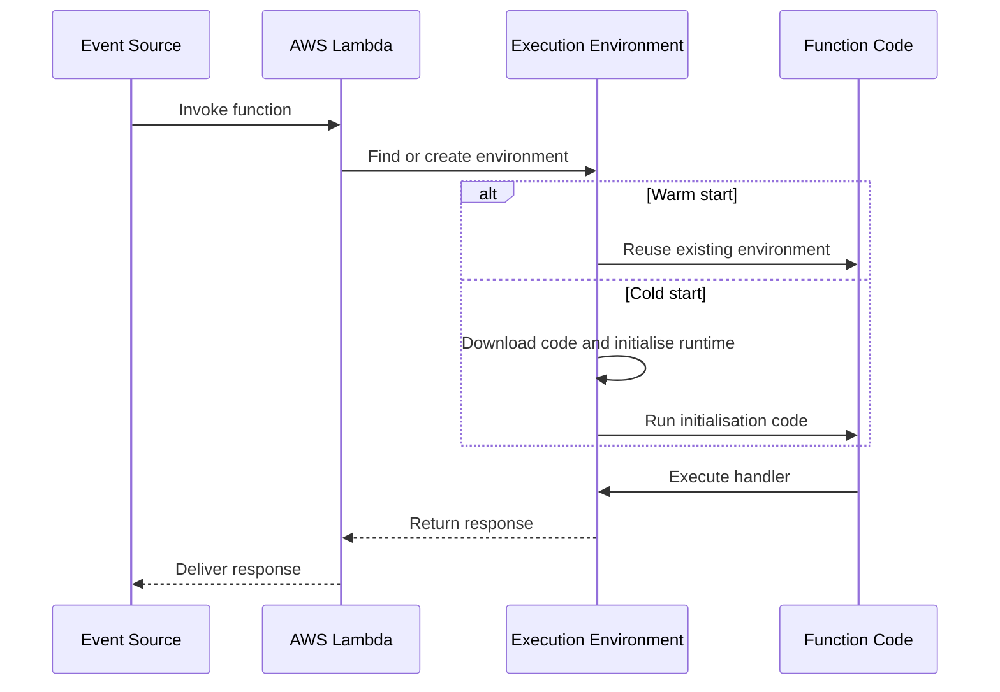
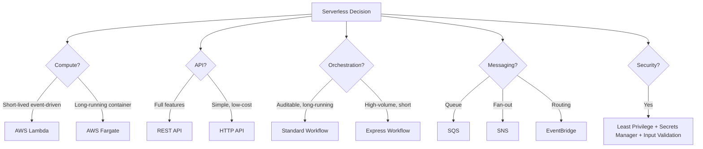

# W10: Serverless Computing on AWS

Serverless computing removes the burden of provisioning, scaling, and managing servers. You write code or configure services, and AWS handles capacity, patching, and availability. The core of serverless on AWS is AWS Lambda, but serverless is broader than functions: API Gateway, Step Functions, EventBridge, SQS, SNS, and DynamoDB all operate without servers to manage. The goal is to build applications that scale automatically, cost nothing at idle, and let teams focus on business logic instead of infrastructure.

## What Is Serverless

*Definition*: Serverless computing is a cloud execution model in which the cloud provider dynamically manages the allocation and provisioning of servers. You write code or configure services, and the provider handles scaling, patching, and availability. You pay only for the resources consumed while your code runs.

- Serverless does not mean there are no servers. It means you do not provision, manage, or scale them.
- The provider handles capacity, patching, fault tolerance, and availability.
- You pay only for what you use. There is no cost at idle.
- Serverless scales automatically from zero to millions of requests per second.
- Serverless shifts operational responsibility to the provider, but security, data modelling, and cost optimisation remain the customer's responsibility.

### The Serverless Spectrum

| Service | Abstraction Level | Management Overhead | Use Case |
|---|---|---|---|
| AWS Fargate | Container | Medium | Long-running containers without EC2 management |
| AWS App Runner | Container | Low | Web applications and APIs from containers |
| AWS Lambda | Function | None | Event-driven, short-lived compute |
| Amazon API Gateway | API | None | HTTP and WebSocket APIs |
| AWS Step Functions | Workflow | None | Multi-step orchestration |
| Amazon EventBridge | Event bus | None | Event routing and integration |
| Amazon SQS | Queue | None | Asynchronous message queuing |
| Amazon SNS | Pub/sub | None | Fan-out notifications |
| Amazon DynamoDB | Database | None | Key-value and document storage |
| Amazon S3 | Storage | None | Object storage |

> [!Important]
> **Serverless is a spectrum, not a single service**: Lambda is the most abstract compute service, but Fargate and App Runner also remove server management for container workloads. The right choice depends on runtime duration, dependency size, and how much control you need over the execution environment.

## AWS Lambda

*Definition*: AWS Lambda is a serverless compute service that runs your code in response to events and automatically manages the compute resources for you. You upload your code as a ZIP file or container image, and Lambda runs it on demand.

### How Lambda Works

Lambda runs your function code in an execution environment. When a function is invoked, Lambda either reuses an existing execution environment or creates a new one. After the invocation completes, the execution environment is frozen for reuse.

- **Cold start**: Lambda creates a new execution environment. This includes downloading the code, starting the runtime, and running initialisation code outside the handler. This adds latency.
- **Warm start**: Lambda reuses an existing execution environment. The initialisation code has already run, so the handler executes quickly.
- **Init phase**: Code outside the handler runs once per execution environment. Use it for database connections, SDK clients, and configuration loading.
- **Invoke phase**: The handler runs for each invocation.
- **Freeze/thaw**: After the invocation, the environment is frozen. It may be thawed for the next invocation.

### Lambda Limits

| Resource | Limit | Adjustable |
|---|---|---|
| Function timeout | 900 seconds (15 minutes) | No |
| Memory allocation | 128 MB to 10,240 MB | Yes |
| Ephemeral storage | 512 MB to 10,240 MB | Yes |
| Concurrent executions (default) | 1,000 | Yes |
| Deployment package (ZIP) | 250 MB unzipped | No |
| Container image size | 10 GB | No |
| Payload (synchronous) | 6 MB | No |
| Payload (asynchronous) | 1 MB | No |
| Environment variables | 4 KB total | No |
| Layers per function | 5 | No |

- Memory and CPU are linked. Increasing memory also increases CPU, which can reduce duration and total cost.
- The 15-minute timeout is a hard limit. For longer-running workloads, use Step Functions, Fargate, or Lambda Durable Functions.
- Container images allow up to 10 GB, which is useful for large dependencies like machine learning libraries.

> [!Important]
> **Memory tuning is cost tuning**: Lambda allocates CPU proportionally to memory. A function with 1,769 MB has one full vCPU. Increasing memory often reduces duration enough to lower total cost, even though the per-millisecond rate is higher. Use AWS Lambda Power Tuning to find the optimal memory setting.

### Lambda Pricing

| Component | Price | Free Tier |
|---|---|---|
| Requests | $0.20 per 1 million requests | 1 million requests per month |
| Duration (x86) | $0.0000166667 per GB-second | 400,000 GB-seconds per month |
| Duration (Arm/Graviton) | $0.0000133334 per GB-second | 400,000 GB-seconds per month |
| Provisioned Concurrency | Additional per GB-second and per hour | No |
| Ephemeral storage | $0.0000000309 per GB-second beyond 512 MB | 512 MB free |

- Arm-based Graviton2 functions are 20% cheaper than x86.
- Provisioned Concurrency has separate pricing and does not benefit from the free tier.
- You pay for duration in 1 ms increments.
- The free tier is perpetual, not limited to 12 months.

> [!Tip]
> **Use Graviton for Lambda workloads**: Arm-based Lambda functions are 20% cheaper and often faster than x86 for the same workload. Test your function on Graviton before committing to x86.

### Lambda Concurrency

*Definition*: Concurrency is the number of function instances processing requests at the same time. Lambda scales concurrency automatically in response to incoming requests.

| Concurrency Type | Description | Use Case |
|---|---|---|
| Unreserved | Shared pool for all functions in the account | Default, most functions |
| Reserved | Dedicated concurrency for a specific function | Protect critical functions from being throttled |
| Provisioned | Pre-initialised execution environments | Eliminate cold starts for latency-sensitive functions |

- Reserved concurrency caps a function's concurrency and reserves it from the shared pool. It also acts as a maximum concurrency limit.
- Provisioned concurrency pre-initialises execution environments so they are ready for immediate invocation. It eliminates cold start latency.
- Provisioned concurrency scales with Application Auto Scaling based on schedule or utilisation.
- Both reserved and provisioned concurrency count toward the account's regional concurrency limit.

> [!Important]
> **Provisioned concurrency is the answer to cold starts**: If your workload requires predictable, low-latency responses, provisioned concurrency pre-initialises execution environments so there is no cold start. It costs more, but it delivers sub-100ms response times. Use Application Auto Scaling to schedule provisioned concurrency for known traffic patterns.

### Lambda Deployment Options

| Option | Package Size | Best For | Cold Start Impact |
|---|---|---|---|
| Direct ZIP upload | 250 MB unzipped | Simple functions, small dependencies | Moderate |
| Lambda Layers | 250 MB unzipped across layers | Shared dependencies across functions | Moderate |
| Container images | 10 GB | Large dependencies, ML models, custom runtimes | Slightly higher |

- ZIP upload is the simplest option for small functions.
- Layers are ZIP archives containing libraries, custom runtimes, or configuration files. Up to 5 layers per function. Layers are extracted to `/opt` at runtime.
- Container images allow up to 10 GB. They cannot use Lambda Layers directly. Package all dependencies into the image.
- Lambda SnapStart reduces cold start latency for Java, Python, and .NET functions. It is also available for container image functions.

> [!Tip]
> **Use container images when dependencies exceed 250 MB**: Container images support up to 10 GB, which is useful for machine learning libraries, custom runtimes, and large binaries. Use layers for smaller shared dependencies.

### Lambda Event Sources

Lambda integrates with many AWS services as event sources.

| Event Source | Invocation Model | Use Case |
|---|---|---|
| API Gateway | Synchronous | HTTP APIs |
| Application Load Balancer | Synchronous | HTTP APIs |
| S3 | Asynchronous | Object uploads, deletions |
| SNS | Asynchronous | Pub/sub notifications |
| EventBridge | Asynchronous | Event routing |
| SQS | Poll-based | Queue processing |
| Kinesis | Poll-based | Stream processing |
| DynamoDB Streams | Poll-based | Change data capture |

- Synchronous invocations return the function response to the caller. Errors are returned directly.
- Asynchronous invocations queue the event and return immediately. Lambda retries failed invocations twice. Use a dead-letter queue for failed events.
- Poll-based invocations poll the source for records and invoke the function. Lambda manages the polling.

## Amazon API Gateway

*Definition*: Amazon API Gateway is a fully managed service that makes it easy to create, publish, maintain, monitor, and secure APIs at any scale. It acts as the front door for applications to access data, business logic, or functionality from backend services.

### REST API vs HTTP API

| Dimension | REST API | HTTP API |
|---|---|---|
| Features | Full feature set | Minimal feature set |
| Price | Higher | Lower (up to 71% cheaper) |
| API Keys | Yes | No |
| Per-Client Throttling | Yes | No |
| Request Validation | Yes | No |
| AWS WAF Integration | Yes | No |
| Private Endpoints | Yes | No |
| Auto-Deployment | No | Yes |
| Use Case | Advanced API management | Simple, low-cost APIs |

- REST APIs support more features, including API keys, per-client throttling, request validation, AWS WAF integration, and private API endpoints.
- HTTP APIs are designed with minimal features so they can be offered at a lower price. They are newer and built with the API Gateway version 2 API.
- Choose REST APIs if you need advanced features. Choose HTTP APIs if you need minimal features, lower price, and auto-deployment.

> [!Tip]
> **Start with HTTP APIs unless you need REST-specific features**: HTTP APIs are cheaper, faster to deploy, and sufficient for most modern API workloads. Use REST APIs only when you need API keys, request validation, AWS WAF, or private endpoints.

### API Gateway Features

- **Authorization**: IAM, Cognito User Pools, Lambda authorizers, and JWT authorizers.
- **Request validation**: Validate request body and query string parameters against a schema before the request reaches Lambda.
- **Throttling**: Rate limiting at the API, stage, or method level.
- **Caching**: Cache API responses to reduce backend load. Cache can be encrypted.
- **Monitoring**: CloudWatch metrics, access logging, and execution logging.
- **Custom domain names**: Use your own domain with ACM certificates.
- **WebSocket APIs**: Persistent connections for real-time applications.

## AWS Step Functions

*Definition*: AWS Step Functions is a serverless orchestration service that lets you build workflows by combining AWS Lambda functions and other AWS services into a state machine. You define the workflow in Amazon States Language, and Step Functions handles execution, retries, and error handling.

### Standard vs Express Workflows

| Dimension | Standard | Express |
|---|---|---|
| Max Duration | 1 year | 5 minutes |
| Execution Model | Exactly-once | At-least-once |
| Execution History | Full history in console | CloudWatch Logs |
| Pricing | Per state transition | Per request and duration |
| Use Case | Long-running, auditable workflows | High-volume, event-processing workloads |
| Idempotency | Built-in | Not guaranteed |

- Standard workflows are ideal for long-running, auditable workflows. They provide full execution history and visual debugging.
- Express workflows are ideal for high-volume, event-processing workloads such as IoT data ingestion, streaming data processing, and mobile application backends.
- Express workflows are significantly cheaper per execution but do not provide the same execution history.

> [!Important]
> **Choose Standard for auditability, Express for volume**: Standard workflows provide full execution history and exactly-once processing. Express workflows are cheaper and faster but do not guarantee exactly-once processing. Use Standard for workflows that need audit trails, and Express for high-volume event processing.

### Step Functions Patterns

- **Sequential**: Steps run one after another.
- **Parallel**: Multiple branches run simultaneously.
- **Choice**: Branch based on a condition.
- **Map**: Iterate over a collection and run a step for each item.
- **Wait**: Pause execution for a specified time.
- **Retry and Catch**: Handle errors with retries and fallback steps.
- **Callback**: Wait for an external system to return a task token.

## Messaging Services: SQS, SNS, and EventBridge

Serverless applications are built on decoupled services that communicate through events, queues, and topics. SQS, SNS, and EventBridge each serve a different communication pattern.

### Service Comparison

| Dimension | Amazon SQS | Amazon SNS | Amazon EventBridge |
|---|---|---|---|
| Communication Model | Pull-based (consumer polls) | Push-based (pub/sub) | Pushed-based (event-driven) |
| Persistence | Messages persist until consumed or expired | Messages not persisted; delivered in real-time | Events not persisted; processed in real-time |
| Delivery Guarantees | At-least-once | At-least-once (HTTP/S), exactly-once (Lambda, SQS) | Exactly-once processing |
| Ordering | FIFO queues ensure strict ordering | FIFO topics guarantee order | No ordering guarantees |
| Filtering | Consumer-based | Subscription filter policies | Complex event pattern matching |
| Subscribers | Pull-based consumers (EC2, Lambda) | HTTP/S, email, SMS, mobile push, Lambda, SQS | AWS services, Lambda, API destinations |
| Use Case | Queue, decoupling | Fan-out, notifications | Event routing, integration |

- SQS is a queue. Producers send messages. Consumers poll for messages. Messages persist until consumed or expired.
- SNS is pub/sub. Publishers send messages to topics. Subscribers receive messages in real-time. SNS does not persist messages.
- EventBridge is an event bus. Rules match events and route them to targets. EventBridge provides complex event pattern matching.

> [!Tip]
> **Use EventBridge for routing, SNS for fan-out, SQS for queuing**: EventBridge sits at the top as the event router. SNS handles fan-out to multiple consumers. SQS handles durable queuing and decoupling. They are complementary, not competing.

### Amazon SQS

- Standard queues provide high throughput with at-least-once delivery.
- FIFO queues provide exactly-once processing and strict ordering, with lower throughput.
- Visibility timeout prevents other consumers from processing a message while it is being handled.
- Dead-letter queues capture messages that fail processing after a configured number of attempts.
- Message retention is configurable from 1 minute to 14 days.

### Amazon SNS

- Topics are the communication channel. Publishers send messages to topics. Subscribers receive messages.
- SNS supports HTTP/S, email, SMS, mobile push, Lambda, and SQS subscribers.
- Message filtering allows subscribers to receive only messages that match a filter policy.
- FIFO topics provide strict ordering and deduplication.
- SNS is commonly used for fan-out: one message delivered to many subscribers.

### Amazon EventBridge

- Event buses receive events from AWS services, custom applications, and SaaS providers.
- Rules match events based on event patterns and route them to targets.
- Targets include Lambda, SQS, SNS, Step Functions, and API destinations.
- EventBridge Pipes connects sources like SQS and DynamoDB Streams to targets like Lambda.
- EventBridge Scheduler provides cron and rate-based scheduling.

## Serverless Security Best Practices

Serverless removes infrastructure management but shifts security responsibility to the application team. A Lambda function has two distinct policies: the resource-based policy controls who can invoke the function, and the execution role controls what the function can access. Both must be scoped to exactly what is needed.

### IAM and Access Control

- **Least privilege**: Be explicit about resources and actions in every policy. Avoid wildcards.
- **One execution role per function**: Do not share roles across functions.
- **IAM Access Analyzer**: Use it to identify and remove unused permissions.
- **Permission boundaries**: Cap the maximum permissions a developer can grant.
- **Service Control Policies**: Enforce compliance rules across accounts.

### Secrets Management

- **Never store secrets in environment variables**. They are visible in the console and logs.
- **Use AWS Secrets Manager or Parameter Store**. Retrieve secrets at runtime.
- **Use the AWS Parameters and Secrets Lambda Extension** for caching secrets.
- **Encrypt environment variables** with AWS KMS if they contain sensitive data.

### Input Validation

- **Validate at API Gateway**: Configure request validation to check the body and query string parameters against a schema before the request reaches Lambda.
- **Validate in the function**: Use AWS Lambda Powertools for strict type validation.
- **Never trust event payloads**. Validate at the top of the handler.

### Network and Runtime Security

- **Run Lambda in a VPC** when it needs to access private resources.
- **Use VPC endpoints** for private access to AWS services.
- **Enable AWS Shield** for DDoS protection.
- **Use AWS WAF** with API Gateway for web application firewall protection.
- **Enable GuardDuty and Inspector** for threat detection and vulnerability scanning.

### Security Checklist

| Control | Description |
|---|---|
| Least privilege IAM | No wildcards, explicit actions and resources |
| One execution role per function | No shared roles |
| Secrets Manager | No secrets in environment variables |
| Input validation | Validate at API Gateway and in the function |
| VPC for private access | Lambda in VPC for private resources |
| VPC endpoints | Private access to AWS services |
| AWS WAF | Protect APIs from web exploits |
| GuardDuty | Threat detection for Lambda |
| Inspector | Vulnerability scanning for Lambda |
| CloudTrail | Audit all API calls |

> [!Important]
> **Serverless shifts security responsibility to the application team**: AWS secures the infrastructure, but you secure the function code, IAM policies, secrets, input validation, and network configuration. A single wildcard in an IAM policy or a secret in an environment variable can expose your entire application. Treat every function as a production endpoint with its own security requirements.

## Serverless Observability

Observability is how you understand what your serverless application is doing. Lambda emits logs to CloudWatch Logs, metrics to CloudWatch Metrics, and traces to AWS X-Ray. For a complete picture, you need all three.

### Logging

- Lambda writes logs to CloudWatch Logs automatically.
- Use structured logging in JSON format for easier querying.
- Use AWS Lambda Powertools for structured logging, tracing, and metrics.
- Set log retention policies to control cost.

### Metrics

- Lambda emits standard metrics: Invocations, Duration, Errors, Throttles, ConcurrentExecutions.
- CloudWatch Alarms trigger on metric thresholds.
- Use custom metrics for business-specific monitoring.

### Tracing

- AWS X-Ray traces requests across Lambda, API Gateway, DynamoDB, and other services.
- Enable active tracing on Lambda functions.
- Use X-Ray service maps to visualise dependencies.
- Use AWS Distro for OpenTelemetry (ADOT) for open-standard tracing.

> [!Tip]
> **Use AWS Lambda Powertools for observability**: Powertools provides structured logging, tracing, and metrics with minimal boilerplate. It enforces best practices and reduces the code you need to write for observability.

## Serverless Best Practices

### Design Principles

- **Use services instead of custom code**. Lambda integrates with most AWS services. Use SQS for queues, EventBridge for routing, SNS for fan-out, and Step Functions for orchestration.
- **Implement idempotency**. Functions can be invoked more than once. Design for repeatable operations.
- **Minimise coupling**. Use asynchronous, event-driven patterns to decouple services.
- **Design for failure**. Use dead-letter queues, retries, and circuit breakers.
- **Keep functions small and focused**. One function, one responsibility.
- **Use environment variables for configuration**. Use Secrets Manager for secrets.

### Performance

- **Minimise cold starts**. Use provisioned concurrency for latency-sensitive functions. Keep deployment packages small. Use Graviton.
- **Reuse connections**. Initialise SDK clients and database connections outside the handler.
- **Tune memory**. Use AWS Lambda Power Tuning to find the optimal memory setting.
- **Use SnapStart** for Java, Python, and .NET functions.

### Cost Optimisation

- **Right-size memory**. More memory means more CPU. Find the optimal setting.
- **Use Graviton**. Arm-based functions are 20% cheaper.
- **Use provisioned concurrency only when needed**. It costs more than on-demand.
- **Set log retention policies**. Logs are stored indefinitely by default.
- **Use S3 lifecycle policies** for stored data.

> [!Important]
> **Serverless is not always cheaper**: For steady-state, high-volume workloads, containers or EC2 may be more cost-effective than Lambda. Serverless is most cost-effective for spiky, unpredictable, or low-volume workloads where you pay only for what you use.

## Assessment Preparation

### Practice Questions

1. Define serverless computing and explain how it differs from traditional compute.
2. Describe how AWS Lambda works, including cold starts and warm starts.
3. List the key Lambda limits: timeout, memory, concurrency, and package size.
4. Explain how Lambda pricing works for requests and duration.
5. Compare unreserved, reserved, and provisioned concurrency.
6. Compare ZIP packages, Lambda Layers, and container images for deployment.
7. Compare REST APIs and HTTP APIs in API Gateway.
8. Compare Standard and Express workflows in Step Functions.
9. Compare SQS, SNS, and EventBridge for messaging.
10. Describe the two policies that govern Lambda security: resource-based policy and execution role.
11. List five serverless security best practices.
12. Explain the three pillars of serverless observability.
13. Describe how to reduce Lambda cold starts.
14. Explain how to optimise Lambda cost with memory tuning and Graviton.
15. Describe the serverless application model (SAM) and its purpose.

### Scenario Questions

**Scenario 1: Event-Driven Image Processing**
A company needs to process images uploaded to S3 and generate thumbnails. What should they use?

- Use AWS Lambda triggered by S3 upload events.
- Lambda automatically scales to handle spikes in upload volume.
- Pay only for the compute time used, with no cost for idle time.
- Use container images if image processing libraries exceed 250 MB.
- Use SQS or EventBridge for asynchronous processing and error handling.

**Scenario 2: Serverless API**
A team needs to build a REST API backed by Lambda functions with request validation and API keys. What should they use?

- Use API Gateway REST API.
- REST APIs support API keys, per-client throttling, request validation, and AWS WAF integration.
- Use Lambda authorizers or Cognito User Pools for authorization.
- Use CloudWatch for monitoring and X-Ray for tracing.

**Scenario 3: Multi-Step Order Processing**
A company needs to orchestrate a multi-step order processing workflow with retries and error handling. What should they use?

- Use AWS Step Functions Standard workflow.
- Standard workflows provide full execution history and exactly-once processing.
- Use Retry and Catch for error handling.
- Use Lambda functions for individual steps.
- Use Parallel state for steps that can run concurrently.

**Scenario 4: High-Volume Event Processing**
A company needs to process millions of events per hour with minimal cost. What should they use?

- Use AWS Step Functions Express workflow.
- Express workflows are ideal for high-volume, event-processing workloads.
- Use EventBridge for event routing.
- Use SQS for durable queuing and decoupling.
- Use Lambda for event processing.

**Scenario 5: Latency-Sensitive API**
A team needs sub-100ms response times for a Lambda-backed API. Cold starts are causing latency spikes. What should they do?

- Enable provisioned concurrency on the Lambda function.
- Use Application Auto Scaling to schedule provisioned concurrency for known traffic patterns.
- Keep deployment packages small to reduce cold start duration.
- Use Graviton for better price-performance.
- Consider HTTP API for lower latency than REST API.

**Scenario 6: Secure Serverless Application**
A security team requires that no secrets are stored in environment variables and that all functions follow least privilege. What should they do?

- Store secrets in AWS Secrets Manager or Parameter Store.
- Use the AWS Parameters and Secrets Lambda Extension for caching.
- Create one execution role per function with explicit actions and resources.
- Use IAM Access Analyzer to remove unused permissions.
- Use permission boundaries to cap maximum permissions.
- Validate input at API Gateway and in the function.

## Key Takeaways

- Serverless computing removes server management. You pay only for what you use, with no cost at idle.
- AWS Lambda runs code in response to events. It scales automatically from zero to millions of requests.
- Lambda limits: 15-minute timeout, 128 MB to 10,240 MB memory, 1,000 default concurrent executions, 250 MB ZIP package, 10 GB container image.
- Lambda pricing is per request ($0.20 per million) and per GB-second ($0.0000166667 for x86, $0.0000133334 for Arm).
- Cold starts occur when Lambda creates a new execution environment. Provisioned concurrency eliminates cold starts.
- Memory and CPU are linked. Increasing memory can reduce duration and total cost.
- Lambda deployment options: ZIP packages, Lambda Layers, and container images.
- API Gateway offers REST APIs (full features) and HTTP APIs (lower cost, minimal features).
- Step Functions orchestrates workflows. Standard workflows are for auditable, long-running processes. Express workflows are for high-volume, short-duration processes.
- SQS is a queue. SNS is pub/sub. EventBridge is an event bus. They are complementary.
- Serverless security requires least privilege IAM, one execution role per function, Secrets Manager for secrets, and input validation.
- Observability requires logging, metrics, and tracing. Use CloudWatch, X-Ray, and AWS Lambda Powertools.
- Best practices: use services instead of custom code, implement idempotency, minimise coupling, design for failure, keep functions small, reuse connections, and tune memory.
- Serverless is not always cheaper. For steady-state, high-volume workloads, containers or EC2 may be more cost-effective.
- AWS SAM is an open-source framework for building serverless applications with infrastructure as code.

> [!Important]
> **Serverless is a design philosophy, not just a compute service**: The real value of serverless is not that you avoid servers. It is that you build applications from managed services that scale automatically, cost nothing at idle, and let you focus on business logic. Use Lambda for compute, API Gateway for APIs, Step Functions for orchestration, SQS and SNS and EventBridge for messaging, and DynamoDB for data. Design for failure, implement idempotency, and validate input at every layer. Serverless is most cost-effective for spiky, unpredictable, or low-volume workloads. For steady-state, high-volume workloads, evaluate containers or EC2. Choose the right tool for the workload, and serverless will deliver agility, scalability, and cost efficiency.
