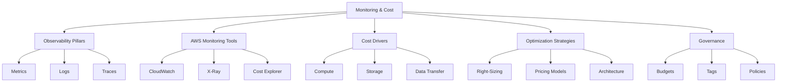

# Lesson: Cloud Monitoring and Cost Optimization

Cloud monitoring and cost optimization are interconnected disciplines essential for sustainable cloud operations. Monitoring provides the visibility needed to understand resource usage, performance, and security posture. Cost optimization uses that visibility to eliminate waste, right-size resources, and align spending with business value. This lesson covers AWS-native tools for observability, key metrics to track, pricing models, and practical strategies for reducing cloud spend without sacrificing reliability.

## Observability Pillars

Effective monitoring rests on three pillars that provide comprehensive system visibility.

### Metrics

-   Numerical data points collected over time.
-   Examples: CPU utilization, request count, error rate, latency.
-   Aggregated at regular intervals (e.g., 1-minute, 5-minute).
-   Used for alerting, dashboards, and auto-scaling triggers.
-   Custom metrics allow tracking business KPIs alongside infrastructure stats.

### Logs

-   Discrete records of events generated by applications and services.
-   Examples: API access logs, application debug logs, OS syslog.
-   Provide detailed context for specific requests or errors.
-   Can be voluminous; require filtering and retention policies.
-   Structured logging (JSON) enables easier querying and analysis.

### Traces

-   End-to-end records of a single request across distributed systems.
-   Show the path through multiple services, including latency per hop.
-   Essential for debugging microservices and serverless architectures.
-   Identify bottlenecks and dependencies.
-   Sampled to manage overhead and cost.

> [!Important]
> **Correlate pillars for root cause analysis**: Metrics tell you *something* is wrong. Logs tell you *what* happened. Traces tell you *where* it happened. Use all three together to diagnose issues efficiently. For example, a spike in error rate (metric) leads to searching logs for that timestamp, then tracing a specific failed request to find the failing downstream service.

## AWS Monitoring Tools

AWS provides a suite of native tools for full-stack observability.

### Amazon CloudWatch

-   Centralized monitoring service for metrics, logs, and alarms.
-   Collects default metrics for most AWS services automatically.
-   Unified Logs Insights for querying log data using SQL-like syntax.
-   Alarms trigger actions based on metric thresholds (e.g., SNS notification, Auto Scaling).
-   Dashboards visualize operational health in real-time.
-   Contributor Insights identifies top contributors to high-cardinality metrics.

### AWS X-Ray

-   Distributed tracing service for analyzing request flows.
-   Integrates with Lambda, API Gateway, EC2, ECS, and SDKs.
-   Service maps visualize architecture and dependencies.
-   Analytics highlight latency outliers and error rates.
-   Sampling rules control trace volume and cost.

### AWS Cost Explorer and Budgets

-   Cost Explorer visualizes spending trends and forecasts future costs.
-   Filter and group by service, region, tag, or account.
-   Rightsizing recommendations identify underutilized resources.
-   Budgets set custom cost and usage limits.
-   Alerts notify via email or SNS when thresholds are breached.
-   Anomaly detection flags unexpected spending spikes automatically.

| Tool | Primary Function | Key Feature | Best For |
| :--- | :--- | :--- | :--- |
| CloudWatch | Metrics & Logs | Alarms & Dashboards | Infrastructure health |
| X-Ray | Tracing | Service Maps | Distributed debugging |
| Cost Explorer | Spend Analysis | Forecasting | Financial visibility |
| Budgets | Cost Control | Alerts | Preventing overspend |
| Trusted Advisor | Best Practices | Checks | Security & Optimization |

## Understanding Cost Drivers

Identifying where money is spent is the first step to optimization.

### Compute Costs

-   Typically the largest expense category.
-   Driven by instance type, size, quantity, and runtime.
-   On-Demand pricing is most expensive but flexible.
-   Idle or underutilized instances are pure waste.
-   Serverless costs scale with invocations and duration.

### Storage Costs

-   S3 storage classes vary significantly in price.
-   Frequent access patterns increase Standard tier costs.
-   Infrequent access data should move to IA or Glacier.
-   EBS volumes incur charges even when unattached.
-   Snapshots and backups accumulate silently over time.

### Data Transfer Costs

-   Ingress (data in) is generally free.
-   Egress (data out) to internet is costly.
-   Cross-region and cross-AZ transfers incur fees.
-   NAT Gateways charge per GB processed plus hourly fee.
-   VPC Endpoints reduce transfer costs for AWS services.

### Database and Managed Services

-   RDS/Aurora costs include instance hours, storage, and I/O.
-   Provisioned capacity vs. serverless billing models.
-   DynamoDB charges for RCUs/WCUs or on-demand requests.
-   ElastiCache node hours add up quickly.
-   Licensing fees for commercial software (e.g., Oracle, Windows).

> [!Tip]
> **Tag everything for attribution**: Without tags, you cannot determine which team, project, or environment drives costs. Implement a mandatory tagging strategy early. Tags enable granular cost allocation reports and accountability. Common tags: Environment, Owner, Project, CostCenter.

## Optimization Strategies

Actionable techniques to reduce cloud spend while maintaining performance.

### Right-Sizing Resources

-   Match instance types to actual workload requirements.
-   Use CloudWatch metrics to identify low-utilization resources.
-   Downsize over-provisioned EC2 instances and RDS databases.
-   Terminate idle resources (unattached EBS, elastic IPs).
-   Re-evaluate sizing regularly as workloads evolve.

### Leveraging Pricing Models

-   Reserved Instances (RIs) save up to 72% for steady-state usage.
-   Savings Plans offer flexibility across instance families and regions.
-   Spot Instances save up to 90% for fault-tolerant batch workloads.
-   Convertible RIs allow exchanging attributes as needs change.
-   Analyze historical usage before committing to reservations.

### Architectural Optimization

-   Adopt serverless for variable or spiky workloads.
-   Use auto-scaling to match capacity to demand dynamically.
-   Implement caching (CloudFront, ElastiCache) to reduce backend load.
-   Compress data to reduce storage and transfer costs.
-   Choose appropriate S3 storage classes based on access patterns.
-   Use VPC Endpoints to avoid NAT Gateway data processing fees.

### Automation and Governance

-   Schedule non-production resources to shut down off-hours.
-   Implement lifecycle policies for S3 and EBS snapshots.
-   Use AWS Config to enforce compliance and prevent drift.
-   Automate rightsizing recommendations via Systems Manager.
-   Set up automated alerts for budget breaches and anomalies.

## Financial Governance

Establishing processes to maintain cost discipline over time.

### Tagging Strategy

-   Define standardized tag keys and values organization-wide.
-   Enforce tagging via IAM policies or SCPs.
-   Use tags for chargeback/showback reporting.
-   Review tag compliance regularly.
-   Automate tagging during resource provisioning (IaC).

### Budgeting and Alerting

-   Create budgets for each account, team, or project.
-   Set forecasted and actual spend thresholds.
-   Configure multi-tier alerts (e.g., 80%, 100%, 120%).
-   Integrate alerts with Slack, PagerDuty, or email.
-   Review budget variance monthly with stakeholders.

### Regular Reviews

-   Conduct monthly FinOps reviews with engineering and finance.
-   Analyze top cost drivers and optimization opportunities.
-   Track savings achieved versus targets.
-   Update forecasts based on business changes.
-   Share wins and learnings across teams.

> [!Important]
> **Optimization is continuous, not one-time**: Cloud environments are dynamic. New features launch, prices change, and workloads evolve. Establish a recurring cadence for review and optimization. Embed cost awareness into development culture. Make cost a non-functional requirement alongside performance and security.

## Assessment Preparation

### Practice Questions

1.  Name the three pillars of observability and explain their purpose.
2.  How does AWS X-Ray differ from CloudWatch?
3.  List three major cost drivers in AWS.
4.  Explain the difference between Reserved Instances and Savings Plans.
5.  When should you use Spot Instances?
6.  How can tagging improve cost management?
7.  Describe two architectural changes that reduce data transfer costs.
8.  What is the purpose of AWS Budgets?
9.  How do you identify underutilized EC2 instances?
10. Why is right-sizing an ongoing process rather than a one-time task?

### Scenario Questions

**Scenario 1: Unexpected Cost Spike**
A company's AWS bill increased 40% month-over-month. How do you investigate?

-   Use Cost Explorer to filter by service and identify the driver.
-   Check for new resources launched or configuration changes.
-   Review CloudWatch metrics for unusual usage patterns.
-   Verify if data transfer or NAT Gateway usage spiked.
-   Check if RI/Savings Plan coverage expired.
-   Set up anomaly detection to catch future spikes early.

**Scenario 2: Over-Provisioned Web Tier**
EC2 instances show average CPU utilization of 5%. How to optimize?

-   Right-size instances to smaller family or generation.
-   Implement Auto Scaling Group to scale based on demand.
-   Consider migrating to serverless (Lambda/API Gateway) if applicable.
-   Purchase Savings Plans if baseline usage is predictable.
-   Monitor performance after changes to ensure SLAs met.

**Scenario 3: High Data Transfer Costs**
Application transfers terabytes between AZs daily. How to reduce?

-   Keep traffic within same AZ where possible.
-   Use VPC Endpoints for AWS service access.
-   Cache frequently accessed data locally.
-   Compress payloads before transmission.
-   Evaluate if cross-AZ redundancy is truly necessary for this workload.

**Scenario 4: Development Environment Waste**
Dev/test environments run 24/7 but only used 9-5 weekdays. Solution?

-   Implement Instance Scheduler to stop/start automatically.
-   Use Spot Instances for non-critical dev workloads.
-   Terminate unused resources nightly via Lambda script.
-   Enforce tagging to identify orphaned dev resources.
-   Educate developers on cost-conscious provisioning.

**Scenario 5: Choosing Storage Class**
Data accessed once a month for compliance reporting. Current S3 Standard. Optimize?

-   Move to S3 Infrequent Access or Glacier Instant Retrieval.
-   Configure Lifecycle Policy to transition automatically.
-   Estimate retrieval costs vs. storage savings.
-   Test restore times meet compliance SLAs.
-   Monitor access patterns to validate class choice.

## Key Takeaways

-   Monitoring and cost optimization are inseparable; visibility enables savings.
-   Observability requires metrics, logs, and traces working together.
-   CloudWatch and X-Ray provide comprehensive AWS-native monitoring.
-   Compute, storage, and data transfer are primary cost drivers.
-   Right-sizing, pricing models, and architecture changes drive optimization.
-   Tagging is foundational for cost attribution and governance.
-   Budgets and alerts prevent financial surprises.
-   FinOps is a cultural practice requiring collaboration between tech and finance.
-   Optimization is iterative; establish regular review cadences.
-   Balance cost savings with performance, reliability, and security requirements.

> [!Important]
> **Make cost visible to engineers**: Developers make decisions that impact cost daily. Provide them with dashboards showing their team's spend. Include cost estimates in PR reviews. Celebrate optimization wins. When cost becomes everyone's responsibility, sustainable savings follow. Tools like AWS Cost Anomaly Detection and Budgets Alerts automate vigilance, but human judgment drives meaningful architectural improvements.
