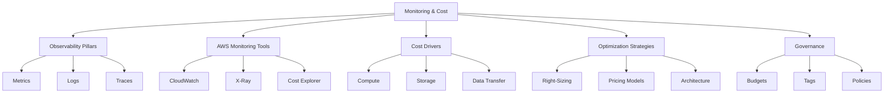

# Migration in progress
# Lesson: Cloud Monitoring and Cost Optimization

Cloud monitoring and cost optimization are interconnected disciplines essential for sustainable cloud operations. Monitoring provides the visibility needed to understand resource usage, performance, and security posture. Cost optimization uses that visibility to eliminate waste, right-size resources, and align spending with business value. This lesson covers AWS-native tools for observability, key metrics to track, pricing models, and practical strategies for reducing cloud spend without sacrificing reliability.

## Observability Pillars

Effective monitoring rests on three pillars that provide comprehensive system visibility.

### Metrics

-   Numerical data points collected over time.
-   Examples: CPU utilization, request count, error rate, latency.
-   Aggregated at regular intervals (e.g., 1-minute, 5-minute).
-   Used for alerting, dashboards, and auto-scaling triggers.
-   Custom metrics allow tracking business KPIs alongside infrastructure stats.

### Logs

-   Discrete records of events generated by applications and services.
-   Examples: API access logs, application debug logs, OS syslog.
-   Provide detailed context for specific requests or errors.
-   Can be voluminous; require filtering and retention policies.
-   Structured logging (JSON) enables easier querying and analysis.

### Traces

-   End-to-end records of a single request across distributed systems.
-   Show the path through multiple services, including latency per hop.
-   Essential for debugging microservices and serverless architectures.
-   Identify bottlenecks and dependencies.
-   Sampled to manage overhead and cost.

> [!Important]
> **Correlate pillars for root cause analysis**: Metrics tell you *something* is wrong. Logs tell you *what* happened. Traces tell you *where* it happened. Use all three together to diagnose issues efficiently. For example, a spike in error rate (metric) leads to searching logs for that timestamp, then tracing a specific failed request to find the failing downstream service.

## AWS Monitoring Tools

AWS provides a suite of native tools for full-stack observability.

### Amazon CloudWatch

-   Centralized monitoring service for metrics, logs, and alarms.
-   Collects default metrics for most AWS services automatically.
-   Unified Logs Insights for querying log data using SQL-like syntax.
-   Alarms trigger actions based on metric thresholds (e.g., SNS notification, Auto Scaling).
-   Dashboards visualize operational health in real-time.
-   Contributor Insights identifies top contributors to high-cardinality metrics.

### AWS X-Ray

-   Distributed tracing service for analyzing request flows.
-   Integrates with Lambda, API Gateway, EC2, ECS, and SDKs.
-   Service maps visualize architecture and dependencies.
-   Analytics highlight latency outliers and error rates.
-   Sampling rules control trace volume and cost.

### AWS Cost Explorer and Budgets

-   Cost Explorer visualizes spending trends and forecasts future costs.
-   Filter and group by service, region, tag, or account.
-   Rightsizing recommendations identify underutilized resources.
-   Budgets set custom cost and usage limits.
-   Alerts notify via email or SNS when thresholds are breached.
-   Anomaly detection flags unexpected spending spikes automatically.

| Tool | Primary Function | Key Feature | Best For |
| :--- | :--- | :--- | :--- |
| CloudWatch | Metrics & Logs | Alarms & Dashboards | Infrastructure health |
| X-Ray | Tracing | Service Maps | Distributed debugging |
| Cost Explorer | Spend Analysis | Forecasting | Financial visibility |
| Budgets | Cost Control | Alerts | Preventing overspend |
| Trusted Advisor | Best Practices | Checks | Security & Optimization |

## Understanding Cost Drivers

Identifying where money is spent is the first step to optimization.

### Compute Costs

-   Typically the largest expense category.
-   Driven by instance type, size, quantity, and runtime.
-   On-Demand pricing is most expensive but flexible.
-   Idle or underutilized instances are pure waste.
-   Serverless costs scale with invocations and duration.

### Storage Costs

-   S3 storage classes vary significantly in price.
-   Frequent access patterns increase Standard tier costs.
-   Infrequent access data should move to IA or Glacier.
-   EBS volumes incur charges even when unattached.
-   Snapshots and backups accumulate silently over time.

### Data Transfer Costs

-   Ingress (data in) is generally free.
-   Egress (data out) to internet is costly.
-   Cross-region and cross-AZ transfers incur fees.
-   NAT Gateways charge per GB processed plus hourly fee.
-   VPC Endpoints reduce transfer costs for AWS services.

### Database and Managed Services

-   RDS/Aurora costs include instance hours, storage, and I/O.
-   Provisioned capacity vs. serverless billing models.
-   DynamoDB charges for RCUs/WCUs or on-demand requests.
-   ElastiCache node hours add up quickly.
-   Licensing fees for commercial software (e.g., Oracle, Windows).

> [!Tip]
> **Tag everything for attribution**: Without tags, you cannot determine which team, project, or environment drives costs. Implement a mandatory tagging strategy early. Tags enable granular cost allocation reports and accountability. Common tags: Environment, Owner, Project, CostCenter.

## Optimization Strategies

Actionable techniques to reduce cloud spend while maintaining performance.

### Right-Sizing Resources

-   Match instance types to actual workload requirements.
-   Use CloudWatch metrics to identify low-utilization resources.
-   Downsize over-provisioned EC2 instances and RDS databases.
-   Terminate idle resources (unattached EBS, elastic IPs).
-   Re-evaluat