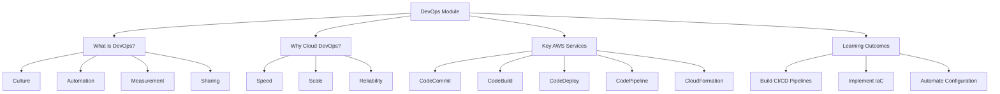

# Migration in progress
# Lesson 0: Module Introduction

This lesson introduces the DevOps in the Cloud module. It defines DevOps, explains its cultural and technical pillars, and outlines how AWS services enable automation, continuous delivery, and infrastructure management. The goal is to shift from manual, siloed operations to automated, collaborative workflows that accelerate software delivery while maintaining stability and security.

## What Is DevOps?

DevOps is not a job title or a specific tool. It is a cultural and professional movement that emphasizes collaboration between development (Dev) and operations (Ops) teams.

-   **Culture**: Breaking down silos, shared responsibility, and blameless post-mortems.
-   **Automation**: Removing manual toil from building, testing, and deploying.
-   **Measurement**: Using metrics to drive improvement (e.g., lead time, failure rate).
-   **Sharing**: Transparent communication and knowledge sharing across teams.

> [!Important]
> **DevOps is about flow**: The primary goal is to reduce the time from code commit to production deployment while maintaining high quality and stability. It is not just about moving faster; it is about moving safely and sustainably.

## Why Cloud DevOps?

The cloud provides the ideal platform for DevOps practices due to its programmability and scalability.

### Speed and Agility

-   Provision resources in minutes via API calls.
-   Automate environment creation and destruction.
-   Rapid experimentation and feedback loops.
-   Self-service capabilities for developers.

### Scale and Consistency

-   Treat infrastructure as code to ensure identical environments.
-   Auto-scaling handles variable loads without manual intervention.
-   Global reach allows deployment to multiple regions easily.
-   Managed services reduce operational overhead.

### Reliability and Security

-   Automated testing and deployment reduce human error.
-   Immutable infrastructure prevents configuration drift.
-   Built-in security controls and compliance certifications.
-   Comprehensive logging and monitoring for quick diagnosis.

| Traditional Ops | Cloud DevOps |
|---|---|
| Manual server provisioning | Infrastructure as Code |
| Siloed teams | Cross-functional collaboration |
| Large, infrequent releases | Small, frequent releases |
| Reactive troubleshooting | Proactive monitoring |
| Static infrastructure | Dynamic, elastic resources |

## Key AWS DevOps Services

AWS offers a suite of managed services that form a complete DevOps toolchain.

### Source Control and Build

-   **AWS CodeCommit**: Secure, scalable, managed Git repositories.
-   **AWS CodeBuild**: Fully managed build service that compiles code, runs tests, and produces artifacts. Scales automatically.

### Deployment and Orchestration

-   **AWS CodeDeploy**: Automates deployments to EC2, Lambda, ECS, and on-premises servers. Supports blue/green and canary strategies.
-   **AWS CodePipeline**: Continuous delivery service that models, visualizes, and automates the steps required to release software. Connects source, build, and deploy stages.

### Infrastructure as Code (IaC)

-   **AWS CloudFormation**: Native IaC service using JSON/YAML