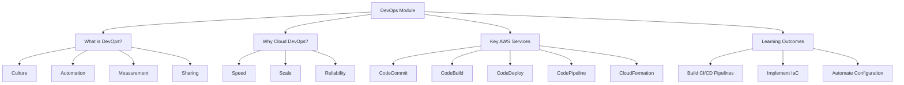

# Lesson 0: Module Introduction

This lesson introduces the DevOps in the Cloud module. It defines DevOps, explains its cultural and technical pillars, and outlines how AWS services enable automation, continuous delivery, and infrastructure management. The goal is to shift from manual, siloed operations to automated, collaborative workflows that accelerate software delivery while maintaining stability and security.

## What Is DevOps?

DevOps is not a job title or a specific tool. It is a cultural and professional movement that emphasizes collaboration between development (Dev) and operations (Ops) teams.

-   **Culture**: Breaking down silos, shared responsibility, and blameless post-mortems.
-   **Automation**: Removing manual toil from building, testing, and deploying.
-   **Measurement**: Using metrics to drive improvement (e.g., lead time, failure rate).
-   **Sharing**: Transparent communication and knowledge sharing across teams.

> [!Important]
> **DevOps is about flow**: The primary goal is to reduce the time from code commit to production deployment while maintaining high quality and stability. It is not just about moving faster; it is about moving safely and sustainably.

## Why Cloud DevOps?

The cloud provides the ideal platform for DevOps practices due to its programmability and scalability.

### Speed and Agility

-   Provision resources in minutes via API calls.
-   Automate environment creation and destruction.
-   Rapid experimentation and feedback loops.
-   Self-service capabilities for developers.

### Scale and Consistency

-   Treat infrastructure as code to ensure identical environments.
-   Auto-scaling handles variable loads without manual intervention.
-   Global reach allows deployment to multiple regions easily.
-   Managed services reduce operational overhead.

### Reliability and Security

-   Automated testing and deployment reduce human error.
-   Immutable infrastructure prevents configuration drift.
-   Built-in security controls and compliance certifications.
-   Comprehensive logging and monitoring for quick diagnosis.

| Traditional Ops | Cloud DevOps |
|---|---|
| Manual server provisioning | Infrastructure as Code |
| Siloed teams | Cross-functional collaboration |
| Large, infrequent releases | Small, frequent releases |
| Reactive troubleshooting | Proactive monitoring |
| Static infrastructure | Dynamic, elastic resources |

## Key AWS DevOps Services

AWS offers a suite of managed services that form a complete DevOps toolchain.

### Source Control and Build

-   **AWS CodeCommit**: Secure, scalable, managed Git repositories.
-   **AWS CodeBuild**: Fully managed build service that compiles code, runs tests, and produces artifacts. Scales automatically.

### Deployment and Orchestration

-   **AWS CodeDeploy**: Automates deployments to EC2, Lambda, ECS, and on-premises servers. Supports blue/green and canary strategies.
-   **AWS CodePipeline**: Continuous delivery service that models, visualizes, and automates the steps required to release software. Connects source, build, and deploy stages.

### Infrastructure as Code (IaC)

-   **AWS CloudFormation**: Native IaC service using JSON/YAML templates. Manages resources as stacks.
-   **AWS CDK (Cloud Development Kit)**: Define infrastructure using familiar programming languages (Python, Java, TypeScript).

### Configuration and Management

-   **AWS Systems Manager**: Unified interface for managing resources. Includes Patch Manager, Run Command, and Parameter Store.
-   **AWS Config**: Tracks resource configuration changes and evaluates compliance against rules.

## Learning Outcomes

By the end of this module, you will be able to:

-   Explain the core principles of DevOps and their business value.
-   Design and implement a CI/CD pipeline using AWS Code* services.
-   Provision and manage infrastructure using CloudFormation or CDK.
-   Automate application deployments with zero downtime strategies.
-   Manage configuration and secrets securely using Systems Manager.
-   Integrate security checks into the delivery pipeline (DevSecOps).
-   Monitor pipeline performance and application health.

## Assessment Preparation

### Practice Questions

1.  Define DevOps and explain why it is more than just tools.
2.  List the four key pillars of the DevOps culture.
3.  How does the cloud enable DevOps practices compared to on-premises?
4.  What is the role of AWS CodePipeline in a DevOps workflow?
5.  Differentiate between CodeBuild and CodeDeploy.
6.  Why is Infrastructure as Code critical for DevOps?
7.  What are the benefits of using managed Git services like CodeCommit?
8.  How does Systems Manager help with configuration management?
9.  Explain the concept of "shifting left" in security.
10. What metrics would you track to measure DevOps success?

### Scenario Questions

**Scenario 1: Manual Release Process**
A team spends two days manually deploying updates, leading to frequent errors.

-   Implement CodePipeline to automate the workflow.
-   Use CodeCommit for version control.
-   Use CodeBuild for automated testing and packaging.
-   Use CodeDeploy for consistent, repeatable deployments.
-   Reduce deployment time from days to minutes.

**Scenario 2: Environment Drift**
Staging and production environments behave differently due to manual changes.

-   Adopt CloudFormation or CDK for all infrastructure.
-   Store templates in version control.
-   Use same templates for all environments with different parameters.
-   Enable AWS Config to detect and alert on drift.
-   Eliminate manual console changes.

**Scenario 3: Security Compliance**
Security team requires all deployments to pass vulnerability scans.

-   Integrate SAST/DAST tools in CodeBuild phase.
-   Fail the pipeline if critical vulnerabilities are found.
-   Use Amazon Inspector for runtime assessment.
-   Store secrets in Secrets Manager, not in code.
-   Audit pipeline actions with CloudTrail.

## Key Takeaways

-   DevOps is a cultural shift toward collaboration, automation, and shared responsibility.
-   Cloud platforms provide the agility and programmability needed for effective DevOps.
-   AWS Code* services offer a fully managed, integrated toolchain for CI/CD.
-   Infrastructure as Code ensures consistency, repeatability, and version control.
-   Automation reduces human error and accelerates feedback loops.
-   Security must be integrated early in the pipeline (DevSecOps).
-   Measurement and monitoring drive continuous improvement.
-   Start small, automate incrementally, and focus on cultural change alongside tooling.

> [!Important]
> **Tools enable, culture sustains**: Buying AWS DevOps tools does not make you a DevOps organization. You must foster trust, break down silos, and encourage experimentation. Tools automate the process, but people define the value. Focus on reducing friction for developers while maintaining operational stability.
