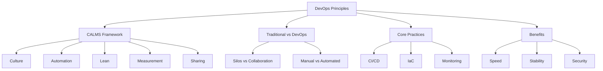

# Lesson 1: Introduction to DevOps Principles

DevOps is a cultural and professional movement that emphasizes collaboration between development (Dev) and operations (Ops) teams. It aims to shorten the systems development life cycle and provide continuous delivery with high software quality. This lesson defines the core principles of DevOps, explains the CALMS framework, and contrasts traditional siloed approaches with modern collaborative workflows.

## The CALMS Framework

The CALMS framework provides a structured way to understand the key pillars of DevOps. It was coined by Jez Humble and John Willis to help organizations assess their DevOps maturity.

### Culture

-   Breaks down silos between development, operations, security, and business teams.
-   Encourages shared responsibility for the entire application lifecycle.
-   Promotes a blameless post-mortem culture where failures are learning opportunities.
-   Values empathy, trust, and open communication.
-   Shifts from "throwing code over the wall" to cross-functional collaboration.

> [!Important]
> **Culture eats strategy for breakfast**: Tools alone cannot fix broken team dynamics. DevOps requires a fundamental shift in mindset where developers care about operational stability and operations staff understand development constraints. Without cultural change, automation just speeds up chaos.

### Automation

-   Eliminates manual, repetitive, and error-prone tasks.
-   Covers infrastructure provisioning, configuration management, testing, and deployment.
-   Ensures consistency across environments (dev, test, prod).
-   Enables rapid feedback loops by reducing cycle times.
-   "If you do it twice, automate it."

### Lean

-   Focuses on eliminating waste and optimizing flow.
-   Small batch sizes reduce risk and improve feedback speed.
-   Limits work in progress (WIP) to prevent bottlenecks.
-   Continuous improvement through iterative changes.
-   Value stream mapping to identify delays and inefficiencies.

### Measurement

-   Data-driven decision making replaces gut feelings.
-   Key metrics include Lead Time, Deployment Frequency, Change Failure Rate, and Mean Time to Recovery (MTTR).
-   Monitoring both technical performance and business outcomes.
-   Visibility into pipeline health and application status.
-   Feedback loops allow teams to adjust processes based on real data.

### Sharing

-   Transparent communication across teams and stakeholders.
-   Shared tools, repositories, and dashboards.
-   Knowledge sharing through documentation, pair programming, and communities of practice.
-   Open source contribution and internal reuse of components.
-   Breaking down knowledge hoarding and individual heroics.

| Pillar | Focus | Key Question |
|---|---|---|
| Culture | People & Mindset | Do we trust each other? |
| Automation | Technology & Process | What can we automate? |
| Lean | Flow & Efficiency | Where is the waste? |
| Measurement | Data & Feedback | How do we know it works? |
| Sharing | Knowledge & Transparency | Are we working together? |

## Traditional IT vs. DevOps

Understanding the contrast helps clarify why DevOps is necessary in modern cloud environments.

### Traditional Siloed Approach

-   **Structure**: Separate teams for Dev, Ops, QA, and Security.
-   **Handoffs**: Code is thrown over the wall from Dev to Ops.
-   **Goals**: Dev focuses on features; Ops focuses on stability. Often conflicting.
-   **Process**: Manual deployments, long release cycles (months/years).
-   **Risk**: Large batches of changes increase failure risk.
-   **Response**: Reactive firefighting when things break.

### DevOps Collaborative Approach

-   **Structure**: Cross-functional teams with shared ownership.
-   **Handoffs**: Minimal handoffs; continuous integration.
-   **Goals**: Shared responsibility for speed, stability, and security.
-   **Process**: Automated pipelines, frequent releases (days/hours/minutes).
-   **Risk**: Small batches reduce impact of failures.
-   **Response**: Proactive monitoring and automated recovery.

| Dimension | Traditional IT | DevOps |
|---|---|---|
| Team Structure | Siloed | Cross-functional |
| Release Frequency | Infrequent | Frequent |
| Deployment | Manual | Automated |
| Infrastructure | Static/Pet | Dynamic/Cattle |
| Error Handling | Blame | Learning |
| Security | End-of-pipeline | Shift-left |

> [!Tip]
> **Pets vs. Cattle**: In traditional IT, servers are "pets" – named, nurtured, and irreplaceable. In DevOps, servers are "cattle" – numbered, interchangeable, and replaced automatically if they fail. This mindset shift enables scalability and resilience.

## Core DevOps Practices

These practices operationalize the CALMS principles.

### Continuous Integration (CI)

-   Developers merge code changes into a central repository frequently.
-   Automated builds and tests run on every commit.
-   Detects integration errors early.
-   Reduces "integration hell" at the end of projects.

### Continuous Delivery/Deployment (CD)

-   **Delivery**: Code is always in a deployable state. Manual approval for production.
-   **Deployment**: Changes are automatically released to production without manual intervention.
-   Enables rapid feedback from users.
-   Reduces deployment risk through small, incremental changes.

### Infrastructure as Code (IaC)

-   Manage infrastructure using code and version control.
-   Templates define desired state (e.g., CloudFormation, Terraform).
-   Ensures reproducibility and consistency.
-   Allows peer review of infrastructure changes.

### Monitoring and Logging

-   Comprehensive visibility into application and infrastructure health.
-   Real-time alerts for anomalies.
-   Centralized logging for troubleshooting.
-   Feedback loop to developers for performance optimization.

### Security Integration (DevSecOps)

-   Security checks integrated into the CI/CD pipeline.
-   Automated vulnerability scanning and compliance checks.
-   "Shift left" security to catch issues early.
-   Shared responsibility for security across teams.

## Benefits of DevOps

Adopting DevOps principles delivers tangible business and technical benefits.

### Business Benefits

-   Faster time to market for new features.
-   Improved customer satisfaction through rapid bug fixes.
-   Higher quality software with fewer defects.
-   Reduced costs through automation and efficiency.
-   Competitive advantage through agility.

### Technical Benefits

-   Increased deployment frequency.
-   Lower change failure rate.
-   Faster mean time to recovery (MTTR).
-   Improved system stability and reliability.
-   Better resource utilization.

### Cultural Benefits

-   Higher employee satisfaction and engagement.
-   Reduced burnout from manual toil.
-   Improved collaboration and trust.
-   Continuous learning and skill development.

| Benefit Category | Impact | Metric Example |
|---|---|---|
| Speed | Faster releases | Deployment Frequency |
| Stability | Fewer outages | Change Failure Rate |
| Quality | Better software | Defect Escape Rate |
| Efficiency | Lower costs | Lead Time |
| Culture | Happier teams | Employee Net Promoter Score |

## Assessment Preparation

### Practice Questions

1.  What does the acronym CALMS stand for in DevOps?
2.  Explain the difference between Continuous Delivery and Continuous Deployment.
3.  Why is a blameless culture important in DevOps?
4.  How does Automation support the Lean principle?
5.  Contrast the "Pets" vs. "Cattle" mentality in infrastructure management.
6.  List three key metrics used to measure DevOps success.
7.  What is Infrastructure as Code and why is it critical?
8.  How does DevOps improve security compared to traditional models?
9.  Describe the role of Measurement in the feedback loop.
10. Why is Sharing considered a core pillar of DevOps?

### Scenario Questions

**Scenario 1: Siloed Teams Causing Delays**
Developers complain that Ops takes weeks to provision servers. Ops complains that Dev code is unstable.

-   Implement cross-functional teams with shared goals.
-   Adopt Infrastructure as Code to self-service server provisioning.
-   Use CI/CD pipelines to automate testing and deployment.
-   Establish blameless post-mortems to build trust.
-   Share metrics on deployment frequency and stability.

**Scenario 2: Manual Deployments Leading to Errors**
A company deploys manually once a month, resulting in frequent outages.

-   Automate the build and deployment process using CI/CD.
-   Break monthly releases into smaller, daily updates.
-   Implement automated testing to catch errors early.
-   Use blue/green deployments to minimize downtime.
-   Monitor deployment success rates and rollback automatically if needed.

**Scenario 3: Lack of Visibility into Performance**
Team does not know why applications are slow or failing.

-   Implement comprehensive monitoring and logging.
-   Define key metrics (latency, error rate, throughput).
-   Set up alerts for anomalies.
-   Share dashboards with both Dev and Ops teams.
-   Use data to drive performance improvements.

**Scenario 4: Security Bottleneck at End of Pipeline**
Security review happens only before production, causing delays.

-   Shift security left by integrating scans into the CI pipeline.
-   Automate vulnerability scanning for dependencies and code.
-   Make security a shared responsibility.
-   Provide security training for developers.
-   Use policy-as-code to enforce compliance automatically.

**Scenario 5: Inconsistent Environments**
Code works in dev but fails in prod due to configuration differences.

-   Use Infrastructure as Code to define all environments.
-   Store configurations in version control.
-   Automate environment provisioning.
-   Ensure dev, test, and prod are as identical as possible.
-   Validate configurations automatically in the pipeline.

## Key Takeaways

-   DevOps is a cultural movement emphasizing collaboration, automation, and shared responsibility.
-   The CALMS framework (Culture, Automation, Lean, Measurement, Sharing) guides DevOps adoption.
-   Traditional silos create friction; DevOps breaks them down through cross-functional teams.
-   Core practices include CI/CD, IaC, Monitoring, and DevSecOps.
-   Benefits include faster time to market, higher quality, and improved stability.
-   Metrics like Lead Time and Change Failure Rate measure success.
-   Automation eliminates toil and reduces human error.
-   Security must be integrated early, not added at the end.
-   Continuous improvement is driven by data and feedback.
-   Culture change is harder than tool adoption but essential for success.

> [!Important]
> **Start with Culture, Enable with Tools**: Do not buy tools expecting them to fix cultural problems. Start by building trust, breaking down silos, and establishing shared goals. Then use automation and measurement to support these cultural changes. DevOps is a journey, not a destination. Focus on small, incremental improvements rather than big-bang transformations.
