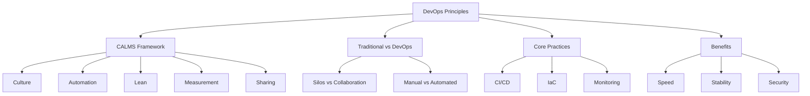

# Migration in progress
# Lesson 1: Introduction to DevOps Principles

DevOps is a cultural and professional movement that emphasizes collaboration between development (Dev) and operations (Ops) teams. It aims to shorten the systems development life cycle and provide continuous delivery with high software quality. This lesson defines the core principles of DevOps, explains the CALMS framework, and contrasts traditional siloed approaches with modern collaborative workflows.

## The CALMS Framework

The CALMS framework provides a structured way to understand the key pillars of DevOps. It was coined by Jez Humble and John Willis to help organizations assess their DevOps maturity.

### Culture

-   Breaks down silos between development, operations, security, and business teams.
-   Encourages shared responsibility for the entire application lifecycle.
-   Promotes a blameless post-mortem culture where failures are learning opportunities.
-   Values empathy, trust, and open communication.
-   Shifts from "throwing code over the wall" to cross-functional collaboration.

> [!Important]
> **Culture eats strategy for breakfast**: Tools alone cannot fix broken team dynamics. DevOps requires a fundamental shift in mindset where developers care about operational stability and operations staff understand development constraints. Without cultural change, automation just speeds up chaos.

### Automation

-   Eliminates manual, repetitive, and error-prone tasks.
-   Covers infrastructure provisioning, configuration management, testing, and deployment.
-   Ensures consistency across environments (dev, test, prod).
-   Enables rapid feedback loops by reducing cycle times.
-   "If you do it twice, automate it."

### Lean

-   Focuses on eliminating waste and optimizing flow.
-   Small batch sizes reduce risk and improve feedback speed.
-   Limits work in progress (WIP) to prevent bottlenecks.
-   Continuous improvement through iterative changes.
-   Value stream mapping to identify delays and inefficiencies.

### Measurement

-   Data-driven decision making replaces gut feelings.
-   Key metrics include Lead Time, Deployment Frequency, Change Failure Rate, and Mean Time to Recovery (MTTR).
-   Monitoring both technical performance and business outcomes.
-   Visibility into pipeline health and application status.
-   Feedback loops allow teams to adjust processes based on real data.

### Sharing

-   Transparent communication across teams and stakeholders.
-   Shared tools, repositories, and dashboards.
-   Knowledge sharing through documentation, pair programming, and communities of practice.
-   Open source contribution and internal reuse of components.
-   Breaking down knowledge hoarding and individual heroics.

| Pillar | Focus | Key Question |
|---|---|---|
| Culture | People & Mindset | Do we trust each other? |
| Automation | Technology & Process | What can we automate? |
| Lean | Flow & Efficiency | Where is the waste? |
| Measurement | Data & Feedback | How do we know it works? |
| Sharing | Knowledge & Transparency | Are we working together? |

## Traditional IT vs. DevOps

Understanding the contrast helps clarify why DevOps is necessary in modern cloud environments.

### Traditional Siloed Approach

-   **Structure**: Separate teams for Dev, Ops, QA, and Security.
-   **Handoffs**: Code is thrown over the wall from Dev to Ops.
-   **Goals**: Dev focuses on features; Ops focuses on stability. Often conflicting.
-   **Process**: Manual deployments, long release cycles (months/years).
-   **Risk**: Large batches of changes increase failure risk.
-   **Response**: Reactive firefighting when things break.

### DevOps Collaborative Approach

-   **Structure**: Cross-functional teams with shared ownership.
-   **Handoffs**: Minimal handoffs; continuous integration.
-   **Goals**: Shared responsibility for speed, stability, and security.
-   **Process**: Automated pipelines, frequent releases (days/hours/minutes).
-   **Risk**: Small batches reduce impact of failures.
-   **Response**: Proactive monitoring and automated recovery.

| Dimension | Traditional IT | DevOps |
|---|---|---|
| Team Structure | Siloed | Cross-functional |
| Release Frequency | Infrequent | Frequent |
| Deployment | Manual | Automated |
| Infrastructure | Static/Pet | Dynamic/Cattle |
| Error Handling | Blame | Learning |
| Security | End-of-pipeline | Shift-left |

> [!Tip]
> **Pets vs. Cattle**: In traditional IT, servers are "pets" – named, nurtured, and irreplaceable. In DevOps, servers are "cattle" – numbered, interchangeable, and replaced automatically if they fail. This mindset shift enables scalability and resilience.

## Core DevOps Practices

These practices operationalize the CALMS principles.

### Continuous Integration (CI)

-   Developers merge code changes into a central repository frequently.
-   Automated builds and tests run on every commit.
-   Detects integration errors early.
-   Reduces "integration hell" at the end of projects.

### Continuous Delivery/Deployment (CD)

-   **Delivery**: Code is always in a deployable state. Manual approval for production.
-   **Deployment**: Changes are automatically released to production without manual intervention.
-   Enables rapid feedback from users.
-   Reduces deployment risk th