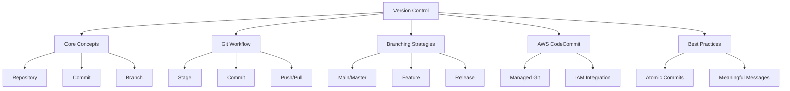
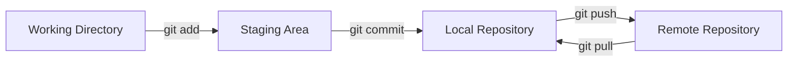

# Migration in progress
# Lesson 2: Version Control Foundations

Version control is the backbone of DevOps. It allows teams to track changes, collaborate on code, and manage history without overwriting each other's work. In a cloud-native environment, version control extends beyond application code to include infrastructure definitions, configuration files, and documentation. This lesson covers core concepts of Git, branching strategies, and how AWS CodeCommit integrates into the DevOps workflow.

## Core Concepts of Version Control

Understanding the terminology is essential for effective collaboration.

### Repository (Repo)

-   A centralized storage location for project files and their entire history.
-   Contains all versions of every file ever committed.
-   Can be local (on your machine) or remote (on a server like CodeCommit or GitHub).
-   Includes metadata about who changed what and when.

### Commit

-   A snapshot of changes at a specific point in time.
-   Each commit has a unique identifier (SHA hash).
-   Includes author, timestamp, and a message describing the change.
-   Atomic: should represent a single logical unit of work.

### Branch

-   A parallel line of development.
-   Allows you to work on features or fixes without affecting the main codebase.
-   The default branch is usually named `main` or `master`.
-   Branches can be merged back into the main branch once work is complete.

### Merge

-   Combining changes from one branch into another.
-   Can be automatic if no conflicts exist.
-   Requires manual resolution if the same lines of code were changed differently in both branches.
-   Critical step in integrating feature work.

> [!Important]
> **Commit often, push wisely**: Small, frequent commits make it easier to isolate bugs and revert changes. However, pushing to shared branches should only happen after code is tested and reviewed. Never commit secrets, API keys, or large binary files to version control.

## The Git Workflow

Git is a distributed version control system. The typical workflow involves three areas: the Working Directory, the Staging Area, and the Repository.

### Working Directory

-   Where you edit files on your local machine.
-   Changes here are not yet tracked by Git.
-   You can create, modify, or delete files freely.

### Staging Area (Index)

-   An intermediate area where you prepare changes for the next commit.
-   Use `git add` to move changes from working directory to staging.
-   Allows you to select specific changes to include in a commit.
-   Provides a clean separation between work-in-progress and saved snapshots.

### Local Repository

-   Stores committed snapshots on your local machine.
-   Use `git commit` to save staged changes to the local repo.
-   History is maintained locally until pushed to a remote server.

### Remote Repository

-   Centralized copy of the repo hosted on a server (e.g., AWS CodeCommit).
-   Use `git push` to upload local commits to the remote.
-   Use `git pull` to download changes from the remote to your local machine.
-   Enables collaboration among team members.

## Branching Strategies

Choosing the right branching strategy helps manage complexity and parallel work.

### Mainline Development (Trunk-Based)

-   Everyone works on the main branch.
-   Features are hidden behind feature flags.
-   Requires high discipline and robust automated testing.
-   Minimizes merge conflicts but increases coordination overhead.

### Feature Branch Workflow

-   Create a new branch for each feature or bug fix.
-   Merge back to main via Pull Request (PR) or Merge Request.
-   Allows isolated development and code review.
-   Most common strategy in modern DevOps teams.

### Gitflow

-   Uses distinct branches: `main`, `develop`, `feature`, `release`, `hotfix`.
-   More complex but provides strict structure for releases.
-   Suitable for projects with scheduled release cycles.
-   Less common in continuous deployment environments due to overhead.

| Strategy | Complexity | Best For | Code Review |
|---|---|---|---|
| Trunk-Based | High Discipline | Continuous Deployment | Pre-commit or Post-merge |
| Feature Branch | Medium | Most Teams | Via Pull Requests |
| Gitflow | High | Scheduled Releases | At Release Boundaries |

> [!Tip]
> **Keep branches short-lived**: Long-lived branches drift from main, leading to painful merges. Aim to merge feature branches back to main within a few days. If a feature takes weeks, break it into smaller sub-features that can be merged incrementally.

## AWS CodeCommit

AWS CodeCommit is a fully managed source control service that hosts secure Git-based repositories.

### Key Features

-   **Secure**: Encrypted at rest and in transit. Integrates with AWS IAM for access control.
-   **Scalable**: Handles large repositories and high traffic without performance degradation.
-   **Integrated**: Works seamlessly with C