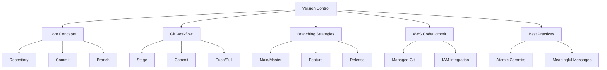
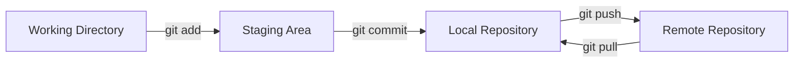

# Lesson 2: Version Control Foundations

Version control is the backbone of DevOps. It allows teams to track changes, collaborate on code, and manage history without overwriting each other's work. In a cloud-native environment, version control extends beyond application code to include infrastructure definitions, configuration files, and documentation. This lesson covers core concepts of Git, branching strategies, and how AWS CodeCommit integrates into the DevOps workflow.

## Core Concepts of Version Control

Understanding the terminology is essential for effective collaboration.

### Repository (Repo)

-   A centralized storage location for project files and their entire history.
-   Contains all versions of every file ever committed.
-   Can be local (on your machine) or remote (on a server like CodeCommit or GitHub).
-   Includes metadata about who changed what and when.

### Commit

-   A snapshot of changes at a specific point in time.
-   Each commit has a unique identifier (SHA hash).
-   Includes author, timestamp, and a message describing the change.
-   Atomic: should represent a single logical unit of work.

### Branch

-   A parallel line of development.
-   Allows you to work on features or fixes without affecting the main codebase.
-   The default branch is usually named `main` or `master`.
-   Branches can be merged back into the main branch once work is complete.

### Merge

-   Combining changes from one branch into another.
-   Can be automatic if no conflicts exist.
-   Requires manual resolution if the same lines of code were changed differently in both branches.
-   Critical step in integrating feature work.

> [!Important]
> **Commit often, push wisely**: Small, frequent commits make it easier to isolate bugs and revert changes. However, pushing to shared branches should only happen after code is tested and reviewed. Never commit secrets, API keys, or large binary files to version control.

## The Git Workflow

Git is a distributed version control system. The typical workflow involves three areas: the Working Directory, the Staging Area, and the Repository.

### Working Directory

-   Where you edit files on your local machine.
-   Changes here are not yet tracked by Git.
-   You can create, modify, or delete files freely.

### Staging Area (Index)

-   An intermediate area where you prepare changes for the next commit.
-   Use `git add` to move changes from working directory to staging.
-   Allows you to select specific changes to include in a commit.
-   Provides a clean separation between work-in-progress and saved snapshots.

### Local Repository

-   Stores committed snapshots on your local machine.
-   Use `git commit` to save staged changes to the local repo.
-   History is maintained locally until pushed to a remote server.

### Remote Repository

-   Centralized copy of the repo hosted on a server (e.g., AWS CodeCommit).
-   Use `git push` to upload local commits to the remote.
-   Use `git pull` to download changes from the remote to your local machine.
-   Enables collaboration among team members.

## Branching Strategies

Choosing the right branching strategy helps manage complexity and parallel work.

### Mainline Development (Trunk-Based)

-   Everyone works on the main branch.
-   Features are hidden behind feature flags.
-   Requires high discipline and robust automated testing.
-   Minimizes merge conflicts but increases coordination overhead.

### Feature Branch Workflow

-   Create a new branch for each feature or bug fix.
-   Merge back to main via Pull Request (PR) or Merge Request.
-   Allows isolated development and code review.
-   Most common strategy in modern DevOps teams.

### Gitflow

-   Uses distinct branches: `main`, `develop`, `feature`, `release`, `hotfix`.
-   More complex but provides strict structure for releases.
-   Suitable for projects with scheduled release cycles.
-   Less common in continuous deployment environments due to overhead.

| Strategy | Complexity | Best For | Code Review |
|---|---|---|---|
| Trunk-Based | High Discipline | Continuous Deployment | Pre-commit or Post-merge |
| Feature Branch | Medium | Most Teams | Via Pull Requests |
| Gitflow | High | Scheduled Releases | At Release Boundaries |

> [!Tip]
> **Keep branches short-lived**: Long-lived branches drift from main, leading to painful merges. Aim to merge feature branches back to main within a few days. If a feature takes weeks, break it into smaller sub-features that can be merged incrementally.

## AWS CodeCommit

AWS CodeCommit is a fully managed source control service that hosts secure Git-based repositories.

### Key Features

-   **Secure**: Encrypted at rest and in transit. Integrates with AWS IAM for access control.
-   **Scalable**: Handles large repositories and high traffic without performance degradation.
-   **Integrated**: Works seamlessly with CodeBuild, CodePipeline, and CodeDeploy.
-   **Private**: No public exposure unless explicitly configured.
-   **Cost-Effective**: Pay only for storage and data transfer. Free tier available.

### Access Control

-   Uses IAM policies to grant permissions (Read, Write, Admin).
-   Granular control over who can push, pull, or delete branches.
-   Supports SSH and HTTPS connections.
-   Cross-account access possible via resource-based policies.

### Collaboration Tools

-   **Pull Requests**: Request review and approval before merging.
-   **Comments**: Discuss specific lines of code.
-   **Approvals**: Require minimum number of approvals before merge.
-   **Notifications**: SNS triggers for events like pushes or PR updates.

## Best Practices for Version Control

Adopting these habits ensures a clean and manageable repository.

### Atomic Commits

-   Each commit should do one thing.
-   Avoid mixing unrelated changes (e.g., fixing a bug and refactoring code in the same commit).
-   Makes reverting specific changes easier.
-   Simplifies code review.

### Meaningful Commit Messages

-   Use clear, concise language.
-   Follow a standard format (e.g., "Verb + Object").
-   Explain *why* the change was made, not just *what* changed.
-   Example: "Add validation to user login form" instead of "Fix stuff".

### Ignore Unnecessary Files

-   Use `.gitignore` to exclude build artifacts, dependencies, and OS files.
-   Keeps the repository small and fast.
-   Prevents accidental commitment of sensitive or temporary files.

### Protect Main Branch

-   Require Pull Requests for all changes to main.
-   Enforce status checks (build/test pass) before merging.
-   Restrict direct pushes to main.
-   Ensure main is always in a deployable state.

### Regular Syncing

-   Pull changes from remote frequently to stay up-to-date.
-   Resolve conflicts early rather than letting them accumulate.
-   Communicate with team members about major refactoring.

## Assessment Preparation

### Practice Questions

1.  What is the difference between the Working Directory and the Staging Area?
2.  Explain the purpose of a Branch in Git.
3.  Why is it important to keep commits atomic?
4.  What are the benefits of using AWS CodeCommit over self-hosted Git?
5.  Describe the Feature Branch workflow.
6.  How does IAM integrate with CodeCommit for security?
7.  What is a Pull Request and why is it used?
8.  Why should you use a `.gitignore` file?
9.  What is the risk of long-lived branches?
10. How do you resolve a merge conflict?

### Scenario Questions

**Scenario 1: Accidental Secret Commit**
A developer accidentally commits an AWS access key to the repository.

-   Immediately revoke the compromised key in IAM.
-   Do not just delete the file; the history still contains the secret.
-   Use tools like `git filter-branch` or BFG Repo-Cleaner to remove the secret from history.
-   Force push the cleaned history (caution: disrupts other clones).
-   Implement pre-commit hooks to scan for secrets in the future.

**Scenario 2: Merge Conflict Hell**
Two developers worked on the same file for weeks without syncing.

-   Communicate to understand intent of both changes.
-   Manually edit the file to combine logic correctly.
-   Test thoroughly to ensure no functionality is broken.
-   Commit the resolution with a clear message.
-   Adopt a policy of daily pulls to prevent recurrence.

**Scenario 3: Broken Main Branch**
A bad merge broke the build on the main branch.

-   Identify the commit that caused the break using `git bisect`.
-   Revert the specific commit using `git revert`.
-   Push the revert to restore stability.
-   Investigate why CI/CD checks did not catch it.
-   Strengthen pre-merge validation rules.

**Scenario 4: Large Binary Files**
Team is storing large design assets in Git, slowing down clones.

-   Remove binaries from Git history.
-   Use AWS S3 for storing large assets.
-   Reference S3 objects in code/config instead of embedding them.
-   Alternatively, use Git LFS (Large File Storage) if binaries must be versioned.
-   Update `.gitignore` to prevent future binary commits.

**Scenario 5: Code Review Bottleneck**
Pull Requests sit unreviewed for days, delaying deployment.

-   Set expectations for review turnaround time (e.g., 24 hours).
-   Assign specific reviewers automatically based on code ownership.
-   Keep PRs small and focused to make review easier.
-   Use code owners file to route reviews to experts.
-   Celebrate timely reviews to reinforce culture.

## Key Takeaways

-   Version control is essential for collaboration and history tracking.
-   Git uses a distributed model with Working, Staging, and Repository areas.
-   Branches allow parallel development without disrupting main code.
-   AWS CodeCommit provides secure, managed Git hosting with IAM integration.
-   Atomic commits and meaningful messages improve maintainability.
-   Protect the main branch with Pull Requests and automated checks.
-   Short-lived branches reduce merge complexity.
-   Never commit secrets or large binaries to Git.
-   Regular syncing prevents conflict accumulation.
-   Code review is a critical quality gate in the DevOps pipeline.

> [!Important]
> **Git is a tool, collaboration is the goal**: Mastering Git commands is useful, but understanding how to work together effectively is vital. Use version control to facilitate communication, not just to store files. Treat your repository as a shared source of truth that everyone respects and protects. Clean history makes debugging and auditing significantly easier.
