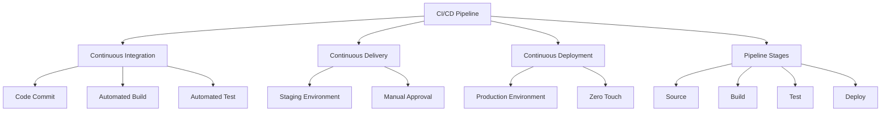
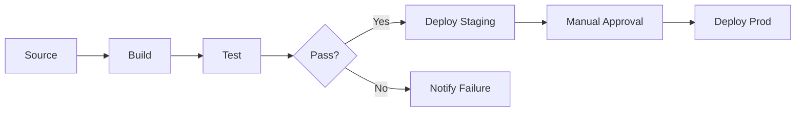

# Lesson 3: CI/CD Concepts

Continuous Integration (CI) and Continuous Delivery/Deployment (CD) are the engine rooms of DevOps. They automate the process of getting code from a developer’s machine to production. This lesson defines CI and CD, explains their differences, outlines the stages of a typical pipeline, and details how AWS services implement these concepts to ensure rapid, reliable software delivery.

## Continuous Integration (CI)

CI is the practice of merging all developer working copies to a shared mainline several times a day. It focuses on the "Build" and "Test" phases.

### Core Principles

-   **Frequent Commits**: Developers integrate code into a shared repository frequently (at least daily).
-   **Automated Builds**: Every commit triggers an automated build process.
-   **Automated Testing**: Unit tests and integration tests run automatically to catch bugs early.
-   **Fast Feedback**: If the build or test fails, the team is notified immediately.
-   **Fix Immediately**: A broken build is the highest priority; fix it before adding new code.

### Benefits of CI

-   **Reduced Integration Risk**: Small changes are easier to debug than large batches.
-   **Early Bug Detection**: Issues are found minutes after coding, not weeks later.
-   **Improved Code Quality**: Automated tests enforce standards.
-   **Visibility**: Everyone knows the current health of the codebase.

> [!Important]
> **The Build Must Be Fast**: If CI takes hours, developers will stop committing frequently. Aim for build and test cycles under 10 minutes. Use parallelization and caching to speed up processes. A slow CI pipeline becomes a bottleneck rather than an enabler.

## Continuous Delivery vs. Continuous Deployment

While often used interchangeably, these terms have distinct meanings regarding the final step to production.

### Continuous Delivery

-   Code is always in a deployable state.
-   Every change that passes all stages of the production pipeline is released to users automatically, *except* for the final step.
-   **Manual Approval**: A human must explicitly approve the deployment to production.
-   Suitable for regulated industries or high-risk changes.
-   Ensures business stakeholders can control release timing.

### Continuous Deployment

-   Goes one step further than Continuous Delivery.
-   Every change that passes all automated tests is deployed to production automatically.
-   **No Manual Intervention**: No human approval is required for production release.
-   Requires extreme confidence in automated testing and monitoring.
-   Enables multiple deployments per day.
-   Relies heavily on feature flags to hide unfinished work.

| Feature | Continuous Delivery | Continuous Deployment |
|---|---|---|
| Production Release | Manual Approval | Automatic |
| Human Intervention | Yes (Gate) | No |
| Risk Level | Moderate | Low (due to small batches) |
| Testing Requirement | High | Extremely High |
| Best For | Regulated/Enterprise | Agile/SaaS Startups |

## The CI/CD Pipeline Stages

A standard pipeline consists of four sequential stages. Each stage must pass before moving to the next.

### 1. Source Stage

-   Triggered by a code commit to the version control system (e.g., CodeCommit, GitHub).
-   Retrieves the latest code version.
-   Validates that the commit is valid.
-   Initiates the pipeline execution.

### 2. Build Stage

-   Compiles source code into executable artifacts.
-   Installs dependencies (libraries, packages).
-   Packages the application (e.g., JAR, ZIP, Docker Image).
-   Stores artifacts in a repository (e.g., S3, ECR).
-   Fails if compilation errors occur.

### 3. Test Stage

-   Runs automated tests against the built artifact.
-   **Unit Tests**: Verify individual components.
-   **Integration Tests**: Verify interaction between components.
-   **Security Scans**: Check for vulnerabilities (SAST/DAST).
-   **Code Quality**: Check for style violations and complexity.
-   Fails if any test case fails or security threshold is breached.

### 4. Deploy Stage

-   Deploys the artifact to target environments.
-   **Dev/Staging**: Automated deployment for validation.
-   **Production**: Manual approval (Delivery) or automatic (Deployment).
-   Uses strategies like Blue/Green or Canary to minimize downtime.
-   Performs post-deployment smoke tests.

## AWS Implementation of CI/CD

AWS provides a fully managed suite of services to build CI/CD pipelines.

### AWS CodePipeline

-   Orchestration service that models the entire workflow.
-   Connects Source, Build, Test, and Deploy stages.
-   Visualizes pipeline status and history.
-   Supports parallel actions and manual approval gates.
-   Integrates with third-party tools (Jenkins, GitHub Actions).

### AWS CodeBuild

-   Serverless build service.
-   Executes build commands defined in `buildspec.yml`.
-   Scales automatically to handle concurrent builds.
-   Provides isolated environments for each build.
-   Charges only for build minutes used.

### AWS CodeDeploy

-   Automates application deployment to EC2, Lambda, ECS, and on-premises.
-   Supports Blue/Green, Canary, Linear, and All-at-Once strategies.
-   Handles rolling updates to avoid downtime.
-   Automatically rolls back if health checks fail.
-   Tracks deployment history and status.

### AWS CodeArtifact

-   Fully managed artifact repository service.
-   Stores software packages (Maven, npm, PyPI, NuGet).
-   Securely shares dependencies across teams.
-   Integrates with CodeBuild for dependency resolution.
-   Alternative to public repositories for internal libraries.

## Deployment Strategies

How you release software impacts availability and risk.

### All-at-Once

-   Deploys new version to all instances simultaneously.
-   Fastest but highest risk.
-   Causes downtime during restart.
-   Suitable for dev/test environments only.

### Rolling Update

-   Replaces instances in batches.
-   Maintains availability as some instances remain running.
-   Slower than all-at-once but safer.
-   Users may see mixed versions during transition.

### Blue/Green Deployment

-   Two identical environments: Blue (current) and Green (new).
-   Deploy to Green while Blue serves traffic.
-   Test Green thoroughly.
-   Switch traffic from Blue to Green instantly.
-   Instant rollback by switching back to Blue.
-   Higher cost due to duplicate infrastructure.

### Canary Deployment

-   Routes a small percentage of traffic (e.g., 5%) to the new version.
-   Monitor metrics (errors, latency) for the canary group.
-   Gradually increase traffic if healthy.
-   Rollback quickly if issues arise.
-   Minimizes impact of bad releases.

| Strategy | Downtime | Risk | Cost | Complexity |
|---|---|---|---|---|
| All-at-Once | Yes | High | Low | Low |
| Rolling | No | Medium | Low | Medium |
| Blue/Green | No | Low | High | High |
| Canary | No | Lowest | Medium | High |

> [!Tip]
> **Start with Rolling, aim for Blue/Green**: Rolling updates are a good balance of safety and cost. As maturity increases, move to Blue/Green for critical production services where zero downtime is mandatory. Use Canary for high-traffic user-facing applications to detect subtle issues.

## Assessment Preparation

### Practice Questions

1.  Define Continuous Integration and list its three core practices.
2.  What is the key difference between Continuous Delivery and Continuous Deployment?
3.  Describe the four stages of a typical CI/CD pipeline.
4.  Why is fast feedback important in CI?
5.  What role does AWS CodeBuild play in CodePipeline?
6.  Explain the Blue/Green deployment strategy.
7.  When would you choose Canary deployment over Blue/Green?
8.  What is the purpose of AWS CodeArtifact?
9.  Why should you automate testing in the CI stage?
10. How does CodeDeploy handle failed deployments?

### Scenario Questions

**Scenario 1: Integration Hell**
Team merges code once a month, resulting in days of fixing conflicts.

-   Implement Continuous Integration.
-   Require developers to commit to main at least daily.
-   Set up automated builds and tests on every commit.
-   Fix broken builds immediately.
-   Reduce batch size to minimize conflict complexity.

**Scenario 2: Fear of Deployment**
Team is afraid to deploy on Fridays because releases often break things.

-   Implement automated testing to catch bugs before production.
-   Use Blue/Green deployment to enable instant rollback.
-   Deploy smaller changes more frequently.
-   Improve monitoring to detect issues quickly.
-   Build confidence through successful, low-risk releases.

**Scenario 3: Slow Build Times**
CI pipeline takes 45 minutes, discouraging frequent commits.

-   Parallelize test execution.
-   Cache dependencies in CodeBuild.
-   Split monolithic build into smaller microservice builds.
-   Optimize build scripts and remove unnecessary steps.
-   Use incremental builds where possible.

**Scenario 4: Regulatory Compliance**
Financial app requires manual sign-off before production release.

-   Implement Continuous Delivery, not Deployment.
-   Add a Manual Approval action in CodePipeline before Prod stage.
-   Require specific IAM users to approve.
-   Audit trail of who approved and when.
-   Ensure all automated tests pass before approval gate.

**Scenario 5: Dependency Management**
Developers use different versions of libraries, causing "it works on my machine" issues.

-   Use AWS CodeArtifact to centralize dependencies.
-   Define exact versions in `package.json` or `pom.xml`.
-   CodeBuild pulls dependencies from CodeArtifact.
-   Ensures consistent build environment for everyone.
-   Scan dependencies for vulnerabilities automatically.

## Key Takeaways

-   CI automates building and testing code on every commit.
-   Continuous Delivery requires manual approval for production; Continuous Deployment does not.
-   A standard pipeline has Source, Build, Test, and Deploy stages.
-   AWS CodePipeline orchestrates the workflow; CodeBuild handles builds; CodeDeploy handles releases.
-   Blue/Green deployment offers zero downtime and instant rollback.
-   Canary deployment minimizes risk by exposing new code to a small user subset.
-   Fast feedback loops are critical for CI success.
-   Automated testing is non-negotiable for reliable CD.
-   Artifact management ensures consistency across environments.
-   Choose deployment strategy based on risk tolerance and cost constraints.

> [!Important]
> **Automate the boring stuff**: The goal of CI/CD is to remove human error from repetitive tasks. If a human has to click a button to copy a file, automate it. If a human has to check if tests passed, automate the notification. Trust your automation, but verify it with monitoring. The pipeline is your safety net; keep it strong, fast, and reliable.
