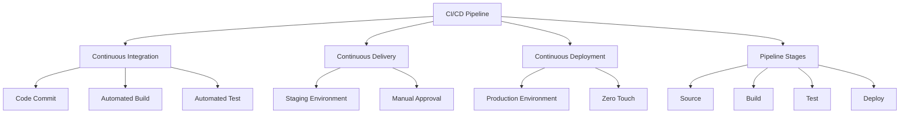
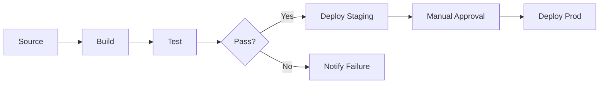

# Migration in progress
# Lesson 3: CI/CD Concepts

Continuous Integration (CI) and Continuous Delivery/Deployment (CD) are the engine rooms of DevOps. They automate the process of getting code from a developer’s machine to production. This lesson defines CI and CD, explains their differences, outlines the stages of a typical pipeline, and details how AWS services implement these concepts to ensure rapid, reliable software delivery.

## Continuous Integration (CI)

CI is the practice of merging all developer working copies to a shared mainline several times a day. It focuses on the "Build" and "Test" phases.

### Core Principles

-   **Frequent Commits**: Developers integrate code into a shared repository frequently (at least daily).
-   **Automated Builds**: Every commit triggers an automated build process.
-   **Automated Testing**: Unit tests and integration tests run automatically to catch bugs early.
-   **Fast Feedback**: If the build or test fails, the team is notified immediately.
-   **Fix Immediately**: A broken build is the highest priority; fix it before adding new code.

### Benefits of CI

-   **Reduced Integration Risk**: Small changes are easier to debug than large batches.
-   **Early Bug Detection**: Issues are found minutes after coding, not weeks later.
-   **Improved Code Quality**: Automated tests enforce standards.
-   **Visibility**: Everyone knows the current health of the codebase.

> [!Important]
> **The Build Must Be Fast**: If CI takes hours, developers will stop committing frequently. Aim for build and test cycles under 10 minutes. Use parallelization and caching to speed up processes. A slow CI pipeline becomes a bottleneck rather than an enabler.

## Continuous Delivery vs. Continuous Deployment

While often used interchangeably, these terms have distinct meanings regarding the final step to production.

### Continuous Delivery

-   Code is always in a deployable state.
-   Every change that passes all stages of the production pipeline is released to users automatically, *except* for the final step.
-   **Manual Approval**: A human must explicitly approve the deployment to production.
-   Suitable for regulated industries or high-risk changes.
-   Ensures business stakeholders can control release timing.

### Continuous Deployment

-   Goes one step further than Continuous Delivery.
-   Every change that passes all automated tests is deployed to production automatically.
-   **No Manual Intervention**: No human approval is required for production release.
-   Requires extreme confidence in automated testing and monitoring.
-   Enables multiple deployments per day.
-   Relies heavily on feature flags to hide unfinished work.

| Feature | Continuous Delivery | Continuous Deployment |
|---|---|---|
| Production Release | Manual Approval | Automatic |
| Human Intervention | Yes (Gate) | No |
| Risk Level | Moderate | Low (due to small batches) |
| Testing Requirement | High | Extremely High |
| Best For | Regulated/Enterprise | Agile/SaaS Startups |

## The CI/CD Pipeline Stages

A standard pipeline consists of four sequential stages. Each stage must pass before moving to the next.

### 1. Source Stage

-   Triggered by a code commit to the version control system (e.g., CodeCommit, GitHub).
-   Retrieves the latest code version.
-   Validates that the commit is valid.
-   Initiates the pipeline execution.

### 2. Build Stage

-   Compiles source code into executable artifacts.
-   Installs dependencies (libraries, packages).
-   Packages the application (e.g., JAR, ZIP, Docker Image).
-   Stores artifacts in a repository (e.g., S3, ECR).
-   Fails if compilation errors occur.

### 3. Test Stage

-   Runs automated tests against the built artifact.
-   **Unit Tests**: Verify individual components.
-   **Integration Tests**: Verify interaction between components.
-   **Security Scans**: Check for vulnerabilities (SAST/DAST).
-   **Code Quality**: Check for style violations and complexity.
-   Fails if any test case fails or security threshold is breached.

### 4. Deploy Stage

-   Deploys the artifact to target environments.
-   **Dev/Staging**: Automated deployment for validation.
-   **Production**: Manual approval (Delivery) or automatic (Deployment).
-   Uses strategies like Blue/Green or Canary to minimize downtime.
-   Performs post-deployment smoke tests.

## AWS Implementation of CI/CD

AWS provides a fully managed suite of services to build CI/CD pipelines.

### AWS CodePipeline

-   Orchestration service that models the entire workflow.
-   Connects Source, Build, Test, and Deploy stages.
-   Visualizes pipeline status and history.
-   Supports parallel actions and manual approval gates.
-   Integrates with third-party tools (Jenkins, GitHub Actions).

### AWS CodeBuild

-   Serverless build service.
-   Executes build commands defined in `buildspec.yml`.
-   Scales automatically to handle concurrent builds.
-   Provides isolated environments for each build.
-   Charges only for build minutes used.

### AWS CodeDeploy

-   Automates application depl