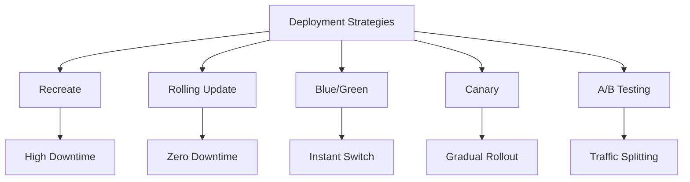
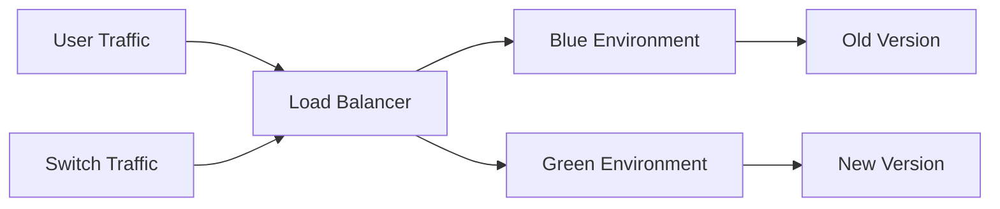

# Lesson 4: Deployment Strategies

Deployment strategies define how new versions of an application are released to production. The goal is to minimize downtime, reduce risk, and enable fast rollback if issues arise. This lesson compares common deployment patterns, explains how to implement them using AWS services, and discusses trade-offs between cost, complexity, and reliability.

## Why Deployment Strategy Matters

How you deploy determines your availability and risk profile.

-   **Downtime**: Does the service stop during deployment?
-   **Risk**: How many users are affected if the new version has bugs?
-   **Rollback Speed**: How quickly can you revert to the previous version?
-   **Cost**: Do you need double the infrastructure temporarily?
-   **Complexity**: How difficult is it to configure and manage?

> [!Important]
> **There is no perfect strategy**: Each strategy involves trade-offs. Blue/Green offers safety but costs more. Rolling updates are cheap but slower. Choose based on your application’s criticality, traffic patterns, and budget.

## Common Deployment Strategies

### 1. Recreate (Stop-Start)

-   Terminate all instances of the old version.
-   Start all instances of the new version.
-   **Pros**: Simple to implement; clean state.
-   **Cons**: Significant downtime; high risk if new version fails.
-   **Use Case**: Development environments or non-critical batch jobs.

### 2. Rolling Update

-   Replace instances in batches (e.g., 20% at a time).
-   Old and new versions run simultaneously during transition.
-   **Pros**: Zero downtime; low cost (no extra infrastructure).
-   **Cons**: Slow rollout; users may see mixed versions; rollback is slow.
-   **Use Case**: Standard web applications with moderate traffic.

### 3. Blue/Green Deployment

-   Two identical environments: Blue (live) and Green (new).
-   Deploy new version to Green while Blue serves traffic.
-   Test Green thoroughly.
-   Switch load balancer to point to Green.
-   **Pros**: Zero downtime; instant rollback (switch back to Blue); safe testing.
-   **Cons**: High cost (double infrastructure); complex database migration.
-   **Use Case**: Critical production systems requiring high availability.

### 4. Canary Deployment

-   Route a small percentage of traffic (e.g., 5%) to the new version.
-   Monitor metrics (errors, latency) for the canary group.
-   Gradually increase traffic (10%, 50%, 100%) if healthy.
-   **Pros**: Low risk; real-user feedback; early detection of issues.
-   **Cons**: Complex routing logic; requires robust monitoring.
-   **Use Case**: High-traffic user-facing applications.

### 5. A/B Testing

-   Similar to Canary but focuses on business metrics rather than technical health.
-   Split traffic to test different features or UIs.
-   **Pros**: Data-driven decisions; optimizes user experience.
-   **Cons**: Requires feature flagging; complex analysis.
-   **Use Case**: Marketing features, UI changes, recommendation engines.

| Strategy | Downtime | Risk | Cost | Rollback Speed | Complexity |
|---|---|---|---|---|---|
| Recreate | High | High | Low | Slow | Low |
| Rolling | None | Medium | Low | Slow | Medium |
| Blue/Green | None | Low | High | Instant | High |
| Canary | None | Lowest | Medium | Fast | High |
| A/B Testing | None | Low | Medium | Fast | High |

## Implementing Strategies on AWS

AWS provides native tools to support these patterns.

### AWS CodeDeploy

-   Supports Rolling, Blue/Green, and Canary for EC2 and Lambda.
-   Configurable via `appspec.yml` file.
-   Automatically handles instance registration/deregistration.
-   Integrates with Elastic Load Balancing (ELB).

### Amazon ECS (Elastic Container Service)

-   Native support for Rolling and Blue/Green deployments.
-   Uses Task Definitions to version container images.
-   Service updates replace tasks gradually.
-   Integrated with Application Load Balancer.

### AWS Lambda

-   Uses Aliases and Versions for deployment.
-   **Linear**: Shift traffic in equal increments over time.
-   **Canary**: Shift traffic in two increments (e.g., 10% then 90%).
-   Automated rollback if CloudWatch alarms trigger.

### Amazon API Gateway & CloudFront

-   Use weighted target groups in ALB for traffic splitting.
-   Use CloudFront functions or Lambda@Edge for advanced routing.
-   Feature flags can be managed via AWS AppConfig or DynamoDB.

## Database Considerations

Deployment is not just about code; data schema changes are critical.

### Backward Compatibility

-   Ensure new code works with old schema during rolling updates.
-   Avoid dropping columns or tables immediately.
-   Add new columns as nullable first.

### Migration Strategies

-   **Expand and Contract**: Add new structure, migrate data, switch code, remove old structure.
-   **Dual Write**: Write to both old and new databases during transition.
-   **Feature Flags**: Toggle new schema usage via configuration.

> [!Tip]
> **Decouple code and database deployments**: Do not tie database migrations to application restarts. Run migrations independently before deploying code. This allows you to roll back code without rolling back data, which is often impossible.

## Best Practices

### Automate Everything

-   Manual deployments are error-prone and unrepeatable.
-   Use Infrastructure as Code (IaC) to provision environments.
-   Script database migrations.

### Monitor Closely

-   Define key health metrics (error rate, latency, throughput).
-   Set up automated alarms to trigger rollback.
-   Use distributed tracing (X-Ray) to identify bottlenecks.

### Test in Staging

-   Mirror production environment in staging.
-   Perform dry runs of Blue/Green switches.
-   Validate database migrations on copy of production data.

### Communicate Changes

-   Notify stakeholders before major deployments.
-   Maintain release notes.
-   Use maintenance windows if downtime is unavoidable.

### Plan for Rollback

-   Always have a tested rollback plan.
-   Keep old artifacts available for quick redeployment.
-   Ensure database rollback is possible or unnecessary.

## Assessment Preparation

### Practice Questions

1.  Compare Rolling Update and Blue/Green deployment.
2.  What is the main advantage of Canary deployment?
3.  Why is Recreate strategy unsuitable for production web apps?
4.  How does AWS CodeDeploy facilitate Blue/Green deployments?
5.  What is the challenge of database migrations during rolling updates?
6.  Explain the difference between Canary deployment and A/B testing.
7.  How do Lambda aliases support canary deployments?
8.  Why is backward compatibility important in schema changes?
9.  What role does monitoring play in Canary deployments?
10. List three factors to consider when choosing a deployment strategy.

### Scenario Questions

**Scenario 1: E-Commerce Black Friday**
High-traffic event requires zero downtime and minimal risk.

-   Use Blue/Green deployment.
-   Provision Green environment with same capacity as Blue.
-   Deploy and test Green thoroughly.
-   Switch traffic instantly during low-traffic window.
-   Keep Blue running for instant rollback if needed.

**Scenario 2: Internal Tool Update**
Non-critical internal app with low traffic.

-   Use Rolling Update.
-   Cost-effective and simple.
-   Downtime is acceptable if brief.
-   Monitor logs for errors during rollout.

**Scenario 3: Mobile App Backend**
Millions of users; need to detect subtle performance issues.

-   Use Canary deployment.
-   Route 1% traffic to new version.
-   Monitor latency and error rates closely.
-   Gradually increase to 10%, 50%, 100%.
-   Rollback immediately if metrics degrade.

**Scenario 4: Database Schema Change**
Need to add a new required field to user table.

-   Add column as nullable first.
-   Deploy code that writes to new column but reads from old.
-   Backfill data for existing records.
-   Deploy code that reads from new column.
-   Make column required and drop old column later.

**Scenario 5: Feature Experiment**
Marketing wants to test two different checkout flows.

-   Use A/B Testing.
-   Split traffic 50/50 using Load Balancer or Feature Flags.
-   Track conversion rates for each group.
-   Choose winner based on business metrics.
-   Roll out winner to 100% of users.

## Key Takeaways

-   Deployment strategies balance speed, safety, and cost.
-   Rolling Updates are cost-effective but slow.
-   Blue/Green offers instant rollback but doubles infrastructure cost.
-   Canary deployments minimize risk by exposing few users initially.
-   Database migrations require careful planning for backward compatibility.
-   AWS CodeDeploy, ECS, and Lambda provide native support for these patterns.
-   Automation and monitoring are essential for safe deployments.
-   Always have a tested rollback plan.
-   Choose strategy based on application criticality and traffic volume.
-   Decouple code and database changes whenever possible.

> [!Important]
> **Deployment is a business decision**: Technical teams choose the method, but business leaders define the risk tolerance. A banking app needs Blue/Green; a blog might accept Rolling Updates. Align your strategy with business goals. Never deploy on Fridays without a solid rollback plan and on-call support. Trust your automation, but verify with data.
