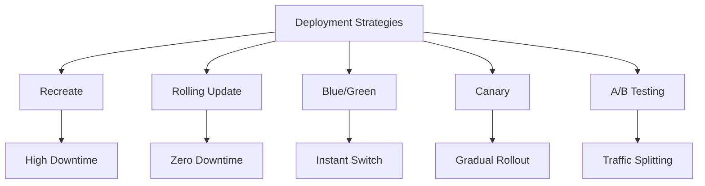
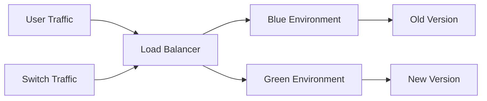

# Migration in progress
# Lesson 4: Deployment Strategies

Deployment strategies define how new versions of an application are released to production. The goal is to minimize downtime, reduce risk, and enable fast rollback if issues arise. This lesson compares common deployment patterns, explains how to implement them using AWS services, and discusses trade-offs between cost, complexity, and reliability.

## Why Deployment Strategy Matters

How you deploy determines your availability and risk profile.

-   **Downtime**: Does the service stop during deployment?
-   **Risk**: How many users are affected if the new version has bugs?
-   **Rollback Speed**: How quickly can you revert to the previous version?
-   **Cost**: Do you need double the infrastructure temporarily?
-   **Complexity**: How difficult is it to configure and manage?

> [!Important]
> **There is no perfect strategy**: Each strategy involves trade-offs. Blue/Green offers safety but costs more. Rolling updates are cheap but slower. Choose based on your application’s criticality, traffic patterns, and budget.

## Common Deployment Strategies

### 1. Recreate (Stop-Start)

-   Terminate all instances of the old version.
-   Start all instances of the new version.
-   **Pros**: Simple to implement; clean state.
-   **Cons**: Significant downtime; high risk if new version fails.
-   **Use Case**: Development environments or non-critical batch jobs.

### 2. Rolling Update

-   Replace instances in batches (e.g., 20% at a time).
-   Old and new versions run simultaneously during transition.
-   **Pros**: Zero downtime; low cost (no extra infrastructure).
-   **Cons**: Slow rollout; users may see mixed versions; rollback is slow.
-   **Use Case**: Standard web applications with moderate traffic.

### 3. Blue/Green Deployment

-   Two identical environments: Blue (live) and Green (new).
-   Deploy new version to Green while Blue serves traffic.
-   Test Green thoroughly.
-   Switch load balancer to point to Green.
-   **Pros**: Zero downtime; instant rollback (switch back to Blue); safe testing.
-   **Cons**: High cost (double infrastructure); complex database migration.
-   **Use Case**: Critical production systems requiring high availability.

### 4. Canary Deployment

-   Route a small percentage of traffic (e.g., 5%) to the new version.
-   Monitor metrics (errors, latency) for the canary group.
-   Gradually increase traffic (10%, 50%, 100%) if healthy.
-   **Pros**: Low risk; real-user feedback; early detection of issues.
-   **Cons**: Complex routing logic; requires robust monitoring.
-   **Use Case**: High-traffic user-facing applications.

### 5. A/B Testing

-   Similar to Canary but focuses on business metrics rather than technical health.
-   Split traffic to test different features or UIs.
-   **Pros**: Data-driven decisions; optimizes user experience.
-   **Cons**: Requires feature flagging; complex analysis.
-   **Use Case**: Marketing features, UI changes, recommendation engines.

| Strategy | Downtime | Risk | Cost | Rollback Speed | Complexity |
|---|---|---|---|---|---|
| Recreate | High | High | Low | Slow | Low |
| Rolling | None | Medium | Low | Slow | Medium |
| Blue/Green | None | Low | High | Instant | High |
| Canary | None | Lowest | Medium | Fast | High |
| A/B Testing | None | Low | Medium | Fast | High |

## Implementing Strategies on AWS

AWS provides native tools to support these patterns.

### AWS CodeDeploy

-   Supports Rolling, Blue/Green, and Canary for EC2 and Lambda.
-   Configurable via `appspec.yml` file.
-   Automatically handles instance registration/deregistration.
-   Integrates with Elastic Load Balancing (ELB).

### Amazon ECS (Elastic Container Service)

-   Native support for Rolling and Blue/Green deployments.
-   Uses Task Definitions to version container images.
-   Service updates replace tasks gradually.
-   Integrated with Application Load Balancer.

### AWS Lambda

-   Uses Aliases and Versions for deployment.
-   **Linear**: Shift traffic in equal increments over time.
-   **Canary**: Shift traffic in two increments (e.g., 10% then 90%).
-   Automated rollback if CloudWatch alarms trigger.

### Amazon API Gateway & CloudFront

-   Use weighted target groups in ALB for traffic splitting.
-   Use CloudFront functions or Lambda@Edge for advanced routing.
-   Feature flags can be managed via AWS AppConfig or DynamoDB.

#