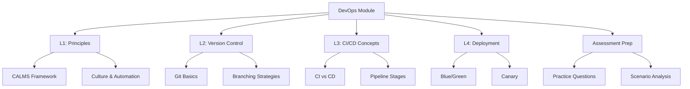

# Lesson 5: Summary and Assessment

This lesson consolidates the key concepts from the DevOps in the Cloud module. It reviews the progression from cultural principles to technical implementation, covering version control, CI/CD pipelines, and deployment strategies. The goal is to ensure you can design automated workflows that accelerate software delivery while maintaining stability, security, and quality. This summary serves as a final review before the assessment.

## Module Recap

The module covered four distinct but interconnected areas of DevOps on AWS.

### Lesson 1: Introduction to DevOps Principles

-   Defined DevOps as a cultural movement emphasizing collaboration between Dev and Ops.
-   Introduced the CALMS framework: Culture, Automation, Lean, Measurement, Sharing.
-   Contrasted traditional siloed IT with modern cross-functional teams.
-   Highlighted core practices: CI/CD, Infrastructure as Code (IaC), and Monitoring.
-   Emphasized the shift from "Pets" to "Cattle" in infrastructure management.

### Lesson 2: Version Control Foundations

-   Established Git as the standard for source control.
-   Explained core concepts: Repository, Commit, Branch, Merge.
-   Detailed the Git workflow: Working Directory, Staging Area, Local/Remote Repo.
-   Compared branching strategies: Feature Branch, Gitflow, Trunk-Based.
-   Introduced AWS CodeCommit as a secure, managed Git service with IAM integration.
-   Stressed best practices: atomic commits, meaningful messages, and protecting main branches.

### Lesson 3: CI/CD Concepts

-   Defined Continuous Integration (CI): frequent merges, automated builds/tests.
-   Differentiated Continuous Delivery (manual approval) from Continuous Deployment (automatic).
-   Outlined pipeline stages: Source, Build, Test, Deploy.
-   Reviewed AWS tools: CodePipeline (orchestration), CodeBuild (build), CodeDeploy (release).
-   Discussed the importance of fast feedback loops and automated testing.

### Lesson 4: Deployment Strategies

-   Compared strategies: Recreate, Rolling Update, Blue/Green, Canary, A/B Testing.
-   Analyzed trade-offs: downtime, risk, cost, complexity, rollback speed.
-   Detailed AWS implementation via CodeDeploy, ECS, and Lambda aliases.
-   Addressed database migration challenges (backward compatibility, expand/contract).
-   Emphasized monitoring and automated rollback mechanisms.

## Key Concepts Matrix

A quick reference table connecting concepts across lessons.

| Concept | Lesson 1 | Lesson 2 | Lesson 3 | Lesson 4 |
|---|---|---|---|---|
| **Automation** | Core pillar of CALMS | Git hooks, CI triggers | CodeBuild, CodePipeline | CodeDeploy, Auto-scaling |
| **Collaboration** | Cross-functional teams | Pull Requests, Code Review | Shared pipeline visibility | Joint ownership of releases |
| **Quality** | Shift-left security | Atomic commits, clean history | Automated testing, SAST | Canary analysis, health checks |
| **Risk Management** | Blameless culture | Branch protection, .gitignore | Staging environments, gates | Blue/Green, Instant Rollback |
| **Infrastructure** | IaC (CloudFormation) | Config as code | Artifact storage (S3/ECR) | Immutable servers, containers |

## Common Pitfalls and Mitigations

Understanding where things go wrong is as important as knowing how they work.

### Siloed Mindset

-   **Pitfall**: Teams use DevOps tools but maintain old cultural barriers.
-   **Mitigation**: Focus on shared goals and metrics. Encourage cross-training. Leadership must model collaborative behavior.

### Brittle Pipelines

-   **Pitfall**: CI/CD pipelines fail frequently due to flaky tests or environment issues.
-   **Mitigation**: Invest in stable test environments. Fix flaky tests immediately. Keep pipelines simple and modular.

### Manual Drift

-   **Pitfall**: Manual changes to production infrastructure bypass version control.
-   **Mitigation**: Enforce IaC for all resources. Use AWS Config to detect drift. Restrict console access for production.

### Big Bang Releases

-   **Pitfall**: Deploying large batches of changes infrequently.
-   **Mitigation**: Adopt CI to merge small changes daily. Use feature flags to hide incomplete work. Deploy frequently.

### Inadequate Rollback Plans

-   **Pitfall**: No clear way to revert if a deployment fails.
-   **Mitigation**: Use Blue/Green or Canary strategies. Keep previous artifacts available. Automate rollback triggers based on metrics.

## Assessment Preparation

### Practice Questions

1.  Explain the CALMS framework and its relevance to DevOps.
2.  What is the difference between `git add` and `git commit`?
3.  Why is a Feature Branch workflow preferred over direct commits to main?
4.  Define Continuous Integration and list its three core practices.
5.  What is the key difference between Continuous Delivery and Continuous Deployment?
6.  Describe the four stages of a standard CI/CD pipeline.
7.  Compare Blue/Green and Canary deployment strategies.
8.  How does AWS CodeDeploy handle failed deployments?
9.  Why is backward compatibility critical during database migrations?
10. What are the benefits of using AWS CodeCommit over self-hosted Git?

### Scenario Analysis

**Scenario 1: Startup Moving to Cloud**
A small team wants to adopt DevOps quickly.

-   **Strategy**: Start with Culture and Automation.
-   **Tools**: Use CodeCommit for source control. Set up a simple CodePipeline with CodeBuild for testing.
-   **Deployment**: Use Rolling Updates for cost efficiency.
-   **Goal**: Establish a basic CI/CD loop within two weeks.

**Scenario 2: Enterprise Banking App**
High security, strict compliance, zero downtime required.

-   **Strategy**: Focus on Security and Reliability.
-   **Tools**: Use CodeCommit with strict IAM policies. Integrate SAST/DAST in CodeBuild.
-   **Deployment**: Use Blue/Green deployment with manual approval gate in CodePipeline.
-   **Goal**: Ensure auditability and zero-downtime releases.

**Scenario 3: High-Traffic E-Commerce Site**
Millions of users, need to detect performance issues early.

-   **Strategy**: Focus on Risk Reduction and Feedback.
-   **Tools**: Use CloudWatch and X-Ray for monitoring.
-   **Deployment**: Use Canary deployment via CodeDeploy or ALB weighted targets.
-   **Goal**: Limit impact of bad releases to a small user subset.

**Scenario 4: Legacy Monolith Migration**
Moving from manual server updates to automated deployments.

-   **Strategy**: Incremental Automation.
-   **Tools**: Wrap legacy app in containers (ECS). Use CodePipeline for orchestration.
-   **Deployment**: Start with Rolling Updates, move to Blue/Green as confidence grows.
-   **Goal**: Eliminate manual SSH deployments and reduce errors.

**Scenario 5: Multi-Team Collaboration**
Five teams working on the same repository causing conflicts.

-   **Strategy**: Improve Version Control Practices.
-   **Tools**: Enforce Feature Branch workflow. Require Pull Requests with code owners.
-   **Process**: Daily syncs with main branch. Automated conflict detection in CI.
-   **Goal**: Reduce merge conflicts and improve code quality through review.

## Final Review Checklist

Before taking the assessment, ensure you can:

-   [ ] Define DevOps and explain the CALMS framework.
-   [ ] Perform basic Git operations (add, commit, push, pull, merge).
-   [ ] Choose an appropriate branching strategy for a given team size.
-   [ ] Design a CI/CD pipeline with Source, Build, Test, and Deploy stages.
-   [ ] Differentiate between Continuous Delivery and Continuous Deployment.
-   [ ] Select the right deployment strategy (Blue/Green, Canary, Rolling) based on requirements.
-   [ ] Explain how AWS Code* services integrate to form a DevOps toolchain.
-   [ ] Handle database migrations safely during deployments.
-   [ ] Implement automated rollback mechanisms.
-   [ ] Apply security best practices (IAM, secrets management) in the pipeline.

## Key Takeaways

-   DevOps is a cultural shift toward collaboration, automation, and shared responsibility.
-   Version control (Git) is the foundation of all DevOps practices.
-   CI/CD automates the path from code commit to production.
-   Continuous Integration focuses on building and testing; Continuous Delivery/Deployment focuses on releasing.
-   Deployment strategies balance risk, cost, and speed.
-   Blue/Green offers safety; Canary offers early detection; Rolling offers cost efficiency.
-   AWS provides a fully managed suite (CodeCommit, Build, Deploy, Pipeline) for DevOps.
-   Infrastructure as Code ensures consistency and repeatability.
-   Monitoring and feedback loops drive continuous improvement.
-   Security must be integrated early (DevSecOps) and automated.

> [!Important]
> **DevOps is a journey, not a destination**: You do not "finish" DevOps. It is a continuous process of improving how you build, test, and deliver software. Start with small wins, automate repetitive tasks, and foster a culture of trust and learning. Tools enable the process, but people make it succeed. Focus on delivering value to customers faster and more reliably.
