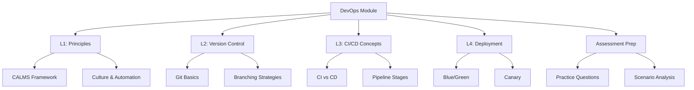

# Migration in progress
# Lesson 5: Summary and Assessment

This lesson consolidates the key concepts from the DevOps in the Cloud module. It reviews the progression from cultural principles to technical implementation, covering version control, CI/CD pipelines, and deployment strategies. The goal is to ensure you can design automated workflows that accelerate software delivery while maintaining stability, security, and quality. This summary serves as a final review before the assessment.

## Module Recap

The module covered four distinct but interconnected areas of DevOps on AWS.

### Lesson 1: Introduction to DevOps Principles

-   Defined DevOps as a cultural movement emphasizing collaboration between Dev and Ops.
-   Introduced the CALMS framework: Culture, Automation, Lean, Measurement, Sharing.
-   Contrasted traditional siloed IT with modern cross-functional teams.
-   Highlighted core practices: CI/CD, Infrastructure as Code (IaC), and Monitoring.
-   Emphasized the shift from "Pets" to "Cattle" in infrastructure management.

### Lesson 2: Version Control Foundations

-   Established Git as the standard for source control.
-   Explained core concepts: Repository, Commit, Branch, Merge.
-   Detailed the Git workflow: Working Directory, Staging Area, Local/Remote Repo.
-   Compared branching strategies: Feature Branch, Gitflow, Trunk-Based.
-   Introduced AWS CodeCommit as a secure, managed Git service with IAM integration.
-   Stressed best practices: atomic commits, meaningful messages, and protecting main branches.

### Lesson 3: CI/CD Concepts

-   Defined Continuous Integration (CI): frequent merges, automated builds/tests.
-   Differentiated Continuous Delivery (manual approval) from Continuous Deployment (automatic).
-   Outlined pipeline stages: Source, Build, Test, Deploy.
-   Reviewed AWS tools: CodePipeline (orchestration), CodeBuild (build), CodeDeploy (release).
-   Discussed the importance of fast feedback loops and automated testing.

### Lesson 4: Deployment Strategies

-   Compared strategies: Recreate, Rolling Update, Blue/Green, Canary, A/B Testing.
-   Analyzed trade-offs: downtime, risk, cost, complexity, rollback speed.
-   Detailed AWS implementation via CodeDeploy, ECS, and Lambda aliases.
-   Addressed database migration challenges (backward compatibility, expand/contract).
-   Emphasized monitoring and automated rollback mechanisms.

## Key Concepts Matrix

A quick reference table connecting concepts across lessons.

| Concept | Lesson 1 | Lesson 2 | Lesson 3 | Lesson 4 |
|---|---|---|---|---|
| **Automation** | Core pillar of CALMS | Git hooks, CI triggers | CodeBuild, CodePipeline | CodeDeploy, Auto-scaling |
| **Collaboration** | Cross-functional teams | Pull Requests, Code Review | Shared pipeline visibility | Joint ownership of releases |
| **Quality** | Shift-left security | Atomic commits, clean history | Automated testing, SAST | Canary analysis, health checks |
| **Risk Management** | Blameless culture | Branch protection, .gitignore | Staging environments, gates | Blue/Green, Instant Rollback |
| **Infrastructure** | IaC (CloudFormation) | Config as code | Artifact storage (S3/ECR) | Immutable servers, containers |

## Common Pitfalls and Mitigations

Understanding where things go wrong is as important as knowing how they work.

### Siloed Mindset

-   **Pitfall**: Teams use DevOps tools but maintain old cultural barriers.
-   **Mitigation**: Focus on shared goals and metrics. Encourage cross-training. Leadership must model collaborative behavior.

### Brittle Pipelines

-   **Pitfall**: CI/CD pipelines fail frequently due to flaky tests or environment issues.
-   **Mitigation**: Invest in stable test environments. Fix flaky tests immediately. Keep pipelines simple and modular.

### Manual Drift

-   **Pitfall**: Manual changes to production infrastructure bypass version control.
-   **Mitigation**: Enforce IaC for all resources. Use AWS Config to detect drift. Restrict console access for production.

### Big Bang Releases

-   **Pitfall**: Deploying large batches of changes infrequently.
-   **Mitigation**: Adopt CI to merge small changes daily. Use feature flags to hide incomplete work. Deploy frequently.

### Inadequate Rollback Plans

-   **Pitfall**: No clear way to revert if a deployment fa