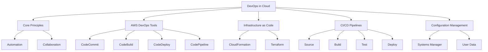

# Migration in progress
# W12: DevOps in the Cloud

DevOps is a cultural and professional movement that emphasizes collaboration between development and operations teams. In the cloud, DevOps is enabled by automation, infrastructure as code, and continuous delivery pipelines. This lesson covers core DevOps principles, AWS services for CI/CD, Infrastructure as Code (IaC), configuration management, and monitoring feedback loops. The goal is to accelerate software delivery while maintaining stability and security.

## Core DevOps Principles

DevOps is not just about tools; it is about mindset and practices.

### Collaboration and Communication

-   Break down silos between development, operations, and security.
-   Shared responsibility for application lifecycle.
-   Regular feedback loops between teams.
-   Blameless culture for post-incident reviews.
-   Joint ownership of production stability.

### Automation

-   Automate repetitive manual tasks to reduce errors.
-   Infrastructure provisioning, testing, and deployment.
-   Consistent environments from dev to production.
-   Faster release cycles with higher quality.
-   "Everything as Code": infrastructure, configuration, policies.

### Continuous Integration and Continuous Delivery (CI/CD)

-   **CI**: Frequently merge code changes into a central repository. Automated builds and tests run on every commit.
-   **CD**: Automatically deploy validated changes to staging or production.
-   Reduces integration hell and deployment risk.
-   Enables rapid feedback from users.
-   Small, frequent releases are safer than large batches.

### Monitoring and Feedback

-   Monitor application performance and infrastructure health.
-   Use metrics to drive improvement decisions.
-   Fast feedback loops for developers.
-   Proactive incident detection and response.
-   Business metrics tied to technical performance.

> [!Important]
> **DevOps is a culture, not a job title**: It requires changing how teams work together. Tools enable the process, but trust, transparency, and shared goals make it succeed. Security must be integrated early (DevSecOps), not added at the end.

## AWS DevOps Services

AWS provides a suite of managed services to build end-to-end DevOps workflows.

### AWS CodeCommit

-   Fully managed source control service.
-   Hosts private Git repositories.
-   Integrates with other AWS DevOps services.
-   High availability and durability.
-   Encryption at rest and in transit.
-   Alternative to GitHub or Bitbucket for AWS-native workflows.

### AWS CodeBuild

-   Fully managed build service.
-   Compiles source code, runs tests, and produces artifacts.
-   Scales automatically to handle peak loads.
-   Pay only for build minutes used.
-   Supports custom build environments via Docker images.
-   Integrates with CodePipeline and CodeCommit.

### AWS CodeDeploy

-   Automates application deployments to various compute services.
-   Supports EC2, Lambda, ECS, and on-premises servers.
-   Deployment strategies: Blue/Green, Canary, Linear, All-at-once.
-   Rollback automatically if health checks fail.
-   Tracks deployment history and status.

### AWS CodePipeline

-   Continuous delivery service for fast and reliable updates.
-   Models, visualizes, and automates steps required to release software.
-   Integrates with third-party tools (GitHub, Jenkins, Jira).
-   Stages: Source, Build, Test, Deploy, Approval.
-   Event-driven execution based on source changes.

| Service | Function | Key Benefit | Integration |
| :--- | :--- | :--- | :--- |
| CodeCommit | Source Control | Managed Git repos | CodePipeline, CodeBuild |
| CodeBuild | Build & Test | Serverless scaling | CodePipeline, CodeCommit |
| CodeDeploy | Deployment | Zero-downtime strategies | EC2, Lambda, ECS |
| CodePipeline | Orchestration | End-to-end automation | All AWS DevOps services |
| CodeArtifact | Package Management | Secure dependency storage | Maven, npm, pip |

## Infrastructure as Code (IaC)

IaC manages and provisions computing infrastructure through machine-readable definition files rather than physical hardware configuration or interactive configuration tools.

### AWS CloudFormation

-   Native AWS IaC service.
-   Uses JSON or YAML templates.
-   Declarative model: define desired state, AWS handles creation.
-   Stack management: create, update, delete as a single unit.
-   Drift detection: identifies manual changes outside template.
-   Change Sets: preview changes before applying them.
-   Nested stacks for modular architecture.

### Terraform (Third-Party)

-   Open-source IaC tool by HashiCorp.
-   Multi-cloud support (AWS, Azure, GCP).
-   Uses HCL (HashiCorp Configuration Language).
-   State file manages resource tracking.
-   Large community module registry.
-   Often preferred for multi-cloud or hybrid environments.

### Benefits of IaC

-   **Consistency**: Eliminates manual configuration errors.
-   **Version Control**: Track changes to infrastructure over time.
-   **Reusability**: Templates can be reused across projects.
-   **Speed**: Provision environments in minutes, not days.
-   **Documentation**: Code serves as living documentation of infrastructure.

> [!Tip]
> **Start with CloudFormation for AWS-only workloads**: It integrates deeply with AWS services and requires no additional tooling. Use Terraform if you anticipate multi-cloud needs or already have Terraform expertise. Always store IaC templates in version control.

## CI/CD Pipeline Design

A typical CI/CD pipeline on AWS follows a standard flow.

### Source Stage

-   Developer pushes code to CodeCommit or GitHub.
-   CodePipeline detects the change via webhook or polling.
-   Triggers the pipeline execution.

### Build Stage

-   CodeBuild pulls source code.
-   Installs dependencies.
-   Compiles code and runs unit tests.
-   Packages artifacts (JAR, ZIP, Docker image).
-   Stores artifacts in S3 or ECR (Elastic Container Registry).

### Test Stage

-   Run integration tests against a st