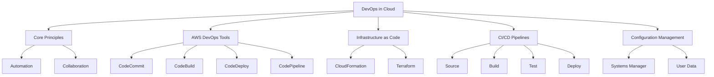
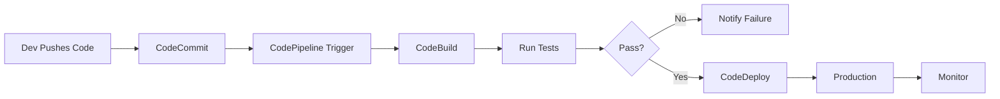

# W12: DevOps in the Cloud

DevOps is a cultural and professional movement that emphasizes collaboration between development and operations teams. In the cloud, DevOps is enabled by automation, infrastructure as code, and continuous delivery pipelines. This lesson covers core DevOps principles, AWS services for CI/CD, Infrastructure as Code (IaC), configuration management, and monitoring feedback loops. The goal is to accelerate software delivery while maintaining stability and security.

## Core DevOps Principles

DevOps is not just about tools; it is about mindset and practices.

### Collaboration and Communication

-   Break down silos between development, operations, and security.
-   Shared responsibility for application lifecycle.
-   Regular feedback loops between teams.
-   Blameless culture for post-incident reviews.
-   Joint ownership of production stability.

### Automation

-   Automate repetitive manual tasks to reduce errors.
-   Infrastructure provisioning, testing, and deployment.
-   Consistent environments from dev to production.
-   Faster release cycles with higher quality.
-   "Everything as Code": infrastructure, configuration, policies.

### Continuous Integration and Continuous Delivery (CI/CD)

-   **CI**: Frequently merge code changes into a central repository. Automated builds and tests run on every commit.
-   **CD**: Automatically deploy validated changes to staging or production.
-   Reduces integration hell and deployment risk.
-   Enables rapid feedback from users.
-   Small, frequent releases are safer than large batches.

### Monitoring and Feedback

-   Monitor application performance and infrastructure health.
-   Use metrics to drive improvement decisions.
-   Fast feedback loops for developers.
-   Proactive incident detection and response.
-   Business metrics tied to technical performance.

> [!Important]
> **DevOps is a culture, not a job title**: It requires changing how teams work together. Tools enable the process, but trust, transparency, and shared goals make it succeed. Security must be integrated early (DevSecOps), not added at the end.

## AWS DevOps Services

AWS provides a suite of managed services to build end-to-end DevOps workflows.

### AWS CodeCommit

-   Fully managed source control service.
-   Hosts private Git repositories.
-   Integrates with other AWS DevOps services.
-   High availability and durability.
-   Encryption at rest and in transit.
-   Alternative to GitHub or Bitbucket for AWS-native workflows.

### AWS CodeBuild

-   Fully managed build service.
-   Compiles source code, runs tests, and produces artifacts.
-   Scales automatically to handle peak loads.
-   Pay only for build minutes used.
-   Supports custom build environments via Docker images.
-   Integrates with CodePipeline and CodeCommit.

### AWS CodeDeploy

-   Automates application deployments to various compute services.
-   Supports EC2, Lambda, ECS, and on-premises servers.
-   Deployment strategies: Blue/Green, Canary, Linear, All-at-once.
-   Rollback automatically if health checks fail.
-   Tracks deployment history and status.

### AWS CodePipeline

-   Continuous delivery service for fast and reliable updates.
-   Models, visualizes, and automates steps required to release software.
-   Integrates with third-party tools (GitHub, Jenkins, Jira).
-   Stages: Source, Build, Test, Deploy, Approval.
-   Event-driven execution based on source changes.

| Service | Function | Key Benefit | Integration |
| :--- | :--- | :--- | :--- |
| CodeCommit | Source Control | Managed Git repos | CodePipeline, CodeBuild |
| CodeBuild | Build & Test | Serverless scaling | CodePipeline, CodeCommit |
| CodeDeploy | Deployment | Zero-downtime strategies | EC2, Lambda, ECS |
| CodePipeline | Orchestration | End-to-end automation | All AWS DevOps services |
| CodeArtifact | Package Management | Secure dependency storage | Maven, npm, pip |

## Infrastructure as Code (IaC)

IaC manages and provisions computing infrastructure through machine-readable definition files rather than physical hardware configuration or interactive configuration tools.

### AWS CloudFormation

-   Native AWS IaC service.
-   Uses JSON or YAML templates.
-   Declarative model: define desired state, AWS handles creation.
-   Stack management: create, update, delete as a single unit.
-   Drift detection: identifies manual changes outside template.
-   Change Sets: preview changes before applying them.
-   Nested stacks for modular architecture.

### Terraform (Third-Party)

-   Open-source IaC tool by HashiCorp.
-   Multi-cloud support (AWS, Azure, GCP).
-   Uses HCL (HashiCorp Configuration Language).
-   State file manages resource tracking.
-   Large community module registry.
-   Often preferred for multi-cloud or hybrid environments.

### Benefits of IaC

-   **Consistency**: Eliminates manual configuration errors.
-   **Version Control**: Track changes to infrastructure over time.
-   **Reusability**: Templates can be reused across projects.
-   **Speed**: Provision environments in minutes, not days.
-   **Documentation**: Code serves as living documentation of infrastructure.

> [!Tip]
> **Start with CloudFormation for AWS-only workloads**: It integrates deeply with AWS services and requires no additional tooling. Use Terraform if you anticipate multi-cloud needs or already have Terraform expertise. Always store IaC templates in version control.

## CI/CD Pipeline Design

A typical CI/CD pipeline on AWS follows a standard flow.

### Source Stage

-   Developer pushes code to CodeCommit or GitHub.
-   CodePipeline detects the change via webhook or polling.
-   Triggers the pipeline execution.

### Build Stage

-   CodeBuild pulls source code.
-   Installs dependencies.
-   Compiles code and runs unit tests.
-   Packages artifacts (JAR, ZIP, Docker image).
-   Stores artifacts in S3 or ECR (Elastic Container Registry).

### Test Stage

-   Run integration tests against a staging environment.
-   Perform security scanning (SAST/DAST).
-   Validate infrastructure changes.
-   Fail pipeline if tests do not pass.

### Deploy Stage

-   CodeDeploy pushes artifacts to target instances.
-   Application stops, new version installs, application starts.
-   Health checks verify deployment success.
-   Automatic rollback if health checks fail.
-   Manual approval gates for production deployments.

## Configuration Management

Managing the configuration of running instances ensures consistency and security.

### AWS Systems Manager (SSM)

-   Unified interface for managing AWS resources.
-   **Patch Manager**: Automates OS patching.
-   **State Manager**: Enforces desired configuration (e.g., install specific software).
-   **Run Command**: Execute commands on fleets of instances without SSH.
-   **Parameter Store**: Securely store configuration data and secrets.
-   Reduces need for bastion hosts and SSH access.

### User Data Scripts

-   Shell scripts executed at first boot of an EC2 instance.
-   Used for initial setup: installing packages, starting services.
-   Limited to initialization; not for ongoing management.
-   Can be combined with SSM for more complex setups.

### Immutable Infrastructure

-   Instead of updating running servers, replace them with new ones.
-   Build new AMI or container image with updated code/config.
-   Deploy new instances and terminate old ones.
-   Eliminates configuration drift.
-   Simplifies rollback: just revert to previous image.

> [!Important]
> **Avoid SSH for configuration**: SSH access is hard to audit and scale. Use AWS Systems Manager Run Command for remote execution. It logs all commands and results in CloudWatch Logs. Restrict SSH access to emergency break-glass scenarios only.

## Security in DevOps (DevSecOps)

Integrating security into the DevOps pipeline.

### Shift Left Security

-   Perform security checks early in the development cycle.
-   Static Application Security Testing (SAST) in build phase.
-   Dependency scanning for known vulnerabilities.
-   Infrastructure scanning for misconfigurations.

### IAM and Permissions

-   Least privilege for CI/CD roles.
-   Separate roles for build, deploy, and test stages.
-   Use IAM Roles for Service Accounts (IRSA) for EKS.
-   Rotate credentials and access keys regularly.

### Compliance as Code

-   Use AWS Config to monitor resource compliance.
-   Define rules for encryption, tagging, and security groups.
-   Auto-remediate non-compliant resources.
-   Audit trail for all infrastructure changes.

## Assessment Preparation

### Practice Questions

1.  Define DevOps and list its core principles.
2.  What is the difference between Continuous Integration and Continuous Delivery?
3.  Describe the role of each AWS Code* service in a pipeline.
4.  What are the benefits of Infrastructure as Code?
5.  Compare CloudFormation and Terraform.
6.  How does AWS Systems Manager improve configuration management?
7.  Explain the concept of immutable infrastructure.
8.  Why is "shifting left" important for security?
9.  How do you handle secrets in a CI/CD pipeline?
10. What is the purpose of a manual approval stage in CodePipeline?

### Scenario Questions

**Scenario 1: Manual Deployment Bottleneck**
A team deploys manually via SSH, causing errors and downtime. Solution?

-   Implement CodePipeline for automation.
-   Move source code to CodeCommit or GitHub.
-   Use CodeBuild for consistent builds.
-   Use CodeDeploy for automated, zero-downtime deployments.
-   Add automated tests to catch errors before production.
-   Remove SSH access for deployments.

**Scenario 2: Configuration Drift**
Servers in production differ from staging due to manual patches. Solution?

-   Adopt Infrastructure as Code (CloudFormation/Terraform).
-   Use AWS Systems Manager State Manager to enforce config.
-   Implement immutable infrastructure: replace instances instead of patching.
-   Use Patch Manager for scheduled OS updates.
-   Audit changes via CloudTrail.

**Scenario 3: Multi-Environment Strategy**
Need Dev, Test, and Prod environments with strict separation. Solution?

-   Use separate AWS accounts for each environment.
-   Use CloudFormation StackSets for cross-account deployment.
-   CodePipeline promotes artifacts from Dev -> Test -> Prod.
-   Manual approval gate before Prod deployment.
-   IAM roles restrict who can deploy to Prod.

**Scenario 4: Security Compliance**
Company requires all S3 buckets to be encrypted. How to enforce?

-   Create AWS Config rule for S3 encryption.
-   Enable auto-remediation using Lambda.
-   Add SAST scanning in CodeBuild phase.
-   Use IAM policies to deny unencrypted bucket creation.
-   Monitor compliance dashboard regularly.

**Scenario 5: Fast Feedback Loop**
Developers wait hours for build results. Solution?

-   Optimize CodeBuild environment (cache dependencies).
-   Parallelize tests in build spec.
-   Use smaller, focused microservices for faster builds.
-   Provide local build tools for pre-commit checks.
-   Notify developers immediately via Slack/Email on failure.

## Key Takeaways

-   DevOps is a cultural shift toward collaboration and automation.
-   CI/CD pipelines automate building, testing, and deploying code.
-   AWS Code* services provide a fully managed DevOps toolchain.
-   Infrastructure as Code ensures consistent, version-controlled environments.
-   CloudFormation is native; Terraform is multi-cloud.
-   AWS Systems Manager simplifies configuration and patching without SSH.
-   Immutable infrastructure reduces drift and simplifies rollbacks.
-   Security must be integrated early (DevSecOps) via automated scanning.
-   Monitoring and feedback loops drive continuous improvement.
-   Automation reduces human error and accelerates delivery.

> [!Important]
> **Automate everything possible**: Manual processes are slow, error-prone, and unscalable. If you do it more than twice, automate it. Start with source control and build automation, then add deployment and infrastructure automation. Measure lead time, deployment frequency, and change failure rate to track DevOps maturity. Culture eats strategy for breakfast, so invest in team collaboration and trust building alongside tooling.
