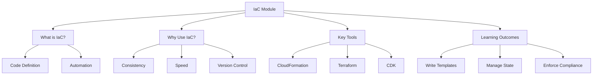

# Lesson 0: Module Introduction

This lesson introduces the Infrastructure as Code (IaC) module. It defines IaC, explains why it is a critical practice in modern cloud engineering, and outlines the tools and techniques you will learn. The goal is to shift from manual, click-ops infrastructure management to automated, version-controlled, and reproducible provisioning. This approach reduces errors, accelerates deployment, and ensures consistency across environments.

## What Is Infrastructure as Code?

Infrastructure as Code (IaC) is the practice of managing and provisioning computing infrastructure through machine-readable definition files, rather than physical hardware configuration or interactive configuration tools.

-   **Code Definition**: Infrastructure resources (servers, databases, networks) are defined in code files (JSON, YAML, HCL, Python, etc.).
-   **Automation**: Tools read these files and automatically create, update, or delete resources to match the desired state.
-   **Version Control**: These code files are stored in Git repositories, allowing tracking of changes, peer review, and rollback.
-   **Reproducibility**: The same code can provision identical environments in Dev, Test, and Production.

> [!Important]
> **Code is the single source of truth**: In an IaC workflow, the code repository is the authoritative record of what your infrastructure should look like. Manual changes made via the AWS Console are considered "drift" and should be avoided or corrected by updating the code. This ensures that your environment is always predictable and auditable.

## Why Use IaC?

Moving from manual provisioning to IaC delivers significant operational and business benefits.

### Consistency and Reliability

-   Eliminates "snowflake servers" (unique, manually configured instances).
-   Ensures Dev, Staging, and Prod environments are identical.
-   Reduces configuration errors caused by manual typos or missed steps.
-   Improves reliability by standardizing infrastructure patterns.

### Speed and Agility

-   Provision entire environments in minutes instead of days.
-   Enable self-service for developers to spin up test environments.
-   Accelerate time-to-market for new features.
-   Facilitate rapid experimentation and teardown of resources.

### Version Control and Collaboration

-   Track who changed what and when via Git history.
-   Use Pull Requests for peer review of infrastructure changes.
-   Rollback to previous versions if a change causes issues.
-   Collaborate on infrastructure design just like application code.

### Cost Optimization

-   Easily tear down unused environments to save costs.
-   Standardize resource sizes to prevent over-provisioning.
-   Tag resources automatically for accurate cost allocation.
-   Audit resource usage through code reviews.

| Manual Operations | Infrastructure as Code |
|---|---|
| Click-ops in Console | Code-defined resources |
| Prone to human error | Automated and consistent |
| Hard to reproduce | Fully reproducible |
| No audit trail | Full Git history |
| Slow provisioning | Rapid deployment |
| Drift common | Drift detected and corrected |

## Key IaC Tools on AWS

AWS supports multiple IaC tools, each with different strengths.

### AWS CloudFormation

-   Native AWS service for IaC.
-   Uses JSON or YAML templates.
-   Managed state by AWS (no state file to maintain).
-   Deep integration with all AWS services.
-   Supports StackSets for multi-account/region deployment.
-   Free to use; pay only for underlying resources.

### HashiCorp Terraform

-   Open-source, multi-cloud IaC tool.
-   Uses HashiCorp Configuration Language (HCL).
-   Requires managing state files (usually stored in S3).
-   Large community and module registry.
-   Provider-based architecture supports AWS, Azure, GCP, etc.
-   Popular for hybrid or multi-cloud strategies.

### AWS CDK (Cloud Development Kit)

-   Allows defining infrastructure using general-purpose languages (Python, TypeScript, Java, C#, Go).
-   Synthesizes into CloudFormation templates.
-   Combines power of programming (loops, conditionals, OOP) with IaC.
-   Higher level of abstraction than raw CloudFormation.
-   Ideal for teams with strong software development skills.

### Other Tools

-   **Pulumi**: Similar to CDK but multi-cloud.
-   **Ansible**: Configuration management and simple provisioning (imperative).
-   **Chef/Puppet**: Traditional configuration management tools.

## Learning Outcomes

By the end of this module, you will be able to:

-   Explain the core principles of Infrastructure as Code.
-   Write and validate AWS CloudFormation templates in YAML/JSON.
-   Understand Terraform basics and state management.
-   Use AWS CDK to define infrastructure with Python or TypeScript.
-   Implement modular designs for reusable infrastructure components.
-   Manage secrets and sensitive data securely in IaC.
-   Detect and correct configuration drift.
-   Integrate IaC validation into CI/CD pipelines.
-   Apply security best practices (Policy as Code).
-   Choose the right IaC tool for specific project requirements.

## Assessment Preparation

### Practice Questions

1.  Define Infrastructure as Code and explain its primary benefit.
2.  Why is version control important for infrastructure management?
3.  What is the difference between declarative and imperative IaC?
4.  List three advantages of using CloudFormation over manual console setup.
5.  How does Terraform handle state differently from CloudFormation?
6.  What is AWS CDK and how does it relate to CloudFormation?
7.  Why should you avoid making manual changes to IaC-managed resources?
8.  What is configuration drift and how do you detect it?
9.  How does IaC improve security and compliance?
10. When would you choose Terraform over CloudFormation?

### Scenario Questions

**Scenario 1: Inconsistent Environments**
Dev works fine, but Prod fails due to missing security group rules.

-   Adopt IaC to define both environments from the same template.
-   Use parameters to differentiate Dev vs Prod settings.
-   Store templates in Git for version control.
-   Deploy via CI/CD pipeline to ensure consistency.
-   Eliminate manual console changes.

**Scenario 2: Slow Provisioning**
It takes two weeks to get a new test environment.

-   Create a reusable IaC module for the standard stack.
-   Allow developers to trigger deployment via self-service pipeline.
-   Automate tagging and networking setup.
-   Reduce provisioning time from weeks to minutes.
-   Tear down environments automatically after testing.

**Scenario 3: Multi-Cloud Strategy**
Company uses AWS for production and Azure for disaster recovery.

-   Choose Terraform for its multi-cloud support.
-   Write separate provider blocks for AWS and Azure.
-   Use modules to abstract cloud-specific details.
-   Manage state remotely in a neutral location (e.g., S3 or Terraform Cloud).
-   Ensure consistent resource naming and tagging across clouds.

**Scenario 4: Developer Preference for Code**
Team knows Python well but struggles with YAML syntax.

-   Adopt AWS CDK with Python.
-   Leverage familiar programming constructs (classes, loops).
-   Synthesize to CloudFormation for deployment.
-   Use IDE features like autocomplete and debugging.
-   Maintain high-level abstractions for complex resources.

**Scenario 5: Compliance Requirement**
Auditors require proof of who changed infrastructure and when.

-   Store all IaC templates in Git.
-   Require Pull Requests for all changes.
-   Enable AWS CloudTrail to log API calls.
-   Correlate Git commits with CloudTrail events.
-   Provide audit logs showing code changes and deployment timestamps.

## Key Takeaways

-   IaC manages infrastructure through code, enabling automation and reproducibility.
-   It eliminates manual errors and ensures consistent environments.
-   Version control provides audit trails, collaboration, and rollback capabilities.
-   CloudFormation is native and stateless; Terraform is multi-cloud and stateful.
-   AWS CDK allows using general-purpose languages to define infrastructure.
-   Manual changes cause drift and should be avoided.
-   IaC accelerates delivery while improving security and compliance.
-   Modular design promotes reuse and maintainability.
-   Security checks should be integrated into the IaC pipeline.
-   Choose the tool that best fits your team’s skills and cloud strategy.

> [!Important]
> **Start small and iterate**: Do not try to convert your entire infrastructure to IaC overnight. Start with a single non-critical resource or environment. Learn the tool, establish best practices, and gradually expand. Treat infrastructure code with the same care as application code: review it, test it, and deploy it safely. The journey to full IaC adoption is incremental, but the payoff in stability and speed is immense.
