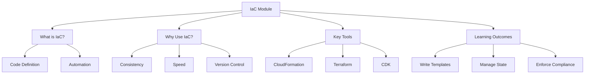

# Migration in progress
# Lesson 0: Module Introduction

This lesson introduces the Infrastructure as Code (IaC) module. It defines IaC, explains why it is a critical practice in modern cloud engineering, and outlines the tools and techniques you will learn. The goal is to shift from manual, click-ops infrastructure management to automated, version-controlled, and reproducible provisioning. This approach reduces errors, accelerates deployment, and ensures consistency across environments.

## What Is Infrastructure as Code?

Infrastructure as Code (IaC) is the practice of managing and provisioning computing infrastructure through machine-readable definition files, rather than physical hardware configuration or interactive configuration tools.

-   **Code Definition**: Infrastructure resources (servers, databases, networks) are defined in code files (JSON, YAML, HCL, Python, etc.).
-   **Automation**: Tools read these files and automatically create, update, or delete resources to match the desired state.
-   **Version Control**: These code files are stored in Git repositories, allowing tracking of changes, peer review, and rollback.
-   **Reproducibility**: The same code can provision identical environments in Dev, Test, and Production.

> [!Important]
> **Code is the single source of truth**: In an IaC workflow, the code repository is the authoritative record of what your infrastructure should look like. Manual changes made via the AWS Console are considered "drift" and should be avoided or corrected by updating the code. This ensures that your environment is always predictable and auditable.

## Why Use IaC?

Moving from manual provisioning to IaC delivers significant operational and business benefits.

### Consistency and Reliability

-   Eliminates "snowflake servers" (unique, manually configured instances).
-   Ensures Dev, Staging, and Prod environments are identical.
-   Reduces configuration errors caused by manual typos or missed steps.
-   Improves reliability by standardizing infrastructure patterns.

### Speed and Agility

-   Provision entire environments in minutes instead of days.
-   Enable self-service for developers to spin up test environments.
-   Accelerate time-to-market for new features.
-   Facilitate rapid experimentation and teardown of resources.

### Version Control and Collaboration

-   Track who changed what and when via Git history.
-   Use Pull Requests for peer review of infrastructure changes.
-   Rollback to previous versions if a change causes issues.
-   Collaborate on infrastructure design just like application code.

### Cost Optimization

-   Easily tear down unused environments to save costs.
-   Standardize resource sizes to prevent over-provisioning.
-   Tag resources automatically for accurate cost allocation.
-   Audit resource usage through code reviews.

| Manual Operations | Infrastructure as Code |
|---|---|
| Click-ops in Console | Code-defined resources |
| Prone to human error | Automated and consistent |
| Hard to reproduce | Fully reproducible |
| No audit trail | Full Git history |
| Slow provisioning | Rapid deployment |
| Drift common | Drift detected and corrected |

## Key IaC Tools on AWS

AWS supports multiple IaC tools, each with different strengths.

### AWS CloudFormation

-   Native AWS service for IaC.
-   Uses JSON or YAML templates.
-   Managed state by AWS (no state file to maintain).
-   Deep integration with all AWS services.
-   Supports StackSets for multi-account/region deployment.
-   Free to use; pay only for underlying resources.

### HashiCorp Terraform

-   Open-source, multi-cloud IaC tool.
-   Uses HashiCorp Configuration Language (HCL).
-   Requires managing state files (usually stored in S3).
-   Large community and module registry.
-   Provider-based architecture supports AWS, Azure, GCP, etc.
-   Popular for hybrid or multi-cloud strategies.

### AWS CDK (Cloud Development Kit)

-   Allows defining infrastructure using general-purpose languages (Python, TypeScript, Java, C#, Go).
-   Synthesizes into CloudFormation templates.
-   Combines power of programming (loops, conditionals, OOP) with IaC.
-   Higher level of abstraction than raw CloudFormation.
-   Ideal for teams with st