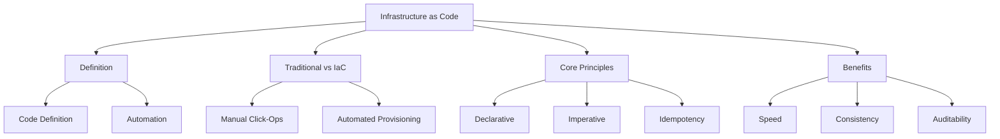

# Lesson 1: Introduction to Infrastructure as Code

Infrastructure as Code (IaC) is the practice of managing and provisioning computing infrastructure through machine-readable definition files, rather than physical hardware configuration or interactive configuration tools. This lesson defines IaC, contrasts it with traditional manual methods, explains the core principles of declarative vs. imperative approaches, and highlights the business value of treating infrastructure as software.

## What Is Infrastructure as Code?

IaC is a key DevOps practice that enables IT teams to manage infrastructure in an automated way. Instead of manually configuring servers, networks, and databases via a graphical user interface (GUI), engineers write code that describes the desired state of the infrastructure.

-   **Machine-Readable Files**: Infrastructure is defined in text files (JSON, YAML, HCL, Python, etc.).
-   **Version Controlled**: These files are stored in source control systems like Git.
-   **Automated Execution**: Tools read these files and automatically provision or update resources to match the definition.
-   **Reproducible**: The same code can create identical environments anywhere, anytime.

> [!Important]
> **Infrastructure is Software**: Treat your infrastructure definitions with the same rigor as your application code. Review it, test it, version it, and deploy it via pipelines. This mindset shift is the foundation of modern cloud engineering.

## Traditional Operations vs. IaC

Understanding the contrast helps clarify why IaC is necessary for scalable cloud operations.

### Traditional Manual Operations (Click-Ops)

-   **Process**: Engineers log into the AWS Console and manually click through wizards to create resources.
-   **Documentation**: Often outdated or non-existent. Relies on tribal knowledge.
-   **Consistency**: Prone to human error. "Snowflake servers" emerge where each instance is slightly different.
-   **Speed**: Slow and labor-intensive. Scaling requires repetitive manual work.
-   **Auditability**: Difficult to track who changed what and when. No clear history.

### Infrastructure as Code

-   **Process**: Engineers write code templates and execute them via CLI or CI/CD pipelines.
-   **Documentation**: Code serves as living, up-to-date documentation.
-   **Consistency**: Identical environments every time. Eliminates configuration drift.
-   **Speed**: Rapid provisioning. Entire environments can be spun up in minutes.
-   **Auditability**: Full Git history shows every change, who made it, and why.

| Dimension | Traditional Ops | Infrastructure as Code |
|---|---|---|
| **Method** | Manual GUI interaction | Automated code execution |
| **Error Rate** | High (human error) | Low (automated validation) |
| **Reproducibility** | Poor | Excellent |
| **Scalability** | Limited by human capacity | Unlimited |
| **Collaboration** | Siloed | Shared via Git |
| **Recovery** | Slow manual rebuild | Fast automated redeploy |

## Core Principles of IaC

Three fundamental concepts underpin effective IaC implementation.

### Declarative vs. Imperative

-   **Declarative (What)**: You define the *desired end state*. The tool determines how to achieve it.
    -   Example: "I want three EC2 instances running."
    -   Tools: AWS CloudFormation, Terraform.
    -   Benefit: Simpler, handles dependencies automatically, idempotent.
-   **Imperative (How)**: You define the *specific steps* to reach the state.
    -   Example: "Create instance 1, then instance 2, then instance 3."
    -   Tools: Shell scripts, Ansible (partially).
    -   Benefit: Fine-grained control, but complex and prone to errors if steps fail.

> [!Tip]
> **Prefer Declarative Models**: Declarative IaC is generally preferred because it abstracts away the complexity of ordering and dependencies. If a resource already exists, the tool simply verifies it matches the definition. If not, it creates it. This leads to more robust and maintainable code.

### Idempotency

-   Applying the same configuration multiple times produces the same result.
-   If resources already exist and match the code, no changes are made.
-   If resources differ, only the necessary changes are applied.
-   Prevents duplicate resources and unintended side effects.
-   Essential for reliable automation and retry logic.

### Single Source of Truth

-   The code repository is the authoritative record of infrastructure.
-   Manual changes outside of code are considered "drift" and should be avoided.
-   Drift detection tools identify when actual state differs from code.
-   Corrections are made by updating the code, not the console.

## Benefits of Infrastructure as Code

Adopting IaC delivers tangible technical and business advantages.

### Speed and Agility

-   Provision resources in minutes instead of days.
-   Enable self-service for developers to create test environments.
-   Accelerate time-to-market for new features.
-   Facilitate rapid experimentation and teardown.

### Consistency and Reliability

-   Eliminate configuration drift between environments.
-   Ensure Dev, Staging, and Prod are identical.
-   Reduce bugs caused by environment differences.
-   Improve system stability through standardized patterns.

### Cost Optimization

-   Easily tear down unused resources to save money.
-   Standardize instance types to prevent over-provisioning.
-   Automate tagging for accurate cost allocation.
-   Identify waste through code review.

### Security and Compliance

-   Enforce security standards via code (e.g., encrypted storage).
-   Audit all changes through Git history.
-   Implement Policy as Code to block non-compliant resources.
-   Reduce risk of human error in security configurations.

### Collaboration and Knowledge Sharing

-   Share infrastructure patterns across teams.
-   Peer review infrastructure changes via Pull Requests.
-   Document infrastructure through code comments and READMEs.
-   Onboard new engineers faster with clear code bases.

| Benefit Category | Impact | Example |
|---|---|---|
| Operational | Reduced toil | Auto-provisioning vs manual clicks |
| Financial | Lower costs | Auto-shutdown of dev envs |
| Technical | Higher quality | Identical staging/prod |
| Security | Better compliance | Encrypted S3 buckets by default |
| Cultural | Improved collaboration | Shared modules and reviews |

## Common Use Cases

IaC is applicable to various scenarios in cloud engineering.

### Environment Provisioning

-   Create complete VPCs, subnets, and security groups.
-   Deploy multi-tier applications (Web, App, DB).
-   Spin up isolated environments for testing.

### Disaster Recovery

-   Define DR infrastructure as code.
-   Test DR plans by provisioning from code.
-   Rapidly rebuild production in a different region.

### Compliance Enforcement

-   Standardize security groups and IAM roles.
-   Ensure all storage is encrypted.
-   Enforce tagging policies for governance.

### Scalable Architectures

-   Define Auto Scaling Groups and Load Balancers.
-   Manage container clusters (ECS/EKS).
-   Handle complex networking setups.

## Assessment Preparation

### Practice Questions

1.  Define Infrastructure as Code and explain its primary purpose.
2.  What is the difference between declarative and imperative IaC?
3.  Why is idempotency important in infrastructure management?
4.  List three benefits of IaC over manual operations.
5.  What is configuration drift and why is it problematic?
6.  How does IaC improve security and compliance?
7.  Why should infrastructure code be version controlled?
8.  Explain the concept of "Single Source of Truth" in IaC.
9.  How does IaC contribute to cost optimization?
10. Describe a scenario where IaC is critical for disaster recovery.

### Scenario Questions

**Scenario 1: Snowflake Servers**
Production servers have unique configurations due to manual patches.

-   Adopt IaC to define standard server images (AMIs).
-   Use Auto Scaling Groups to replace instances regularly.
-   Prohibit manual SSH access for configuration.
-   Ensure all servers are identical and reproducible.

**Scenario 2: Slow Test Environment Setup**
Developers wait weeks for QA environments.

-   Create IaC templates for the full application stack.
-   Allow developers to trigger deployment via self-service pipeline.
-   Automate teardown after testing to save costs.
-   Reduce setup time from weeks to minutes.

**Scenario 3: Compliance Audit Failure**
Auditors cannot verify who changed security groups.

-   Move security group definitions to IaC.
-   Store code in Git with required Pull Requests.
-   Enable CloudTrail to log API calls.
-   Provide Git history as audit evidence.

**Scenario 4: Inconsistent Deployments**
App works in Dev but fails in Prod due to missing config.

-   Use same IaC templates for Dev and Prod.
-   Use parameters for environment-specific values.
-   Validate templates in CI pipeline before deploy.
-   Ensure parity between environments.

**Scenario 5: Disaster Recovery Test**
Company needs to prove it can rebuild prod in another region.

-   Define entire production infrastructure in IaC.
-   Parameterize region and account ID.
-   Execute deployment in DR region from code.
-   Verify functionality and tear down.
-   Document recovery time objective (RTO).

## Key Takeaways

-   IaC manages infrastructure through code, enabling automation and reproducibility.
-   Declarative models (CloudFormation, Terraform) are preferred for simplicity and idempotency.
-   Idempotency ensures safe re-application of configurations without side effects.
-   IaC eliminates manual errors and ensures consistent environments.
-   Version control provides audit trails, collaboration, and rollback capabilities.
-   Benefits include speed, consistency, cost savings, and improved security.
-   Manual changes cause drift and should be avoided.
-   IaC treats infrastructure as software, applying engineering rigor to operations.
-   It is essential for scalable, reliable, and compliant cloud operations.
-   Start with small components and expand gradually.

> [!Important]
> **Code is the authority**: Never bypass the code to make changes. If you need a change, update the code and re-apply. This discipline ensures that your infrastructure remains predictable, auditable, and recoverable. IaC is not just a tool; it is a fundamental shift in how we build and operate systems in the cloud. Embrace the culture of automation and shared responsibility.
