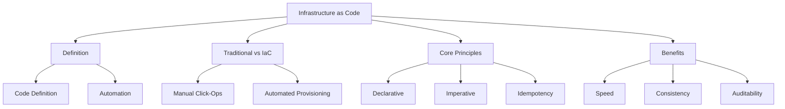

# Migration in progress
# Lesson 1: Introduction to Infrastructure as Code

Infrastructure as Code (IaC) is the practice of managing and provisioning computing infrastructure through machine-readable definition files, rather than physical hardware configuration or interactive configuration tools. This lesson defines IaC, contrasts it with traditional manual methods, explains the core principles of declarative vs. imperative approaches, and highlights the business value of treating infrastructure as software.

## What Is Infrastructure as Code?

IaC is a key DevOps practice that enables IT teams to manage infrastructure in an automated way. Instead of manually configuring servers, networks, and databases via a graphical user interface (GUI), engineers write code that describes the desired state of the infrastructure.

-   **Machine-Readable Files**: Infrastructure is defined in text files (JSON, YAML, HCL, Python, etc.).
-   **Version Controlled**: These files are stored in source control systems like Git.
-   **Automated Execution**: Tools read these files and automatically provision or update resources to match the definition.
-   **Reproducible**: The same code can create identical environments anywhere, anytime.

> [!Important]
> **Infrastructure is Software**: Treat your infrastructure definitions with the same rigor as your application code. Review it, test it, version it, and deploy it via pipelines. This mindset shift is the foundation of modern cloud engineering.

## Traditional Operations vs. IaC

Understanding the contrast helps clarify why IaC is necessary for scalable cloud operations.

### Traditional Manual Operations (Click-Ops)

-   **Process**: Engineers log into the AWS Console and manually click through wizards to create resources.
-   **Documentation**: Often outdated or non-existent. Relies on tribal knowledge.
-   **Consistency**: Prone to human error. "Snowflake servers" emerge where each instance is slightly different.
-   **Speed**: Slow and labor-intensive. Scaling requires repetitive manual work.
-   **Auditability**: Difficult to track who changed what and when. No clear history.

### Infrastructure as Code

-   **Process**: Engineers write code templates and execute them via CLI or CI/CD pipelines.
-   **Documentation**: Code serves as living, up-to-date documentation.
-   **Consistency**: Identical environments every time. Eliminates configuration drift.
-   **Speed**: Rapid provisioning. Entire environments can be spun up in minutes.
-   **Auditability**: Full Git history shows every change, who made it, and why.

| Dimension | Traditional Ops | Infrastructure as Code |
|---|---|---|
| **Method** | Manual GUI interaction | Automated code execution |
| **Error Rate** | High (human error) | Low (automated validation) |
| **Reproducibility** | Poor | Excellent |
| **Scalability** | Limited by human capacity | Unlimited |
| **Collaboration** | Siloed | Shared via Git |
| **Recovery** | Slow manual rebuild | Fast automated redeploy |

## Core Principles of IaC

Three fundamental concepts underpin effective IaC implementation.

### Declarative vs. Imperative

-   **Declarative (What)**: You define the *desired end state*. The tool determines how to achieve it.
    -   Example: "I want three EC2 instances running."
    -   Tools: AWS CloudFormation, Terraform.
    -   Benefit: Simpler, handles dependencies automatically, idempotent.
-   **Imperative (How)**: You define the *specific steps* to reach the state.
    -   Example: "Create instance 1, then instance 2, then instance 3."
    -   Tools: Shell scripts, Ansible (partially).
    -   Benefit: Fine-grained control, but complex and prone to errors if steps fail.

> [!Tip]
> **Prefer Declarative Models**: Declarative IaC is generally preferred because it abstracts away the complexity of ordering and dependencies. If a resource already exists, the tool simply verifies it matches the definition. If not, it creates it. This leads to more robust and maintainable code.

### Idempotency

-   Applying the same configuration multiple times produces the same result.
-   If resources already exist and match the code, no changes are made.
-   If resources differ, only the necessary changes are applied.
-   Prevents duplicate resources and unintended side effects.
-   Essential for reliable automation and retry logic.

### Single Source of Truth

-   The code repository is the authoritative record of infrastructure.
-   Manual changes outside of code are considered "drift" and should be avoided.
-   Drift detection tools identify when actual state differs from code.
-   Corrections are made by updating the code, not the console.

## Benefits of Infrastructure as Code

Adopting IaC delivers tangible technical and business advantages.

### Speed and Agility

-   Provision resources in minutes instead of days.
-   Enable self-service for developers to create test environments.
-   Accelerate time-to-market for new features.
-   Facilitate rapid experimentation and teardown.

### Consistency and Reliability

-