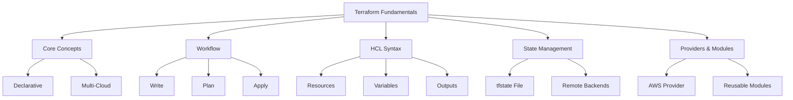
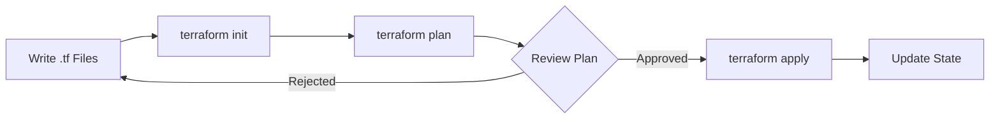

# Lesson 2: Terraform Fundamentals

Terraform is an open-source Infrastructure as Code (IaC) tool created by HashiCorp. It uses a declarative configuration language called HCL (HashiCorp Configuration Language) to define infrastructure across multiple cloud providers. This lesson covers core Terraform concepts, the workflow, state management, and basic syntax for provisioning AWS resources. Understanding these fundamentals is essential for managing portable, version-controlled infrastructure.

## Core Concepts of Terraform

Terraform operates on several key principles that distinguish it from other IaC tools.

### Declarative Configuration

-   You define the desired end state of your infrastructure.
-   Terraform calculates the necessary steps to reach that state.
-   No need to script creation order or handle dependencies manually.
-   Updates are idempotent; applying the same config twice changes nothing if state matches.

### Multi-Cloud Portability

-   Uses provider plugins to interact with APIs of different clouds.
-   Same workflow and language for AWS, Azure, GCP, Kubernetes, etc.
-   Enables hybrid and multi-cloud strategies without learning new tools.
-   Community-driven ecosystem provides thousands of providers.

### Execution Plan

-   Terraform generates a plan before making any changes.
-   Shows exactly what will be created, modified, or destroyed.
-   Allows review and approval before execution.
-   Prevents accidental deletions or unexpected modifications.

> [!Important]
> **Always review the plan**: Never run `terraform apply` without reviewing `terraform plan` first. The plan is your safety net against unintended destruction of production resources. Treat the plan output as a critical code review artifact.

## The Terraform Workflow

The standard Terraform workflow consists of four distinct phases.

### Write

-   Define infrastructure in `.tf` files using HCL.
-   Organize code into logical modules and directories.
-   Use variables for dynamic values and outputs for sharing data.
-   Validate syntax with `terraform validate`.

### Init

-   Run `terraform init` to initialize the working directory.
-   Downloads required provider plugins.
-   Configures backend for state storage.
-   Must be run whenever providers or backend configuration change.

### Plan

-   Run `terraform plan` to preview changes.
-   Compares current state with desired configuration.
-   Outputs a detailed execution plan.
-   Can save plan to a file for later application (`-out=plan.tfplan`).

### Apply

-   Run `terraform apply` to execute the plan.
-   Creates, updates, or deletes resources to match config.
-   Updates state file upon successful completion.
-   Can auto-approve with `-auto-approve` flag (use cautiously).

## HCL Syntax Basics

HashiCorp Configuration Language is designed to be human-readable and machine-friendly.

### Resources

-   Fundamental building block representing an infrastructure object.
-   Syntax: `resource "type" "name" { ... }`
-   Example: `resource "aws_s3_bucket" "logs" { bucket = "my-logs" }`
-   Type defines the resource kind; name is a local identifier.

### Variables

-   Parameterize configurations for reusability.
-   Defined in `variables.tf` or inline.
-   Types: string, number, bool, list, map, object.
-   Set via CLI flags, environment variables, or `.tfvars` files.

### Outputs

-   Expose specific values from your configuration.
-   Useful for passing data between modules or displaying info.
-   Defined in `outputs.tf`.
-   Accessible via `terraform output` command.

### Data Sources

-   Fetch information about existing external resources.
-   Read-only; does not create or modify anything.
-   Syntax: `data "type" "name" { ... }`
-   Example: Look up latest AMI ID or existing VPC ID.

| Block Type | Purpose | Mutability | Example |
|---|---|---|---|
| Resource | Create/manage infrastructure | Mutable | `aws_instance` |
| Data Source | Read existing infrastructure | Immutable | `aws_ami` |
| Variable | Input parameterization | N/A | `var.instance_type` |
| Output | Export values | N/A | `output.ip_address` |

## State Management

State is Terraform's record of what it manages. Proper state handling is critical for team collaboration.

### Local State

-   Default storage in `terraform.tfstate` file.
-   Suitable only for individual experimentation.
-   Risky for teams due to potential overwrites and loss.
-   Contains sensitive data; never commit to Git.

### Remote Backends

-   Store state in shared location like S3, Consul, or Terraform Cloud.
-   Enables team collaboration and CI/CD integration.
-   Supports state locking to prevent concurrent modifications.
-   Recommended backend for AWS: S3 bucket + DynamoDB table for locking.

### State Locking

-   Prevents corruption from simultaneous applies.
-   DynamoDB table stores lock ID during operations.
-   Automatically acquired and released by Terraform.
-   Manual unlock available if process crashes (`terraform force-unlock`).

> [!Tip]
> **Encrypt your state file**: State files often contain secrets (passwords, keys). Always enable server-side encryption on S3 buckets used for remote state. Restrict IAM access to the state bucket strictly. Consider using Terraform Cloud or Enterprise for enhanced secret management.

## Providers and Modules

Extensibility mechanisms that make Terraform powerful and reusable.

### Providers

-   Plugins that translate HCL into API calls for specific platforms.
-   Declared in `required_providers` block.
-   Version constraints ensure compatibility.
-   AWS provider offers hundreds of resource types.

### Modules

-   Containers for multiple resources used together.
-   Promote reuse and encapsulation.
-   Root module is the entry point; child modules are called within.
-   Public Registry hosts community-contributed modules.
-   Best practice: Create internal modules for organizational standards.

### Module Structure

-   `main.tf`: Primary resource definitions.
-   `variables.tf`: Input variable declarations.
-   `outputs.tf`: Output value definitions.
-   `README.md`: Documentation on usage and examples.

## Assessment Preparation

### Practice Questions

1.  What is the primary advantage of Terraform’s declarative model?
2.  Describe the four steps of the Terraform workflow.
3.  Why should you never commit `terraform.tfstate` to version control?
4.  How does state locking prevent corruption in team environments?
5.  What is the difference between a resource and a data source?
6.  Explain the purpose of variables and outputs in HCL.
7.  Why is `terraform init` necessary before planning or applying?
8.  How do modules promote reusability in Terraform?
9.  What backend configuration is recommended for AWS teams?
10. How does Terraform handle dependencies between resources?

### Scenario Questions

**Scenario 1: Accidental Resource Deletion**
A junior engineer runs apply and deletes a production database.

-   Implement mandatory plan reviews before apply.
-   Use `-out` flag to save plans and apply saved plans only.
-   Enable deletion protection on critical resources.
-   Use lifecycle rules to prevent destroy (`prevent_destroy = true`).
-   Require approval gates in CI/CD pipeline.

**Scenario 2: Team Collaboration Issues**
Two engineers overwrite each other’s changes frequently.

-   Migrate to remote backend (S3 + DynamoDB).
-   Enable state locking to serialize operations.
-   Enforce workflow through CI/CD rather than local applies.
-   Use workspaces or separate state files per environment.
-   Educate team on proper state management practices.

**Scenario 3: Hardcoded Values**
Configuration has hardcoded region and instance type everywhere.

-   Extract values to input variables.
-   Create `.tfvars` files per environment.
-   Use variable validation blocks for allowed values.
-   Document variables with descriptions and defaults.
-   Refactor to use modules for standardized patterns.

**Scenario 4: Repeated Code Blocks**
Same VPC configuration copied across five projects.

-   Create a reusable VPC module.
-   Parameterize CIDR blocks, subnets, and tags.
-   Publish to private registry or Git repo.
-   Reference module in projects with specific inputs.
-   Version modules to manage breaking changes.

**Scenario 5: Secret Exposure**
Database password visible in plain text in state file.

-   Never put secrets in `.tf` files directly.
-   Use AWS Secrets Manager or SSM Parameter Store.
-   Reference secrets dynamically via data sources.
-   Encrypt state backend with KMS.
-   Mark sensitive outputs with `sensitive = true`.

## Key Takeaways

-   Terraform uses declarative HCL to define desired infrastructure state.
-   Workflow is Write → Init → Plan → Apply with explicit review step.
-   State tracks managed resources; must be stored remotely for teams.
-   State locking via DynamoDB prevents concurrent modification corruption.
-   Resources create infrastructure; data sources read existing infrastructure.
-   Variables parameterize configs; outputs expose values.
-   Providers enable multi-cloud support via plugins.
-   Modules encapsulate and reuse infrastructure patterns.
-   Never commit state files or secrets to version control.
-   Always review plans before applying changes to production.

> [!Important]
> **Plan is your contract**: The execution plan is the most important output in Terraform. It tells you exactly what will happen before anything changes. Make plan review a non-negotiable part of your deployment process. Save plans to files and apply those specific files in automation to ensure what was reviewed is exactly what gets deployed. This eliminates drift between review and execution.
