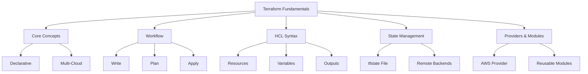
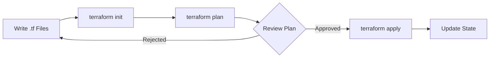

# Migration in progress
# Lesson 2: Terraform Fundamentals

Terraform is an open-source Infrastructure as Code (IaC) tool created by HashiCorp. It uses a declarative configuration language called HCL (HashiCorp Configuration Language) to define infrastructure across multiple cloud providers. This lesson covers core Terraform concepts, the workflow, state management, and basic syntax for provisioning AWS resources. Understanding these fundamentals is essential for managing portable, version-controlled infrastructure.

## Core Concepts of Terraform

Terraform operates on several key principles that distinguish it from other IaC tools.

### Declarative Configuration

-   You define the desired end state of your infrastructure.
-   Terraform calculates the necessary steps to reach that state.
-   No need to script creation order or handle dependencies manually.
-   Updates are idempotent; applying the same config twice changes nothing if state matches.

### Multi-Cloud Portability

-   Uses provider plugins to interact with APIs of different clouds.
-   Same workflow and language for AWS, Azure, GCP, Kubernetes, etc.
-   Enables hybrid and multi-cloud strategies without learning new tools.
-   Community-driven ecosystem provides thousands of providers.

### Execution Plan

-   Terraform generates a plan before making any changes.
-   Shows exactly what will be created, modified, or destroyed.
-   Allows review and approval before execution.
-   Prevents accidental deletions or unexpected modifications.

> [!Important]
> **Always review the plan**: Never run `terraform apply` without reviewing `terraform plan` first. The plan is your safety net against unintended destruction of production resources. Treat the plan output as a critical code review artifact.

## The Terraform Workflow

The standard Terraform workflow consists of four distinct phases.

### Write

-   Define infrastructure in `.tf` files using HCL.
-   Organize code into logical modules and directories.
-   Use variables for dynamic values and outputs for sharing data.
-   Validate syntax with `terraform validate`.

### Init

-   Run `terraform init` to initialize the working directory.
-   Downloads required provider plugins.
-   Configures backend for state storage.
-   Must be run whenever providers or backend configuration change.

### Plan

-   Run `terraform plan` to preview changes.
-   Compares current state with desired configuration.
-   Outputs a detailed execution plan.
-   Can save plan to a file for later application (`-out=plan.tfplan`).

### Apply

-   Run `terraform apply` to execute the plan.
-   Creates, updates, or deletes resources to match config.
-   Updates state file upon successful completion.
-   Can auto-approve with `-auto-approve` flag (use cautiously).

## HCL Syntax Basics

HashiCorp Configuration Language is designed to be human-readable and machine-friendly.

### Resources

-   Fundamental building block representing an infrastructure object.
-   Syntax: `resource "type" "name" { ... }`
-   Example: `resource "aws_s3_bucket" "logs" { bucket = "my-logs" }`
-   Type defines the resource kind; name is a local identifier.

### Variables

-   Parameterize configurations for reusability.
-   Defined in `variables.tf` or inline.
-   Types: string, number, bool, list, map, object.
-   Set via CLI flags, environment variables, or `.tfvars` files.

### Outputs

-   Expose specific values from your configuration.
-   Useful for passing data between modules or displaying info.
-   Defined in `outputs.tf`.
-   Accessible via `terraform output` command.

### Data Sources

-   Fetch information about existing external resources.
-   Read-only; does not create or modify anything.
-   Syntax: `data "type" "name" { ... }`
-   Example: Look up latest AMI ID or existing VPC ID.

| Block Type | Purpose | Mutability | Example |
|---|---|---|---|
| Resource | Create/manage infrastructure | Mutable | `aws_instance` |
| Data Source | Read existing infrastructure | Immutable | `aws_ami` |
| Variable | Input parameterization | N/A | `var.instance_type` |
| Output | Export values | N/A | `output.ip_address` |

## State Management

State is Terraform's record of what it manages. Proper state handling is critical for team collaboration.

### Local State

-   Default storage in `terraform.tfstate` file.
-   Suitable only for individual experimentation.
-   Risky for teams due to potential overwrites and loss.
-   Contains sensitive data; never commit to Git.

### Remote Backends

-   Store st