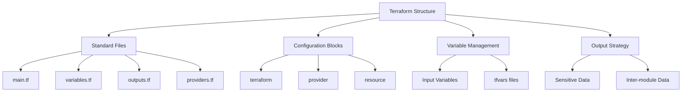

# Migration in progress
# Lesson 3: Terraform Configuration Structure

A well-structured Terraform configuration is essential for maintainability, readability, and collaboration. This lesson details the standard file organization, the role of each configuration block, how to manage variables and outputs effectively, and best practices for organizing complex projects. Understanding this structure allows you to build scalable infrastructure code that is easy to debug and extend.



## Standard File Organization

While Terraform loads all `.tf` files in a directory, adopting a consistent naming convention improves clarity.

### main.tf

-   Contains the primary resource definitions.
-   Defines the core infrastructure components (VPC, EC2, S3).
-   Keeps the "what" of the infrastructure clear.
-   Should not contain variable declarations or provider configurations.

### variables.tf

-   Declares all input variables used in the module.
-   Defines type, description, default values, and validation rules.
-   Centralizes parameterization for the configuration.
-   Makes it easy to see what inputs are required.

### outputs.tf

-   Defines values exported by the module.
-   Used to pass data to other modules or display information after apply.
-   Mark sensitive outputs to hide them from CLI logs.
-   Documents what information is available from this infrastructure.

### providers.tf

-   Configures the required providers and their versions.
-   Uses `required_providers` block to enforce version constraints.
-   Ensures consistent behavior across different environments.
-   Separates provider logic from resource logic.

### backend.tf

-   Configures the remote state backend (e.g., S3).
-   Defines encryption, locking, and bucket details.
-   Often kept separate to allow easy switching between local and remote state.
-   May contain sensitive access keys if not using IAM roles.

| File | Purpose | Content Example |
|---|---|---|
| `main.tf` | Resource Definitions | `resource "aws_instance" "web" { ... }` |
| `variables.tf` | Input Parameters | `variable "instance_type" { ... }` |
| `outputs.tf` | Exported Values | `output "public_ip" { ... }` |
| `providers.tf` | Provider Setup | `terraform { required_providers { ... } }` |
| `backend.tf` | State Storage | `terraform { backend "s3" { ... } }` |

> [!Tip]
> **Consistency is key**: Stick to this standard file structure across all projects. It allows team members to instantly know where to look for resources, variables, or outputs. Avoid creating too many small files; group related resources logically within `main.tf` or split into logical modules if complexity grows.

## Core Configuration Blocks

Terraform configuration is built from several distinct block types.

### terraform Block

-   Settings for Terraform itself.
-   Defines `required_version` to ensure compatible CLI version.
-   Configures `backend` for state storage.
-   Specifies `required_providers` with source and version constraints.
-   Example: `terraform { required_version = ">= 1.0" }`

### provider Block

-   Configures the specific cloud provider plugin.
-   Sets region, alias, or authentication details.
-   Usually minimal when using environment variables or IAM roles.
-   Example: `provider "aws" { region = "us-east-1" }`

### resource Block

-   The most common block; defines an infrastructure object.
-   Syntax: `resource "<TYPE>" "<NAME>" { <CONFIG> }`
-   Type is specific to the provider (e.g., `aws_s3_bucket`).
-   Name is a local identifier for referencing within the module.
-   Attributes define the specific settings of the resource.

### data Block

-   Fetches information about existing external resources.
-   Read-only; does not create or modify anything.
-   Useful for looking up AMI IDs, VPC IDs, or account info.
-   Syntax: `data "<TYPE>" "<NAME>" { <FILTERS> }`

## Variable Management

Variables make your configuration reusable and flexible.

### Input Variables

-   Defined in `variables.tf`.
-   Types: `string`, `number`, `bool`, `list`, `map`, `object`.
-   Use `description` to document purpose.
-   Use `default` for optional values.
-   Use `validation` block to enforce constraints (e.g., regex for instance type).

### Variable Precedence

1.  Environment variables (`TF_VAR_name`).
2.  `.tfvars` files specified via `-var-file`.
3.  `.tfvars.json` files.
4.  Default values in variable definition.

### tfvars Files

-   Store actual values for variables.
-   `dev.tfvars`, `prod.tfvars` for environment-specific configs.
-   Never commit sensitive values (passwords) to Git.
-   Use `.gitignore` to exclude personal or secret tfvars files.

```hcl
variable "instance_type" {
  description = "EC2 instance type"
  type        = string
  default     = "t3.micro"
  
  validation {
    condition     = can(regex("^t[23]\\.", var.instance_type))
    error_message = "Instance type must be t2 or t3 series."
  }
}
```

> [!Important]
> **Validate early**: Use validation blocks in variable definitions to catch errors before the p