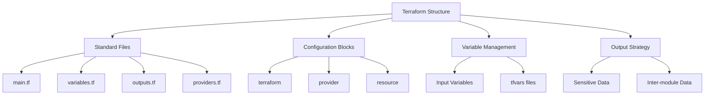

# Lesson 3: Terraform Configuration Structure

A well-structured Terraform configuration is essential for maintainability, readability, and collaboration. This lesson details the standard file organization, the role of each configuration block, how to manage variables and outputs effectively, and best practices for organizing complex projects. Understanding this structure allows you to build scalable infrastructure code that is easy to debug and extend.



## Standard File Organization

While Terraform loads all `.tf` files in a directory, adopting a consistent naming convention improves clarity.

### main.tf

-   Contains the primary resource definitions.
-   Defines the core infrastructure components (VPC, EC2, S3).
-   Keeps the "what" of the infrastructure clear.
-   Should not contain variable declarations or provider configurations.

### variables.tf

-   Declares all input variables used in the module.
-   Defines type, description, default values, and validation rules.
-   Centralizes parameterization for the configuration.
-   Makes it easy to see what inputs are required.

### outputs.tf

-   Defines values exported by the module.
-   Used to pass data to other modules or display information after apply.
-   Mark sensitive outputs to hide them from CLI logs.
-   Documents what information is available from this infrastructure.

### providers.tf

-   Configures the required providers and their versions.
-   Uses `required_providers` block to enforce version constraints.
-   Ensures consistent behavior across different environments.
-   Separates provider logic from resource logic.

### backend.tf

-   Configures the remote state backend (e.g., S3).
-   Defines encryption, locking, and bucket details.
-   Often kept separate to allow easy switching between local and remote state.
-   May contain sensitive access keys if not using IAM roles.

| File | Purpose | Content Example |
|---|---|---|
| `main.tf` | Resource Definitions | `resource "aws_instance" "web" { ... }` |
| `variables.tf` | Input Parameters | `variable "instance_type" { ... }` |
| `outputs.tf` | Exported Values | `output "public_ip" { ... }` |
| `providers.tf` | Provider Setup | `terraform { required_providers { ... } }` |
| `backend.tf` | State Storage | `terraform { backend "s3" { ... } }` |

> [!Tip]
> **Consistency is key**: Stick to this standard file structure across all projects. It allows team members to instantly know where to look for resources, variables, or outputs. Avoid creating too many small files; group related resources logically within `main.tf` or split into logical modules if complexity grows.

## Core Configuration Blocks

Terraform configuration is built from several distinct block types.

### terraform Block

-   Settings for Terraform itself.
-   Defines `required_version` to ensure compatible CLI version.
-   Configures `backend` for state storage.
-   Specifies `required_providers` with source and version constraints.
-   Example: `terraform { required_version = ">= 1.0" }`

### provider Block

-   Configures the specific cloud provider plugin.
-   Sets region, alias, or authentication details.
-   Usually minimal when using environment variables or IAM roles.
-   Example: `provider "aws" { region = "us-east-1" }`

### resource Block

-   The most common block; defines an infrastructure object.
-   Syntax: `resource "<TYPE>" "<NAME>" { <CONFIG> }`
-   Type is specific to the provider (e.g., `aws_s3_bucket`).
-   Name is a local identifier for referencing within the module.
-   Attributes define the specific settings of the resource.

### data Block

-   Fetches information about existing external resources.
-   Read-only; does not create or modify anything.
-   Useful for looking up AMI IDs, VPC IDs, or account info.
-   Syntax: `data "<TYPE>" "<NAME>" { <FILTERS> }`

## Variable Management

Variables make your configuration reusable and flexible.

### Input Variables

-   Defined in `variables.tf`.
-   Types: `string`, `number`, `bool`, `list`, `map`, `object`.
-   Use `description` to document purpose.
-   Use `default` for optional values.
-   Use `validation` block to enforce constraints (e.g., regex for instance type).

### Variable Precedence

1.  Environment variables (`TF_VAR_name`).
2.  `.tfvars` files specified via `-var-file`.
3.  `.tfvars.json` files.
4.  Default values in variable definition.

### tfvars Files

-   Store actual values for variables.
-   `dev.tfvars`, `prod.tfvars` for environment-specific configs.
-   Never commit sensitive values (passwords) to Git.
-   Use `.gitignore` to exclude personal or secret tfvars files.

```hcl
variable "instance_type" {
  description = "EC2 instance type"
  type        = string
  default     = "t3.micro"
  
  validation {
    condition     = can(regex("^t[23]\\.", var.instance_type))
    error_message = "Instance type must be t2 or t3 series."
  }
}
```

> [!Important]
> **Validate early**: Use validation blocks in variable definitions to catch errors before the plan phase. This provides immediate feedback to users if they provide invalid inputs, saving time and preventing failed deployments.

## Output Strategy

Outputs expose data from your infrastructure for use elsewhere.

### Purposes of Outputs

-   **Inter-module Communication**: Pass VPC ID from network module to compute module.
-   **User Information**: Display public IP addresses or DNS names after apply.
-   **CI/CD Integration**: Provide values to subsequent pipeline steps.

### Sensitive Outputs

-   Mark outputs containing secrets with `sensitive = true`.
-   Hides value in CLI output and logs.
-   Does not encrypt value in state file; rely on backend encryption.
-   Example: Database passwords, API keys.

### Formatting Outputs

-   Use `description` to explain what the output represents.
-   Keep outputs minimal; only export what is needed.
-   Avoid exporting large lists or maps unless necessary.

```hcl
output "web_server_ip" {
  description = "Public IP of the web server"
  value       = aws_instance.web.public_ip
  sensitive   = false
}
```

## Best Practices for Structure

### Modular Design

-   Break large configurations into smaller, reusable modules.
-   Each module should have its own `variables.tf` and `outputs.tf`.
-   Root module calls child modules to compose the full architecture.
-   Promotes reuse and simplifies testing.

### Documentation

-   Include `README.md` in every module.
-   Document required variables, outputs, and usage examples.
-   Use `description` fields in variables and outputs.
-   Keep documentation up-to-date with code changes.

### Version Pinning

-   Pin provider versions to avoid breaking changes.
-   Use `~>` operator for patch updates (e.g., `~> 4.0`).
-   Regularly update versions in controlled manner.
-   Test upgrades in non-production environments first.

### Logical Grouping

-   Group related resources in same file if small project.
-   Split by resource type (networking, compute, storage) if large.
-   Use comments to separate sections within `main.tf`.
-   Maintain consistent indentation and formatting.

## Assessment Preparation

### Practice Questions

1.  What is the purpose of `variables.tf` vs `main.tf`?
2.  Explain the role of the `terraform` block.
3.  How do you pass values from one module to another?
4.  Why should you mark certain outputs as sensitive?
5.  What is the precedence order for variable values?
6.  How does `required_providers` help in team environments?
7.  What is the difference between a resource and a data block?
8.  Why is it recommended to use `.tfvars` files?
9.  How do you validate input variables in Terraform?
10. What is the benefit of splitting configuration into multiple files?

### Scenario Questions

**Scenario 1: Unreadable Monolith**
Single `main.tf` file has 2000 lines of mixed resources.

-   Split into `main.tf`, `variables.tf`, `outputs.tf`.
-   Group resources by logical function (networking, compute).
-   Extract repeated patterns into child modules.
-   Add comments and documentation.
-   Improve maintainability and review process.

**Scenario 2: Hardcoded Secrets**
Database password hardcoded in `main.tf`.

-   Move password to input variable.
-   Mark variable as sensitive.
-   Pass value via environment variable or secure vault.
-   Mark output as sensitive if displayed.
-   Ensure state file is encrypted at rest.

**Scenario 3: Inconsistent Environments**
Dev and Prod use different variable values manually.

-   Create `dev.tfvars` and `prod.tfvars`.
-   Define all variables in `variables.tf` with defaults.
-   Use `-var-file` flag in CI/CD pipeline.
-   Ensure same code base for both environments.
-   Validate values using validation blocks.

**Scenario 4: Missing Documentation**
New joiner cannot understand the module inputs.

-   Add `description` to every variable.
-   Create `README.md` with usage examples.
-   Document outputs and their purposes.
-   Include example `.tfvars` files.
-   Review documentation during code reviews.

**Scenario 5: Provider Version Conflict**
Team members use different provider versions causing drift.

-   Add `required_providers` block in `providers.tf`.
-   Pin version to specific range (e.g., `~> 4.50`).
-   Run `terraform init -upgrade` to align versions.
-   Commit `.terraform.lock.hcl` to Git.
-   Enforce version check in CI pipeline.

## Key Takeaways

-   Standard file structure (`main`, `variables`, `outputs`) improves readability.
-   `terraform` block manages version constraints and backend config.
-   Variables parameterize configurations; use validation for safety.
-   Outputs expose data for inter-module communication and user info.
-   Mark sensitive outputs to prevent secret leakage in logs.
-   Use `.tfvars` files to manage environment-specific values.
-   Modular design promotes reuse and simplifies complex architectures.
-   Documentation is critical for team collaboration and onboarding.
-   Pin provider versions to ensure consistent behavior.
-   Logical grouping and comments make code easier to maintain.

> [!Important]
> **Structure enables scale**: A messy configuration works for small tests but fails in production teams. Invest time in proper structure early. Separate concerns into logical files, document everything, and enforce consistency. Good structure makes code reviews faster, debugging easier, and onboarding smoother. Treat your Terraform code with the same architectural rigor as your application code.
