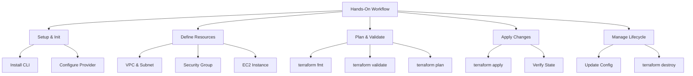

# Lesson 4: Terraform Hands-On

This lesson provides a practical guide to writing, validating, and deploying infrastructure using Terraform. It walks through the creation of a basic AWS environment, including networking and compute resources. The focus is on applying theoretical concepts from previous lessons into executable code, managing state, and handling common operational tasks like updates and destruction.



## Step 1: Environment Setup

Before writing code, ensure your local environment is ready to interact with AWS.

### Prerequisites

-   **Terraform CLI**: Installed and added to system PATH. Verify with `terraform version`.
-   **AWS CLI**: Configured with valid credentials (`aws configure`).
-   **IAM Permissions**: User/Role must have permissions to create VPC, EC2, and Security Groups.

### Directory Structure

Create a new directory for your project. Inside, create the standard files:
-   `providers.tf`: Defines the AWS provider.
-   `main.tf`: Contains resource definitions.
-   `variables.tf`: Defines input parameters.
-   `outputs.tf`: Defines exported values.

### Provider Configuration

In `providers.tf`, specify the AWS provider and region.

```hcl
terraform {
  required_providers {
    aws = {
      source  = "hashicorp/aws"
      version = "~> 5.0"
    }
  }
}

provider "aws" {
  region = "us-east-1"
}
```

> [!Important]
> **Run terraform init**: After creating `providers.tf`, run `terraform init`. This command downloads the AWS provider plugin and initializes the backend. You must run this before any other Terraform command.

## Step 2: Defining Basic Resources

We will build a simple web server infrastructure: a VPC, a Security Group, and an EC2 instance.

### Networking (VPC and Subnet)

Define a Virtual Private Cloud and a public subnet within it.

```hcl
resource "aws_vpc" "main" {
  cidr_block           = "10.0.0.0/16"
  enable_dns_support   = true
  enable_dns_hostnames = true

  tags = {
    Name = "terraform-vpc"
  }
}

resource "aws_subnet" "public" {
  vpc_id            = aws_vpc.main.id
  cidr_block        = "10.0.1.0/24"
  availability_zone = "us-east-1a"

  tags = {
    Name = "terraform-public-subnet"
  }
}
```

### Security Group

Allow HTTP traffic from the internet and SSH from your IP.

```hcl
resource "aws_security_group" "web_sg" {
  name        = "web-sg"
  description = "Allow HTTP and SSH"
  vpc_id      = aws_vpc.main.id

  ingress {
    from_port   = 80
    to_port     = 80
    protocol    = "tcp"
    cidr_blocks = ["0.0.0.0/0"]
  }

  ingress {
    from_port   = 22
    to_port     = 22
    protocol    = "tcp"
    cidr_blocks = ["0.0.0.0/0"] # Restrict in production
  }

  egress {
    from_port   = 0
    to_port     = 0
    protocol    = "-1"
    cidr_blocks = ["0.0.0.0/0"]
  }
}
```

### EC2 Instance

Launch a t2.micro instance using the latest Amazon Linux 2 AMI.

```hcl
data "aws_ami" "amazon_linux" {
  most_recent = true
  owners      = ["amazon"]

  filter {
    name   = "name"
    values = ["amzn2-ami-hvm-*-x86_64-gp2"]
  }
}

resource "aws_instance" "web_server" {
  ami                    = data.aws_ami.amazon_linux.id
  instance_type          = "t2.micro"
  subnet_id              = aws_subnet.public.id
  vpc_security_group_ids = [aws_security_group.web_sg.id]

  tags = {
    Name = "terraform-web-server"
  }
}
```

## Step 3: Variables and Outputs

Make the configuration flexible and retrieve useful information after deployment.

### Input Variables

In `variables.tf`, allow users to customize the instance type.

```hcl
variable "instance_type" {
  description = "EC2 instance type"
  type        = string
  default     = "t2.micro"
}
```

Update `aws_instance` resource to use `var.instance_type`.

### Outputs

In `outputs.tf`, display the public IP address.

```hcl
output "web_server_public_ip" {
  description = "Public IP address of the web server"
  value       = aws_instance.web_server.public_ip
}
```

## Step 4: Validation and Planning

Never apply changes without verifying them first.

### Formatting

Run `terraform fmt` to automatically format code according to standard conventions. This ensures consistency across team members.

### Validation

Run `terraform validate` to check for syntax errors and internal consistency. This does not access AWS; it only checks the local configuration.

### Planning

Run `terraform plan`. This connects to AWS, reads the current state, and compares it with your code.
-   **Green (+)**: Resources to be created.
-   **Yellow (~)**: Resources to be modified.
-   **Red (-)**: Resources to be destroyed.

Review the plan carefully to ensure no unintended deletions occur.

> [!Tip]
> **Save the plan**: Use `terraform plan -out=tfplan` to save the execution plan to a file. Then use `terraform apply tfplan` to apply exactly what was reviewed. This prevents drift between planning and applying.

## Step 5: Applying and Managing State

### Apply Changes

Run `terraform apply`. Terraform will show the plan again and ask for confirmation. Type `yes` to proceed.
-   Terraform creates resources in the correct order based on dependencies.
-   Upon success, it updates the `terraform.tfstate` file.

### Verify State

Check `terraform.tfstate` (or remote backend) to see the recorded IDs and attributes of created resources. Never edit this file manually.

### Accessing Outputs

Run `terraform output` to see the public IP address of your web server. You can use this IP to SSH into the instance or test HTTP connectivity.

## Step 6: Updating and Destroying

### Making Changes

Change the `instance_type` variable to `t3.small` in your `variables.tf` or via `-var`.
1.  Run `terraform plan` to see that the instance will be replaced (since some attributes require replacement).
2.  Run `terraform apply` to execute the change.

### Destruction

When done, run `terraform destroy`.
-   Reviews all managed resources.
-   Asks for confirmation.
-   Deletes all resources in reverse dependency order.
-   Removes them from the state file.

> [!Important]
> **Destroy with caution**: In production, never run `terraform destroy` directly. Instead, remove specific resources from the code and apply to let Terraform handle the lifecycle gracefully. Use `destroy` only for temporary environments or full teardowns.

## Assessment Preparation

### Practice Questions

1.  What is the purpose of `terraform init`?
2.  How do you reference a resource attribute in another resource?
3.  Why is `terraform plan` critical before applying?
4.  What does `terraform fmt` do?
5.  How do you pass a variable value during apply?
6.  What is the role of a `data` source?
7.  How do you view outputs after deployment?
8.  What happens if you manually delete a resource created by Terraform?
9.  How do you update an existing resource without destroying it?
10. Why should you restrict SSH access in security groups?

### Scenario Questions

**Scenario 1: Syntax Error**
`terraform validate` fails with "Unsupported argument".

-   Check spelling of resource types and arguments.
-   Refer to AWS Provider documentation for correct syntax.
-   Ensure brackets and quotes are balanced.
-   Use IDE plugins for real-time linting.

**Scenario 2: Resource Already Exists**
You try to create a VPC with a CIDR that already exists in AWS.

-   Terraform will fail if the resource is not in state.
-   Use `terraform import` to bring existing resource under management.
-   Or, change the CIDR in code to avoid conflict.
-   Never manually delete outside Terraform if it’s managed.

**Scenario 3: Sensitive Output**
You accidentally print a database password in logs.

-   Mark the output as `sensitive = true`.
-   Remove the secret from the code immediately.
-   Rotate the compromised credential.
-   Check Git history to ensure secret wasn’t committed.

**Scenario 4: Dependency Cycle**
Terraform reports a "Cycle" error between two resources.

-   Identify circular references (A depends on B, B depends on A).
-   Break the cycle by removing unnecessary dependencies.
-   Use `depends_on` explicitly only when necessary.
-   Refactor resources to decouple them.

**Scenario 5: Slow Apply**
Creating resources takes a long time.

-   Check AWS service health and limits.
-   Parallelize independent resources where possible.
-   Use `target` flag to apply specific resources first if needed.
-   Monitor CloudWatch logs for underlying AWS delays.

## Key Takeaways

-   `terraform init` downloads providers and initializes backend.
-   `terraform fmt` and `validate` ensure code quality before planning.
-   `terraform plan` previews changes and is essential for safety.
-   `terraform apply` executes changes and updates state.
-   Resources are referenced using `type.name.attribute` syntax.
-   Data sources fetch external information without creating resources.
-   Variables make configurations reusable; outputs expose data.
-   State file tracks managed resources; never edit it manually.
-   `terraform destroy` removes all managed infrastructure.
-   Always verify plans and restrict sensitive data exposure.

> [!Important]
> **Practice makes perfect**: IaC skills are built through repetition. Create small projects, break them, fix them, and destroy them. Experiment with different resource types and modules. The more comfortable you are with the workflow, the more confident you will be in managing production infrastructure. Remember: Plan first, apply second, verify always.
