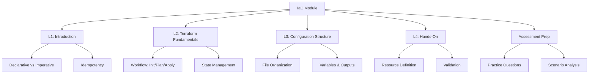

# Lesson 5: Summary and Assessment

This lesson consolidates the key concepts from the Infrastructure as Code (IaC) module. It reviews the progression from foundational principles to practical implementation using Terraform. The goal is to ensure you can define, provision, and manage cloud infrastructure using code, ensuring consistency, reproducibility, and security. This summary serves as a final review before the assessment.

## Module Recap

The module covered four distinct but interconnected areas of IaC on AWS.

### Lesson 1: Introduction to IaC

-   Defined IaC as managing infrastructure through machine-readable files.
-   Contrasted traditional "Click-Ops" with automated code-based provisioning.
-   Introduced core principles: Declarative model, Idempotency, and Single Source of Truth.
-   Highlighted benefits: Speed, consistency, cost optimization, and auditability.
-   Emphasized treating infrastructure with the same rigor as application software.

### Lesson 2: Terraform Fundamentals

-   Introduced Terraform as a multi-cloud, declarative IaC tool.
-   Explained the standard workflow: Write → Init → Plan → Apply.
-   Detailed state management: Local vs. Remote backends (S3 + DynamoDB).
-   Covered HCL syntax basics: Resources, Data Sources, Variables, Outputs.
-   Discussed providers and modules for extensibility and reuse.

### Lesson 3: Terraform Configuration Structure

-   Established standard file organization: `main.tf`, `variables.tf`, `outputs.tf`, `providers.tf`.
-   Detailed configuration blocks: `terraform`, `provider`, `resource`, `data`.
-   Explained variable management: Types, defaults, validation, and `.tfvars` files.
-   Covered output strategies: Inter-module communication and sensitive data handling.
-   Best practices: Modular design, documentation, version pinning, and logical grouping.

### Lesson 4: Terraform Hands-On

-   Walked through setting up the environment and initializing providers.
-   Defined basic AWS resources: VPC, Subnet, Security Group, EC2 Instance.
-   Demonstrated validation (`fmt`, `validate`) and planning (`plan`).
-   Executed deployment (`apply`) and verified state and outputs.
-   Managed lifecycle: Updating configurations and destroying resources safely.

## Key Concepts Matrix

A quick reference table connecting concepts across lessons.

| Concept | Lesson 1 | Lesson 2 | Lesson 3 | Lesson 4 |
|---|---|---|---|---|
| **Definition** | Code-defined infrastructure | HCL Language | File structure (`main.tf`) | Resource blocks |
| **Execution** | Automated provisioning | `terraform apply` | Plan review | Actual deployment |
| **State** | Single source of truth | `tfstate` file | Remote backend (S3) | State verification |
| **Reusability** | Modular design | Modules | Variables/Outputs | Parameterized configs |
| **Safety** | Idempotency | `terraform plan` | Validation/Linting | Dependency management |

## Common Pitfalls and Mitigations

Understanding where things go wrong is as important as knowing how they work.

### Manual Drift

-   **Pitfall**: Making changes via AWS Console instead of code.
-   **Mitigation**: Enforce IaC-only changes. Use AWS Config to detect drift. Restrict console write access. Re-import or update code to match reality if drift occurs.

### State File Corruption

-   **Pitfall**: Multiple users applying changes simultaneously without locking.
-   **Mitigation**: Use remote backends (S3) with state locking (DynamoDB). Serialize applies in CI/CD pipelines. Never share local state files.

### Hardcoded Secrets

-   **Pitfall**: Storing passwords or keys directly in `.tf` files.
-   **Mitigation**: Use variables marked as sensitive. Pass values via environment variables or secret managers (AWS Secrets Manager). Encrypt state backends.

### Unreviewed Plans

-   **Pitfall**: Running `apply` without reviewing the plan, leading to accidental deletions.
-   **Mitigation**: Make plan review mandatory. Save plans to files (`-out`) and apply those specific files. Integrate plan output into Pull Request comments.

### Complex Monoliths

-   **Pitfall**: One giant `main.tf` file with hundreds of resources.
-   **Mitigation**: Break code into modules. Separate networking, compute, and storage. Use consistent file structure. Document modules clearly.

## Assessment Preparation

### Practice Questions

1.  Define Infrastructure as Code and explain its primary benefit over manual operations.
2.  What is the difference between declarative and imperative IaC?
3.  Describe the four steps of the Terraform workflow.
4.  Why is state locking important in team environments?
5.  What is the purpose of `terraform plan`?
6.  How do you pass environment-specific values to Terraform?
7.  Explain the role of a `data` source in Terraform.
8.  Why should you mark certain outputs as `sensitive`?
9.  How does Terraform handle dependencies between resources?
10. What is the risk of committing `terraform.tfstate` to Git?

### Scenario Analysis

**Scenario 1: Startup Adopting Cloud**
Small team wants to avoid manual errors and speed up provisioning.

-   **Strategy**: Start with Terraform for AWS.
-   **Implementation**: Define VPC and EC2 in code. Use local state initially, move to S3 as team grows.
-   **Workflow**: Developers write code, run `plan`, review, then `apply`.
-   **Goal**: Establish reproducible environments for Dev and Prod.

**Scenario 2: Enterprise Compliance**
Strict audit requirements for infrastructure changes.

-   **Strategy**: Full IaC with strict governance.
-   **Implementation**: Remote state with encryption and locking. Policy as Code (OPA/Sentinel) in pipeline.
-   **Workflow**: All changes via Pull Request. Mandatory plan review. Audit trail via Git and CloudTrail.
-   **Goal**: Prove who changed what and when; prevent non-compliant resources.

**Scenario 3: Multi-Environment Management**
Need identical Dev, Staging, and Prod environments.

-   **Strategy**: Modular Terraform with variable files.
-   **Implementation**: Create reusable modules for VPC, App, DB. Use `dev.tfvars`, `prod.tfvars`.
-   **Workflow**: Same code base, different variable inputs. Separate state files per environment.
-   **Goal**: Ensure parity and reduce "works on my machine" issues.

**Scenario 4: Accidental Deletion**
Junior engineer runs `destroy` in production.

-   **Prevention**: Require manual confirmation in CI/CD. Use `prevent_destroy` lifecycle rule on critical resources.
-   **Recovery**: If state is lost, use `terraform import` to regain control. If resources are gone, re-apply code.
-   **Lesson**: Restrict permissions. Use separate accounts for Prod.

**Scenario 5: Secret Exposure in Logs**
Database password appears in CI/CD logs.

-   **Fix**: Mark output variable as `sensitive = true`.
-   **Prevention**: Never print secrets in outputs. Use AWS Secrets Manager for runtime injection.
-   **Cleanup**: Rotate compromised credentials immediately. Check Git history for accidental commits.

## Final Review Checklist

Before taking the assessment, ensure you can:

-   [ ] Define IaC and explain its core principles (Declarative, Idempotent).
-   [ ] List the benefits of IaC over manual operations.
-   [ ] Describe the Terraform workflow (Init, Plan, Apply).
-   [ ] Explain the importance of state management and locking.
-   [ ] Write basic HCL code for AWS resources (EC2, VPC, SG).
-   [ ] Use variables and outputs to parameterize configurations.
-   [ ] Organize Terraform projects using standard file structure.
-   [ ] Validate and format code using `terraform fmt` and `validate`.
-   [ ] Handle sensitive data securely in Terraform.
-   [ ] Troubleshoot common errors like dependency cycles or drift.

## Key Takeaways

-   IaC manages infrastructure through code, enabling automation and reproducibility.
-   Terraform is a declarative, multi-cloud tool using HCL.
-   Workflow is Write → Init → Plan → Apply, with plan review being critical.
-   State tracks managed resources; must be stored remotely and locked for teams.
-   Standard file structure (`main`, `variables`, `outputs`) improves maintainability.
-   Variables make configurations reusable; outputs expose data.
-   Modules encapsulate and reuse infrastructure patterns.
-   Never commit state files or secrets to version control.
-   Manual changes cause drift and should be avoided.
-   IaC accelerates delivery while improving security, compliance, and consistency.

> [!Important]
> **Code is the authority**: Your infrastructure is only as reliable as your code. Treat it with care. Review it, test it, and version it. IaC is not just a tool; it is a discipline that brings engineering rigor to operations. By mastering Terraform and IaC principles, you enable faster, safer, and more scalable cloud deployments. Always plan before you apply, and always verify your state.
