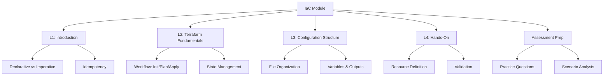

# Migration in progress
# Lesson 5: Summary and Assessment

This lesson consolidates the key concepts from the Infrastructure as Code (IaC) module. It reviews the progression from foundational principles to practical implementation using Terraform. The goal is to ensure you can define, provision, and manage cloud infrastructure using code, ensuring consistency, reproducibility, and security. This summary serves as a final review before the assessment.

## Module Recap

The module covered four distinct but interconnected areas of IaC on AWS.

### Lesson 1: Introduction to IaC

-   Defined IaC as managing infrastructure through machine-readable files.
-   Contrasted traditional "Click-Ops" with automated code-based provisioning.
-   Introduced core principles: Declarative model, Idempotency, and Single Source of Truth.
-   Highlighted benefits: Speed, consistency, cost optimization, and auditability.
-   Emphasized treating infrastructure with the same rigor as application software.

### Lesson 2: Terraform Fundamentals

-   Introduced Terraform as a multi-cloud, declarative IaC tool.
-   Explained the standard workflow: Write → Init → Plan → Apply.
-   Detailed state management: Local vs. Remote backends (S3 + DynamoDB).
-   Covered HCL syntax basics: Resources, Data Sources, Variables, Outputs.
-   Discussed providers and modules for extensibility and reuse.

### Lesson 3: Terraform Configuration Structure

-   Established standard file organization: `main.tf`, `variables.tf`, `outputs.tf`, `providers.tf`.
-   Detailed configuration blocks: `terraform`, `provider`, `resource`, `data`.
-   Explained variable management: Types, defaults, validation, and `.tfvars` files.
-   Covered output strategies: Inter-module communication and sensitive data handling.
-   Best practices: Modular design, documentation, version pinning, and logical grouping.

### Lesson 4: Terraform Hands-On

-   Walked through setting up the environment and initializing providers.
-   Defined basic AWS resources: VPC, Subnet, Security Group, EC2 Instance.
-   Demonstrated validation (`fmt`, `validate`) and planning (`plan`).
-   Executed deployment (`apply`) and verified state and outputs.
-   Managed lifecycle: Updating configurations and destroying resources safely.

## Key Concepts Matrix

A quick reference table connecting concepts across lessons.

| Concept | Lesson 1 | Lesson 2 | Lesson 3 | Lesson 4 |
|---|---|---|---|---|
| **Definition** | Code-defined infrastructure | HCL Language | File structure (`main.tf`) | Resource blocks |
| **Execution** | Automated provisioning | `terraform apply` | Plan review | Actual deployment |
| **State** | Single source of truth | `tfstate` file | Remote backend (S3) | State verification |
| **Reusability** | Modular design | Modules | Variables/Outputs | Parameterized configs |
| **Safety** | Idempotency | `terraform plan` | Validation/Linting | Dependency management |

## Common Pitfalls and Mitigations

Understanding where things go wrong is as important as knowing how they work.

### Manual Drift

-   **Pitfall**: Making changes via AWS Console instead of code.
-   **Mitigation**: Enforce IaC-only changes. Use AWS Config to detect drift. Restrict console write access. Re-import or update code to match reality if drift occurs.

### State File Corruption

-   **Pitfall**: Multiple users applying changes simultaneously without locking.
-   **Mitigation**: Use remote backends (S3) with state locking (DynamoDB). Serialize applies in CI/CD pipelines. Never share local state files.

### Hardcoded Secrets

-   **Pitfall**: Storing passwords or keys directly in `.tf` files.
-   **Mitigation**: Use variables marked as sensitive. Pass values via environment variables or secret managers (AWS Secrets Manager). Encrypt state backends.

### Unreviewed Plans

-   **Pitfall**: Running `apply` without reviewing the plan, leading to accidental deletions.
-   **Mitigation**: Make plan review mandatory. Save plans to files (`-out`) and apply those specific files. Integrate plan output into Pull Request comments.

### Complex Monoliths

-   **Pitfall**: One giant `main.tf` file with hundreds of resources.
-   **