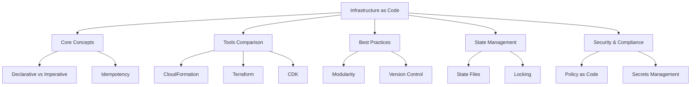

# Migration in progress
# Lesson: Infrastructure as Code (IaC)

Infrastructure as Code (IaC) is the practice of managing and provisioning computing infrastructure through machine-readable definition files, rather than physical hardware configuration or interactive configuration tools. This lesson covers the core concepts of IaC, compares major tools like AWS CloudFormation and Terraform, explores best practices for template design, and discusses state management and security integration. The goal is to enable reproducible, version-controlled, and automated infrastructure deployment.

## Core Concepts of IaC

Understanding the fundamental principles helps in choosing the right approach and tool.

### Declarative vs. Imperative

-   **Declarative**: You define the *desired end state* (e.g., "I want three EC2 instances"). The tool figures out how to achieve it. Examples: CloudFormation, Terraform.
-   **Imperative**: You define the *steps* to achieve the state (e.g., "Create instance 1, then instance 2..."). Examples: Shell scripts, Ansible (to some extent).
-   Declarative is preferred for IaC because it handles drift and idempotency automatically.

### Idempotency

-   Applying the same configuration multiple times produces the same result.
-   If resources already exist and match the definition, no changes are made.
-   Prevents duplicate resources and unintended side effects.
-   Essential for reliable automation and retry logic.

### Drift Detection

-   **Drift**: When the actual infrastructure state differs from the defined code state (e.g., someone manually changes a security group in the console).
-   IaC tools can detect drift and either alert users or automatically correct it.
-   Maintaining consistency requires prohibiting manual changes.

### Version Control

-   IaC templates are stored in Git repositories.
-   Tracks history of infrastructure changes.
-   Enables peer review via Pull Requests.
-   Allows rollback to previous working versions.

> [!Important]
> **Code is the single source of truth**: Never make manual changes to infrastructure managed by IaC. If a change is needed, update the code and re-apply. Manual changes cause drift, break idempotency, and lead to unpredictable behavior during future updates.

## Tools Comparison: CloudFormation vs. Terraform vs. CDK

AWS offers multiple ways to implement IaC. Choosing the right one depends on team skills and project scope.

### AWS CloudFormation

-   **Native AWS Service**: Deep integration with all AWS services.
-   **Language**: JSON or YAML templates.
-   **State Management**: Managed by AWS (no state file to maintain).
-   **Pros**: No extra tools needed, free, automatic drift detection, stack sets for multi-account.
-   **Cons**: Verbose syntax, steep learning curve for complex logic, AWS-only.

### HashiCorp Terraform

-   **Multi-Cloud**: Supports AWS, Azure, GCP, and others.
-   **Language**: HCL (HashiCorp Configuration Language).
-   **State Management**: Local or remote state files (e.g., S3 + DynamoDB for locking).
-   **Pros**: Large community, modular, multi-cloud support, powerful plan/apply workflow.
-   **Cons**: Must manage state file security and locking, third-party tool.

### AWS CDK (Cloud Development Kit)

-   **Procedural IaC**: Define infrastructure using general-purpose languages (Python, TypeScript, Java, C#).
-   **Synthesis**: Compiles code into CloudFormation templates.
-   **Pros**: Use familiar programming constructs (loops, conditionals, OOP), better abstraction, IDE support.
-   **Cons**: Abstraction layer can hide complexity, requires programming knowledge, still relies on CloudFormation underneath.

| Feature | CloudFormation | Terraform | AWS CDK |
|---|---|---|---|
| **Scope** | AWS Only | Multi-Cloud | AWS Only |
| **Language** | JSON/YAML | HCL | Python/TS/Java/etc. |
| **State** | Managed by AWS | State File | Managed by AWS |
| **Learning Curve** | High (Verbose) | Medium | Medium (if you know code) |
| **Community** | Large AWS | Very Large | Growing |

> [!Tip]
> **Choose CloudFormation for AWS-only shops**: It simplifies operations by removing state file management. Choose Terraform if you have a multi-cloud strategy or existing Terraform expertise. Choose CDK if your team prefers writing code over configuring YAML and wants strong abstractions.

## Best Practices for IaC

Adopting these habits ensures scalable and maintainable infrastructure code.

### Modularity and Reusability

-   Break large templates into smaller, reusable modules.
-   Use Nested Stacks in CloudFormation or Modules in Terraform.
-   Parameterize modules to allow customization (e.g., instance type, VPC ID).
-   Avoid copy-pasting code; reuse shared components.

### Environment Separation

-   Use separate stacks/workspaces for Dev, Staging, and Prod.
-   Pass environment-specific values via parameters or variable files.
-   Do not hardcode environment details in the template.
-   Ensure isolation between environments (different accounts or VPCs).

### Documentation and Comments

-   Document complex logic and resource dependencies.
-   Use descriptions in CloudFormation parameters.
-   Maintain a README for each module explaining inputs and outputs.
-   Keep examples of how to use the module.

### Testing and Validation

-   Use linters (cfn-lint, tflint) to check syntax and best practices.
-   Perform dry runs (CloudFormation Change Sets, Terraform Plan) before applying.
-   Use sandbox accounts for testing infrastructure changes.
-   Integrate validation into CI/CD pipelines.

### Immutable Infrastructure

-   Replace resourc