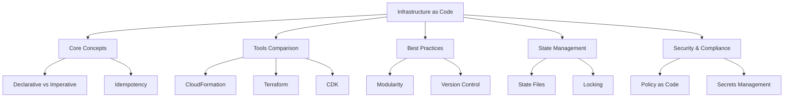

# Lesson: Infrastructure as Code (IaC)

Infrastructure as Code (IaC) is the practice of managing and provisioning computing infrastructure through machine-readable definition files, rather than physical hardware configuration or interactive configuration tools. This lesson covers the core concepts of IaC, compares major tools like AWS CloudFormation and Terraform, explores best practices for template design, and discusses state management and security integration. The goal is to enable reproducible, version-controlled, and automated infrastructure deployment.

## Core Concepts of IaC

Understanding the fundamental principles helps in choosing the right approach and tool.

### Declarative vs. Imperative

-   **Declarative**: You define the *desired end state* (e.g., "I want three EC2 instances"). The tool figures out how to achieve it. Examples: CloudFormation, Terraform.
-   **Imperative**: You define the *steps* to achieve the state (e.g., "Create instance 1, then instance 2..."). Examples: Shell scripts, Ansible (to some extent).
-   Declarative is preferred for IaC because it handles drift and idempotency automatically.

### Idempotency

-   Applying the same configuration multiple times produces the same result.
-   If resources already exist and match the definition, no changes are made.
-   Prevents duplicate resources and unintended side effects.
-   Essential for reliable automation and retry logic.

### Drift Detection

-   **Drift**: When the actual infrastructure state differs from the defined code state (e.g., someone manually changes a security group in the console).
-   IaC tools can detect drift and either alert users or automatically correct it.
-   Maintaining consistency requires prohibiting manual changes.

### Version Control

-   IaC templates are stored in Git repositories.
-   Tracks history of infrastructure changes.
-   Enables peer review via Pull Requests.
-   Allows rollback to previous working versions.

> [!Important]
> **Code is the single source of truth**: Never make manual changes to infrastructure managed by IaC. If a change is needed, update the code and re-apply. Manual changes cause drift, break idempotency, and lead to unpredictable behavior during future updates.

## Tools Comparison: CloudFormation vs. Terraform vs. CDK

AWS offers multiple ways to implement IaC. Choosing the right one depends on team skills and project scope.

### AWS CloudFormation

-   **Native AWS Service**: Deep integration with all AWS services.
-   **Language**: JSON or YAML templates.
-   **State Management**: Managed by AWS (no state file to maintain).
-   **Pros**: No extra tools needed, free, automatic drift detection, stack sets for multi-account.
-   **Cons**: Verbose syntax, steep learning curve for complex logic, AWS-only.

### HashiCorp Terraform

-   **Multi-Cloud**: Supports AWS, Azure, GCP, and others.
-   **Language**: HCL (HashiCorp Configuration Language).
-   **State Management**: Local or remote state files (e.g., S3 + DynamoDB for locking).
-   **Pros**: Large community, modular, multi-cloud support, powerful plan/apply workflow.
-   **Cons**: Must manage state file security and locking, third-party tool.

### AWS CDK (Cloud Development Kit)

-   **Procedural IaC**: Define infrastructure using general-purpose languages (Python, TypeScript, Java, C#).
-   **Synthesis**: Compiles code into CloudFormation templates.
-   **Pros**: Use familiar programming constructs (loops, conditionals, OOP), better abstraction, IDE support.
-   **Cons**: Abstraction layer can hide complexity, requires programming knowledge, still relies on CloudFormation underneath.

| Feature | CloudFormation | Terraform | AWS CDK |
|---|---|---|---|
| **Scope** | AWS Only | Multi-Cloud | AWS Only |
| **Language** | JSON/YAML | HCL | Python/TS/Java/etc. |
| **State** | Managed by AWS | State File | Managed by AWS |
| **Learning Curve** | High (Verbose) | Medium | Medium (if you know code) |
| **Community** | Large AWS | Very Large | Growing |

> [!Tip]
> **Choose CloudFormation for AWS-only shops**: It simplifies operations by removing state file management. Choose Terraform if you have a multi-cloud strategy or existing Terraform expertise. Choose CDK if your team prefers writing code over configuring YAML and wants strong abstractions.

## Best Practices for IaC

Adopting these habits ensures scalable and maintainable infrastructure code.

### Modularity and Reusability

-   Break large templates into smaller, reusable modules.
-   Use Nested Stacks in CloudFormation or Modules in Terraform.
-   Parameterize modules to allow customization (e.g., instance type, VPC ID).
-   Avoid copy-pasting code; reuse shared components.

### Environment Separation

-   Use separate stacks/workspaces for Dev, Staging, and Prod.
-   Pass environment-specific values via parameters or variable files.
-   Do not hardcode environment details in the template.
-   Ensure isolation between environments (different accounts or VPCs).

### Documentation and Comments

-   Document complex logic and resource dependencies.
-   Use descriptions in CloudFormation parameters.
-   Maintain a README for each module explaining inputs and outputs.
-   Keep examples of how to use the module.

### Testing and Validation

-   Use linters (cfn-lint, tflint) to check syntax and best practices.
-   Perform dry runs (CloudFormation Change Sets, Terraform Plan) before applying.
-   Use sandbox accounts for testing infrastructure changes.
-   Integrate validation into CI/CD pipelines.

### Immutable Infrastructure

-   Replace resources instead of modifying them in place when possible.
-   Use Auto Scaling Groups with Launch Templates.
-   Update AMIs or Container Images rather than patching running servers.
-   Simplifies rollback and reduces configuration drift.

## State Management

State is the record of what resources have been created. Managing it correctly is critical.

### CloudFormation State

-   Stored internally by AWS.
-   Associated with Stack ID.
-   Automatic locking during updates.
-   No user maintenance required.
-   View stack events and resources in Console.

### Terraform State

-   Stored in a `terraform.tfstate` file.
-   **Local State**: Risky for teams; prone to loss or conflict.
-   **Remote State**: Store in S3 bucket.
-   **State Locking**: Use DynamoDB table to prevent concurrent writes.
-   **Security**: Encrypt state file at rest (S3 encryption) as it may contain secrets.
-   **Backend Configuration**: Define backend in `backend.tf`.

> [!Important]
> **Never share local state files**: In team environments, always use remote state storage. Concurrent modifications to a local state file will corrupt it. Use S3 with versioning and DynamoDB for locking to ensure data integrity and collaboration safety.

## Security and Compliance in IaC

Integrating security into infrastructure code prevents misconfigurations.

### Policy as Code

-   Use AWS Config Rules or Open Policy Agent (OPA) to validate templates.
-   Check for encrypted storage, public S3 buckets, open security groups.
-   Fail pipeline if policy violations are detected.
-   Shift security left to catch issues before deployment.

### Secrets Management

-   Never hardcode passwords or keys in IaC templates.
-   Use AWS Secrets Manager or Systems Manager Parameter Store.
-   Reference secrets dynamically during deployment.
-   Use IAM Roles for service-to-service authentication.

### Least Privilege IAM

-   Define IAM roles and policies in code.
-   Grant minimum permissions required for resources.
-   Avoid wildcard actions (`*`) in policies.
-   Review generated policies regularly.

### Audit Trail

-   All IaC changes are tracked in Git.
-   AWS CloudTrail logs API calls made by IaC tools.
-   Correlate Git commits with CloudTrail events for full accountability.
-   Identify who changed what and when.

## Assessment Preparation

### Practice Questions

1.  Explain the difference between declarative and imperative IaC.
2.  What is idempotency and why is it important in IaC?
3.  Compare CloudFormation and Terraform in terms of state management.
4.  Why should you avoid manual changes to IaC-managed resources?
5.  What is drift detection and how does it help?
6.  How does AWS CDK differ from traditional CloudFormation?
7.  Why is remote state storage recommended for Terraform?
8.  List three best practices for writing modular IaC templates.
9.  How do you manage secrets in IaC templates securely?
10. What is the role of Policy as Code in IaC?

### Scenario Questions

**Scenario 1: Manual Changes Causing Errors**
A developer manually adds a rule to a security group. Next deployment fails or removes the rule.

-   Educate team on "Code is Single Source of Truth".
-   Implement AWS Config to detect drift.
-   Restrict console access for production resources.
-   Require all changes via Pull Request to IaC repo.
-   Use Service Control Policies (SCPs) to deny manual changes.

**Scenario 2: Multi-Environment Setup**
Need Dev, Test, and Prod environments with identical infrastructure.

-   Create modular IaC templates (VPC, EC2, RDS modules).
-   Use parameter files for environment-specific values (instance size, DB name).
-   Deploy separate stacks for each environment.
-   Use distinct tags for cost allocation.
-   Validate in Dev before promoting to Prod.

**Scenario 3: Team Collaboration on Terraform**
Two engineers try to apply changes simultaneously, corrupting state.

-   Configure remote backend using S3.
-   Enable state locking with DynamoDB.
-   Enforce workflow: Plan -> Review -> Apply.
-   Use CI/CD pipeline to serialize apply operations.
-   Monitor state file access logs.

**Scenario 4: Security Compliance Check**
Company requires all S3 buckets to be private and encrypted.

-   Write IaC templates that enforce encryption and block public access.
-   Use cfn-lint or tflint with custom rules.
-   Integrate OPA or Checkov in CI pipeline.
-   Fail build if non-compliant resources are defined.
-   Audit existing resources with AWS Config.

**Scenario 5: Complex Logic in Templates**
Need to create different resources based on environment (e.g., Multi-AZ in Prod only).

-   Use Conditions in CloudFormation or Count/For_each in Terraform.
-   Better yet, use AWS CDK to use standard `if/else` logic.
-   Keep logic simple; move complex decisions to application layer.
-   Document conditional behavior clearly.
-   Test both paths in sandbox environment.

## Key Takeaways

-   IaC manages infrastructure through code, enabling automation and version control.
-   Declarative models (CloudFormation, Terraform) are preferred for idempotency.
-   CloudFormation is native and stateless; Terraform is multi-cloud and stateful.
-   AWS CDK allows defining infrastructure using general-purpose programming languages.
-   Modularity, documentation, and testing are essential for maintainable IaC.
-   Never make manual changes to IaC-managed resources to avoid drift.
-   Remote state storage and locking are critical for team collaboration in Terraform.
-   Integrate security checks (Policy as Code) into the CI/CD pipeline.
-   Manage secrets externally using Secrets Manager or Parameter Store.
-   IaC accelerates delivery while improving consistency and compliance.

> [!Important]
> **Treat infrastructure like software**: Apply the same rigor to IaC as you do to application code. Review it, test it, version it, and deploy it via pipelines. Infrastructure bugs can take down entire systems, so quality matters. Start with small modules, validate often, and automate everything. The goal is reliable, repeatable, and secure infrastructure delivery.
