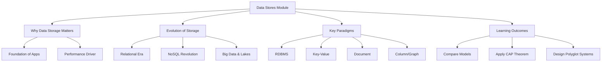

# Lesson 0: Module Introduction

This lesson introduces the Data Stores & Pipelines module. It defines the critical role of data storage in modern applications, outlines the evolution from traditional relational systems to diverse NoSQL and big data solutions, and sets the stage for understanding how to choose the right tool for specific data challenges. The goal is to move beyond "one size fits all" thinking and develop a strategic approach to data architecture based on access patterns, consistency requirements, and scale.

## Why Data Storage Matters

Data is the lifeblood of digital organizations. How you store, retrieve, and manage that data determines the performance, reliability, and scalability of your applications.

-   **Performance**: The right storage engine ensures low-latency responses for users.
-   **Scalability**: Storage choices dictate how easily your system can handle growth in data volume and user traffic.
-   **Cost**: Inefficient storage models lead to wasted resources and high cloud bills.
-   **Insights**: Properly structured data enables effective analytics and machine learning.
-   **Reliability**: Storage mechanisms ensure data durability and availability during failures.

> [!Important]
> **Storage is not just a bucket**: It is an active component of your architecture. Choosing the wrong database can create bottlenecks that are expensive and difficult to fix later. Understanding the underlying mechanics of different storage paradigms is essential for any cloud professional or data engineer.

## Evolution of Data Storage

The landscape of data storage has shifted dramatically over the last few decades.

### The Relational Era (1970s–2000s)

-   Dominated by Relational Database Management Systems (RDBMS).
-   Data organized in tables with strict schemas.
-   SQL became the standard language for querying.
-   ACID transactions ensured data integrity for financial and enterprise systems.
-   Vertical scaling (bigger servers) was the primary method for handling growth.

### The NoSQL Revolution (2000s–2010s)

-   Driven by the rise of web-scale companies (Google, Amazon, Facebook).
-   Need to handle unstructured data, massive volume, and high velocity.
-   Emergence of Key-Value, Document, Column-Family, and Graph databases.
-   Focus on horizontal scaling (adding more servers) and eventual consistency.
-   Schema-less designs allowed for rapid iteration and flexibility.

### The Big Data & Cloud Era (2010s–Present)

-   Explosion of IoT, social media, and log data.
-   Rise of Data Lakes for storing raw, diverse data at low cost.
-   Serverless databases reduce operational overhead.
-   Polyglot persistence becomes standard: using multiple database types in one application.
-   Integration with real-time processing pipelines (Kafka, Kinesis).

| Era | Primary Model | Scaling Strategy | Key Driver |
|---|---|---|---|
| Relational | Tables/SQL | Vertical | Enterprise Apps |
| NoSQL | Key-Value/Document | Horizontal | Web Scale |
| Big Data | Data Lakes/Object | Distributed | Analytics/IoT |

## Key Data Paradigms

This module will explore four major categories of data storage.

### Relational Databases (RDBMS)

-   Structured data with predefined schemas.
-   Strong consistency via ACID properties.
-   Best for: Financial transactions, inventory, ERP systems.
-   Examples: PostgreSQL, MySQL, Amazon Aurora.

### Key-Value Stores

-   Simplest model: unique key maps to a value.
-   Extremely fast reads and writes.
-   Best for: Caching, session storage, user profiles.
-   Examples: Redis, Amazon DynamoDB.

### Document Stores

-   Store data as flexible documents (JSON/BSON).
-   Schema-on-read allows varying structures.
-   Best for: Content management, catalogs, mobile backends.
-   Examples: MongoDB, Amazon DocumentDB.

### Specialized Stores (Column/Graph)

-   **Column-Family**: Optimized for analytical queries over large datasets. Example: Cassandra.
-   **Graph**: Optimized for traversing relationships between entities. Example: Neo4j, Amazon Neptune.

## Learning Outcomes

By the end of this module, you will be able to:

-   Differentiate between relational and non-relational data models.
-   Explain the ACID properties and their importance in transactional systems.
-   Apply the CAP theorem to evaluate distributed database trade-offs.
-   Identify appropriate use cases for Key-Value, Document, Column, and Graph databases.
-   Design polyglot persistence architectures that leverage multiple storage types.
-   Understand the role of Data Lakes in modern analytics pipelines.
-   Evaluate storage choices based on consistency, availability, and partition tolerance requirements.
-   Recognize the impact of schema-on-write vs. schema-on-read approaches.

## Assessment Preparation

### Practice Questions

1.  Why did the NoSQL movement emerge in the late 2000s?
2.  What are the three main guarantees of the CAP theorem?
3.  Give an example of a use case where a Relational Database is preferred over NoSQL.
4.  What is the primary advantage of a Key-Value store?
5.  How does a Document database differ from a Relational database in terms of schema?
6.  Why is Partition Tolerance considered mandatory in distributed cloud systems?
7.  What is polyglot persistence and why is it useful?
8.  When would you choose a Graph database?
9.  What is the difference between vertical and horizontal scaling?
10. How do Data Lakes support big data analytics?

### Scenario Questions

**Scenario 1: Legacy Migration**
A bank wants to modernize its core banking system but needs strict ACID compliance.

-   Stick with Relational Database (e.g., Amazon Aurora).
-   Ensure strong consistency for financial records.
-   Use read replicas for scaling query load.
-   Avoid NoSQL for core ledger due to eventual consistency risks.

**Scenario 2: Social Media App**
App needs to store user posts, comments, and friend connections.

-   User Posts: Document Store (MongoDB) for flexible content.
-   Friend Connections: Graph Database (Neptune) for efficient relationship traversal.
-   Session Data: Key-Value Store (Redis) for fast login states.
-   Strategy: Polyglot persistence to optimize each feature.

**Scenario 3: IoT Sensor Network**
Thousands of sensors send temperature data every second.

-   Use Column-Family Store (Cassandra) or Time-Series DB.
-   High write throughput required.
-   Horizontal scaling to handle volume.
-   Eventual consistency is acceptable for historical trends.

**Scenario 4: E-Commerce Catalog**
Products have varying attributes (size, color, material).

-   Use Document Store (DynamoDB or MongoDB).
-   Schema-on-read allows different attributes per product type.
-   Fast retrieval for user browsing.
-   Avoid rigid relational schema for catalog details.

**Scenario 5: Corporate Data Warehouse**
Company needs to analyze sales, logs, and customer feedback together.

-   Use Data Lake (S3) to store raw data.
-   Use schema-on-read tools (Athena, Spark) for analysis.
-   Cost-effective storage for massive volumes.
-   Enables machine learning on diverse data types.

## Key Takeaways

-   Data storage choices impact performance, cost, and scalability.
-   Relational databases excel at structured data and strong consistency.
-   NoSQL databases offer flexibility and horizontal scaling for unstructured or big data.
-   The CAP theorem highlights inevitable trade-offs in distributed systems.
-   Polyglot persistence allows using the best tool for each specific job.
-   Key-Value stores are fastest for simple lookups; Graph stores handle complex relationships.
-   Data Lakes enable storage of diverse raw data for advanced analytics.
-   Schema-on-write ensures quality; schema-on-read enables agility.
-   Modern applications often combine multiple storage paradigms.
-   Understand your data’s access patterns before choosing a storage solution.

> [!Important]
> **Start with the question, not the tool**: Do not start by asking "Which database is best?" Ask "What questions am I trying to answer with my data?" and "How will my application access this data?" The answers to these questions will guide you to the right storage paradigm. Avoid forcing all data into a single model; embrace diversity where it adds value.
