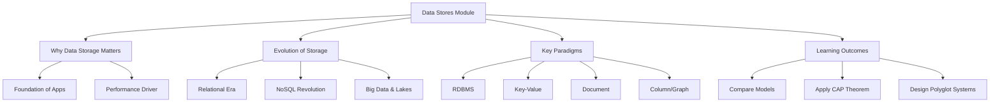

# Migration in progress
# Lesson 0: Module Introduction

This lesson introduces the Data Stores & Pipelines module. It defines the critical role of data storage in modern applications, outlines the evolution from traditional relational systems to diverse NoSQL and big data solutions, and sets the stage for understanding how to choose the right tool for specific data challenges. The goal is to move beyond "one size fits all" thinking and develop a strategic approach to data architecture based on access patterns, consistency requirements, and scale.

## Why Data Storage Matters

Data is the lifeblood of digital organizations. How you store, retrieve, and manage that data determines the performance, reliability, and scalability of your applications.

-   **Performance**: The right storage engine ensures low-latency responses for users.
-   **Scalability**: Storage choices dictate how easily your system can handle growth in data volume and user traffic.
-   **Cost**: Inefficient storage models lead to wasted resources and high cloud bills.
-   **Insights**: Properly structured data enables effective analytics and machine learning.
-   **Reliability**: Storage mechanisms ensure data durability and availability during failures.

> [!Important]
> **Storage is not just a bucket**: It is an active component of your architecture. Choosing the wrong database can create bottlenecks that are expensive and difficult to fix later. Understanding the underlying mechanics of different storage paradigms is essential for any cloud professional or data engineer.

## Evolution of Data Storage

The landscape of data storage has shifted dramatically over the last few decades.

### The Relational Era (1970s–2000s)

-   Dominated by Relational Database Management Systems (RDBMS).
-   Data organized in tables with strict schemas.
-   SQL became the standard language for querying.
-   ACID transactions ensured data integrity for financial and enterprise systems.
-   Vertical scaling (bigger servers) was the primary method for handling growth.

### The NoSQL Revolution (2000s–2010s)

-   Driven by the rise of web-scale companies (Google, Amazon, Facebook).
-   Need to handle unstructured data, massive volume, and high velocity.
-   Emergence of Key-Value, Document, Column-Family, and Graph databases.
-   Focus on horizontal scaling (adding more servers) and eventual consistency.
-   Schema-less designs allowed for rapid iteration and flexibility.

### The Big Data & Cloud Era (2010s–Present)

-   Explosion of IoT, social media, and log data.
-   Rise of Data Lakes for storing raw, diverse data at low cost.
-   Serverless databases reduce operational overhead.
-   Polyglot persistence becomes standard: using multiple database types in one application.
-   Integration with real-time processing pipelines (Kafka, Kinesis).

| Era | Primary Model | Scaling Strategy | Key Driver |
|---|---|---|---|
| Relational | Tables/SQL | Vertical | Enterprise Apps |
| NoSQL | Key-Value/Document | Horizontal | Web Scale |
| Big Data | Data Lakes/Object | Distributed | Analytics/IoT |

## Key Data Paradigms

This module will explore four major categories of data storage.

### Relational Databases (RDBMS)

-   Structured data with predefined schemas.
-   Strong consistency via ACID properties.
-   Best for: Financial transactions, inventory, ERP systems.
-   Examples: PostgreSQL, MySQL, Amazon Aurora.

### Key-Value Stores

-   Simplest model: unique key maps to a value.
-   Extremely fast reads and writes.
-   Best for: Caching, session storage, user profiles.
-   Examples: Redis, Amazon DynamoDB.

### Document Stores

-   Store data as flexible documents (JSON/BSON).
-   Schema-on-read allows varying structures.
-   Best for: Content management, catalogs, mobile backends.
-   Examples: MongoDB, Amazon DocumentDB.

### Specialized Stores (Column/Graph)

-   **Column-Family