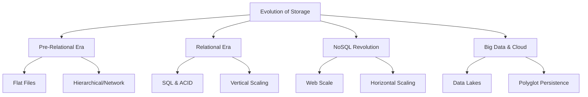

# Migration in progress
# Lesson 1: The Evolution of Data Storage

The history of data storage is a journey from rigid, structured systems designed for transactional integrity to flexible, distributed systems built for scale and variety. This lesson traces the evolution from mainframe file systems to relational databases, the NoSQL revolution, and the modern era of big data and cloud-native storage. Understanding this history provides context for why different storage paradigms exist and when to use them.

## Pre-Relational Era (1960s–1970s)

Before the standardization of relational models, data storage was tightly coupled with application logic.

### Flat Files

-   Data stored in simple text or binary files.
-   Application code handled parsing, indexing, and relationships.
-   **Pros**: Simple, no special software required.
-   **Cons**: Redundant data, difficult to query, no concurrency control, high maintenance.

### Hierarchical and Network Models

-   **Hierarchical**: Tree-like structure (parent-child). Example: IBM IMS.
    -   Fast for predefined paths but rigid; difficult to represent many-to-many relationships.
-   **Network**: Graph-like structure allowing multiple parents. Example: CODASYL.
    -   More flexible than hierarchical but complex to navigate and maintain.

> [!Important]
> **Data Dependency**: In pre-relational systems, changing the data structure often required rewriting the application code. This tight coupling made systems brittle and expensive to modify.

## The Relational Era (1970s–2000s)

Proposed by E.F. Codd in 1970, the relational model revolutionized data management by separating data structure from application logic.

### Core Innovations

-   **Tables**: Data organized into rows and columns.
-   **SQL**: Standardized language for querying and manipulating data.
-   **Normalization**: Process to reduce redundancy and improve data integrity.
-   **ACID Transactions**: Guarantees for Atomicity, Consistency, Isolation, and Durability.

### Dominance and Limitations

-   Became the standard for enterprise applications (ERP, CRM, Banking).
-   **Vertical Scaling**: To handle more load, organizations bought bigger, more expensive servers.
-   **Limitations**:
    -   Struggled with unstructured data (images, logs, social media).
    -   Complex joins became performance bottlenecks at massive scale.
    -   Rigid schema made rapid iteration difficult.

| Feature | Relational Model | Impact |
|---|---|---|
| Structure | Tables/Rows/Columns | Clear, organized data |
| Query Language | SQL | Standardized access |
| Integrity | ACID | Reliable transactions |
| Scaling | Vertical | Limited by hardware |
| Schema | Fixed (Schema-on-Write) | High quality, low flexibility |

## The NoSQL Revolution (2000s–2010s)

The rise of Web 2.0 companies (Google, Amazon, Facebook) exposed the limitations of relational databases at web scale.

### Drivers of Change

-   **Volume**: Massive amounts of user-generated content.
-   **Velocity**: High-speed data ingestion from clicks and sensors.
-   **Variety**: Unstructured data (text, video, logs) did not fit tables.
-   **Cost**: Commodity hardware was cheaper than mainframes.

### Key Characteristics of NoSQL

-   **Horizontal Scaling**: Distribute data across many cheap servers (sharding).
-   **Schema-less**: Flexible data models allow rapid changes without downtime.
-   **BASE Properties**: Basic Availability, Soft state, Eventual consistency.
-   **Specialized Models**: Key-Value, Document, Column-Family, Graph.

> [!Tip]
> **Not Only SQL**: The term NoSQL originally meant "Not Only SQL," acknowledging that relational databases still had a place, but other models were needed for specific challenges. It has since come to mean "Non-Relational."

## Big Data and Cloud Native Era (2010s–Present)

The convergence of cloud computing, open-source frameworks, and advanced analytics created a new paradigm.

### Data Lakes

-   Centralized repositories for storing raw data in its native format.
-   Built on object storage (e.g., Amazon S3, Azure Blob).
-   **Schema-on-Read**: Structure is applied only when data is analyzed.
-   Enables machine learning and advanced analytics on diverse data types.

### Polyglot Persistence

-   Using multiple database technologies within a single application.
-   Example: Relational for billing, Document 