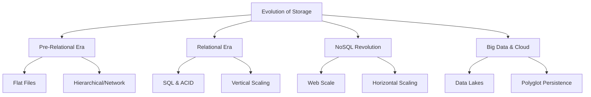

# Lesson 1: The Evolution of Data Storage

The history of data storage is a journey from rigid, structured systems designed for transactional integrity to flexible, distributed systems built for scale and variety. This lesson traces the evolution from mainframe file systems to relational databases, the NoSQL revolution, and the modern era of big data and cloud-native storage. Understanding this history provides context for why different storage paradigms exist and when to use them.

## Pre-Relational Era (1960s–1970s)

Before the standardization of relational models, data storage was tightly coupled with application logic.

### Flat Files

-   Data stored in simple text or binary files.
-   Application code handled parsing, indexing, and relationships.
-   **Pros**: Simple, no special software required.
-   **Cons**: Redundant data, difficult to query, no concurrency control, high maintenance.

### Hierarchical and Network Models

-   **Hierarchical**: Tree-like structure (parent-child). Example: IBM IMS.
    -   Fast for predefined paths but rigid; difficult to represent many-to-many relationships.
-   **Network**: Graph-like structure allowing multiple parents. Example: CODASYL.
    -   More flexible than hierarchical but complex to navigate and maintain.

> [!Important]
> **Data Dependency**: In pre-relational systems, changing the data structure often required rewriting the application code. This tight coupling made systems brittle and expensive to modify.

## The Relational Era (1970s–2000s)

Proposed by E.F. Codd in 1970, the relational model revolutionized data management by separating data structure from application logic.

### Core Innovations

-   **Tables**: Data organized into rows and columns.
-   **SQL**: Standardized language for querying and manipulating data.
-   **Normalization**: Process to reduce redundancy and improve data integrity.
-   **ACID Transactions**: Guarantees for Atomicity, Consistency, Isolation, and Durability.

### Dominance and Limitations

-   Became the standard for enterprise applications (ERP, CRM, Banking).
-   **Vertical Scaling**: To handle more load, organizations bought bigger, more expensive servers.
-   **Limitations**:
    -   Struggled with unstructured data (images, logs, social media).
    -   Complex joins became performance bottlenecks at massive scale.
    -   Rigid schema made rapid iteration difficult.

| Feature | Relational Model | Impact |
|---|---|---|
| Structure | Tables/Rows/Columns | Clear, organized data |
| Query Language | SQL | Standardized access |
| Integrity | ACID | Reliable transactions |
| Scaling | Vertical | Limited by hardware |
| Schema | Fixed (Schema-on-Write) | High quality, low flexibility |

## The NoSQL Revolution (2000s–2010s)

The rise of Web 2.0 companies (Google, Amazon, Facebook) exposed the limitations of relational databases at web scale.

### Drivers of Change

-   **Volume**: Massive amounts of user-generated content.
-   **Velocity**: High-speed data ingestion from clicks and sensors.
-   **Variety**: Unstructured data (text, video, logs) did not fit tables.
-   **Cost**: Commodity hardware was cheaper than mainframes.

### Key Characteristics of NoSQL

-   **Horizontal Scaling**: Distribute data across many cheap servers (sharding).
-   **Schema-less**: Flexible data models allow rapid changes without downtime.
-   **BASE Properties**: Basic Availability, Soft state, Eventual consistency.
-   **Specialized Models**: Key-Value, Document, Column-Family, Graph.

> [!Tip]
> **Not Only SQL**: The term NoSQL originally meant "Not Only SQL," acknowledging that relational databases still had a place, but other models were needed for specific challenges. It has since come to mean "Non-Relational."

## Big Data and Cloud Native Era (2010s–Present)

The convergence of cloud computing, open-source frameworks, and advanced analytics created a new paradigm.

### Data Lakes

-   Centralized repositories for storing raw data in its native format.
-   Built on object storage (e.g., Amazon S3, Azure Blob).
-   **Schema-on-Read**: Structure is applied only when data is analyzed.
-   Enables machine learning and advanced analytics on diverse data types.

### Polyglot Persistence

-   Using multiple database technologies within a single application.
-   Example: Relational for billing, Document for catalog, Graph for recommendations.
-   Optimizes each component for its specific workload.

### Serverless and Managed Services

-   Cloud providers manage infrastructure, scaling, and patching.
-   Pay-per-use pricing models.
-   Examples: Amazon DynamoDB, Aurora Serverless, Cosmos DB.
-   Reduces operational overhead, allowing teams to focus on data value.

### NewSQL and HTAP

-   **NewSQL**: Combines SQL interface and ACID guarantees with NoSQL scalability (e.g., Google Spanner, CockroachDB).
-   **HTAP (Hybrid Transactional/Analytical Processing)**: Systems that handle both transactions and analytics in real-time (e.g., TiDB, SingleStore).

| Era | Primary Focus | Scaling Method | Consistency Model |
|---|---|---|---|
| Relational | Integrity & Structure | Vertical | Strong (ACID) |
| NoSQL | Scale & Flexibility | Horizontal | Eventual (BASE) |
| Cloud/Big Data | Variety & Analytics | Distributed/Elastic | Tunable |

## Assessment Preparation

### Practice Questions

1.  What were the main limitations of flat file systems?
2.  How did the relational model improve upon hierarchical databases?
3.  Why did Web 2.0 companies drive the adoption of NoSQL?
4.  Explain the difference between vertical and horizontal scaling.
5.  What does ACID stand for and why is it important?
6.  What does BASE stand for and how does it differ from ACID?
7.  What is a Data Lake and how does it differ from a traditional database?
8.  Define polyglot persistence and give an example.
9.  Why is schema-on-read advantageous for big data analytics?
10. How has cloud computing changed the way we manage data storage?

### Scenario Questions

**Scenario 1: Legacy System Modernization**
A company uses a mainframe with hierarchical data. They want to move to the cloud.

-   Migrate to a Relational Database (RDS) if data is structured and transactions are critical.
-   Refactor application code to decouple data logic.
-   Use migration tools to convert hierarchical structures to relational tables.
-   Benefit from cloud scalability and managed backups.

**Scenario 2: Social Media Startup**
Needs to store user posts, likes, and comments with rapid growth.

-   Start with a Document Database (MongoDB/DynamoDB) for flexible post structures.
-   Use Horizontal Scaling to handle user growth.
-   Accept eventual consistency for likes/comments to ensure availability.
-   Avoid rigid relational schema to allow feature iteration.

**Scenario 3: Retail Analytics**
Company wants to analyze sales, weather data, and social media sentiment.

-   Store raw data in a Data Lake (S3).
-   Use Schema-on-Read to combine structured sales data with unstructured text.
-   Use Spark or Athena for analysis.
-   Benefit from low-cost storage and powerful analytics engines.

**Scenario 4: Global Banking App**
Requires strict consistency and global availability.

-   Use a NewSQL database (e.g., Google Spanner or Aurora Global Database).
-   Ensures ACID compliance across regions.
-   Provides strong consistency for financial transactions.
-   Handles global scale without sacrificing integrity.

**Scenario 5: IoT Platform**
Millions of devices sending telemetry data.

-   Use a Time-Series or Column-Family database (Cassandra/Keyspaces).
-   Optimized for high-write throughput.
-   Horizontal scaling to handle device growth.
-   Store historical data in Data Lake for long-term analysis.

## Key Takeaways

-   Data storage has evolved from rigid, application-coupled files to flexible, distributed systems.
-   Relational databases introduced structure, SQL, and ACID transactions.
-   NoSQL emerged to solve scale, flexibility, and variety challenges of Web 2.0.
-   Horizontal scaling allows systems to grow by adding more servers rather than bigger ones.
-   BASE properties prioritize availability and partition tolerance over immediate consistency.
-   Data Lakes enable storage and analysis of raw, unstructured data at scale.
-   Polyglot persistence uses the best database for each specific task within an application.
-   Cloud-native services reduce operational overhead and enable serverless scaling.
-   NewSQL bridges the gap between relational integrity and NoSQL scale.
-   Choose storage based on the specific needs of volume, velocity, variety, and consistency.

> [!Important]
> **History informs design**: Understanding why relational databases dominated and why NoSQL emerged helps you avoid common pitfalls. Do not force a relational model on unstructured data, and do not sacrifice consistency for scale unless necessary. Each paradigm solved specific problems; choose the one that solves yours. The future is hybrid, leveraging the strengths of multiple models through polyglot persistence and cloud-native architectures.
