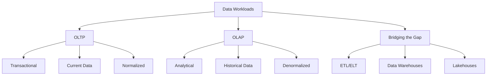

# Migration in progress
# Lesson 2: OLTP vs. OLAP Architectures

Data systems are generally categorized by their primary workload: transaction processing or analytical processing. Understanding the distinction between Online Transaction Processing (OLTP) and Online Analytical Processing (OLAP) is fundamental to designing efficient data architectures. This lesson contrasts their goals, structures, performance characteristics, and typical use cases, and explains how modern data pipelines bridge the gap between them.

## Online Transaction Processing (OLTP)

OLTP systems are designed to manage transaction-oriented applications. They focus on the day-to-day operations of an organization.

### Core Characteristics

-   **Short, Fast Transactions**: Operations involve reading or writing small amounts of data (e.g., inserting a single order).
-   **High Concurrency**: Supports thousands of users performing simultaneous operations.
-   **Data Integrity**: Strict adherence to ACID properties to ensure accuracy.
-   **Current Data**: Stores only the most recent state of data. Historical changes are often overwritten or archived.
-   **Normalized Schema**: Data is split into many tables to reduce redundancy and ensure consistency.

### Typical Operations

-   **CRUD**: Create, Read, Update, Delete.
-   **Point Queries**: Retrieving specific records using primary keys (e.g., "Get user ID 123").
-   **Indexing**: Heavily indexed for fast lookups and updates.

### Use Cases

-   Banking transactions (ATM withdrawals, transfers).
-   E-commerce order processing.
-   Inventory management systems.
-   Customer Relationship Management (CRM) entry.

> [!Important]
> **OLTP is about speed and accuracy**: The goal is to process individual transactions as quickly as possible without locking the database for other users. Complex queries or large-scale aggregations should never run on an OLTP system as they can degrade performance for all users.

## Online Analytical Processing (OLAP)

OLAP systems are designed for complex queries and data analysis. They support business intelligence, reporting, and decision-making.

### Core Characteristics

-   **Complex, Long-Running Queries**: Operations involve scanning millions of rows to calculate aggregates (sums, averages, counts).
-   **Read-Heavy**: Optimized for reading large volumes of data; writes are typically batch-oriented.
-   **Historical Data**: Stores years of historical data to identify trends and patterns.
-   **Denormalized Schema**: Data is combined into fewer, wider tables (Star or Snowflake schemas) to minimize joins during queries.
-   **Columnar Storage**: Often stores data by column rather than row, which is more efficient for aggregation.

### Typical Operations

-   **Aggregations**: SUM, AVG, COUNT, MIN, MAX.
-   **Grouping**: GROUP BY clauses across multiple dimensions (time, region, product).
-   **Joins**: Connecting large datasets to find correlations.

### Use Cases

-   Sales trend analysis.
-   Financial forecasting.
-   Customer segmentation.
-   Supply chain optimization.

| Feature | OLTP | OLAP |
|---|---|---|
| **Purpose** | Run the business | Analyze the business |
| **Query Type** | Simple, short | Complex, long |
| **Data Scope** | Current, detailed | Historical, aggregated |
| **Schema** | Normalized (3NF) | Denormalized (Star/Snowflake) |
| **Storage** | Row-based | Column-based (often) |
| **Users** | Clerks, customers, apps | Analysts, executives, data scientists |
| **Performance Metric** | Transactions per second (TPS) | Query response time |

## Schema Design Differences

The way data is structured differs significantly between the two architectures.

### Normalization (OLTP)

-   **Goal**: Eliminate redundancy and ensure data integrity.
-   **Structure**: Many small tables linked by foreign keys.
-   **Benefit**: Updates are fast and consistent; storage is efficient.
-   **Drawback**: Queries require many joins, which are slow for analytics.

### Denormalization (OLAP)

-   **Goal**: Optimize query performance for read-heavy workloads.
-   **Structure**: Fewer, larger tables with redundant data.
-   **Benefit**: Queries are faster because fewer joins are needed.
-   **Drawback**: Updates are slower and more complex; storage usage is higher.

### Star and Snowflake Schemas

-   **Fact Table**: Contains measurable metrics (e.g., sales amount, quantity).
-   **Dimension Tables**: Contain descriptive attributes (e.g., product name, customer location, date).
-   **Star Schema**: Dimensions are directly connected to the fact table.
-   **Snowflake Schema**: Dimensions are normalized further into sub-dimensions.

> [!Tip]
> **Pre-aggregate for speed**: In OLAP systems, pre-calculating common aggregates (e.g., daily sales totals) can drastically improve query performance. This is often done through Materialized Views or Cube structures.

## Bridging the Gap: ETL 