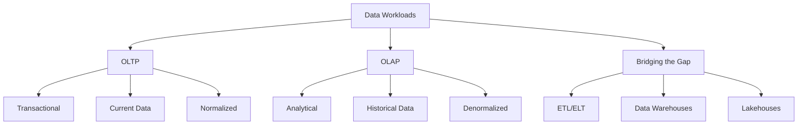
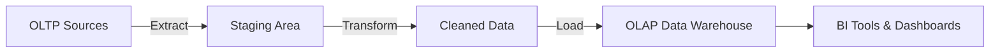

# Lesson 2: OLTP vs. OLAP Architectures

Data systems are generally categorized by their primary workload: transaction processing or analytical processing. Understanding the distinction between Online Transaction Processing (OLTP) and Online Analytical Processing (OLAP) is fundamental to designing efficient data architectures. This lesson contrasts their goals, structures, performance characteristics, and typical use cases, and explains how modern data pipelines bridge the gap between them.

## Online Transaction Processing (OLTP)

OLTP systems are designed to manage transaction-oriented applications. They focus on the day-to-day operations of an organization.

### Core Characteristics

-   **Short, Fast Transactions**: Operations involve reading or writing small amounts of data (e.g., inserting a single order).
-   **High Concurrency**: Supports thousands of users performing simultaneous operations.
-   **Data Integrity**: Strict adherence to ACID properties to ensure accuracy.
-   **Current Data**: Stores only the most recent state of data. Historical changes are often overwritten or archived.
-   **Normalized Schema**: Data is split into many tables to reduce redundancy and ensure consistency.

### Typical Operations

-   **CRUD**: Create, Read, Update, Delete.
-   **Point Queries**: Retrieving specific records using primary keys (e.g., "Get user ID 123").
-   **Indexing**: Heavily indexed for fast lookups and updates.

### Use Cases

-   Banking transactions (ATM withdrawals, transfers).
-   E-commerce order processing.
-   Inventory management systems.
-   Customer Relationship Management (CRM) entry.

> [!Important]
> **OLTP is about speed and accuracy**: The goal is to process individual transactions as quickly as possible without locking the database for other users. Complex queries or large-scale aggregations should never run on an OLTP system as they can degrade performance for all users.

## Online Analytical Processing (OLAP)

OLAP systems are designed for complex queries and data analysis. They support business intelligence, reporting, and decision-making.

### Core Characteristics

-   **Complex, Long-Running Queries**: Operations involve scanning millions of rows to calculate aggregates (sums, averages, counts).
-   **Read-Heavy**: Optimized for reading large volumes of data; writes are typically batch-oriented.
-   **Historical Data**: Stores years of historical data to identify trends and patterns.
-   **Denormalized Schema**: Data is combined into fewer, wider tables (Star or Snowflake schemas) to minimize joins during queries.
-   **Columnar Storage**: Often stores data by column rather than row, which is more efficient for aggregation.

### Typical Operations

-   **Aggregations**: SUM, AVG, COUNT, MIN, MAX.
-   **Grouping**: GROUP BY clauses across multiple dimensions (time, region, product).
-   **Joins**: Connecting large datasets to find correlations.

### Use Cases

-   Sales trend analysis.
-   Financial forecasting.
-   Customer segmentation.
-   Supply chain optimization.

| Feature | OLTP | OLAP |
|---|---|---|
| **Purpose** | Run the business | Analyze the business |
| **Query Type** | Simple, short | Complex, long |
| **Data Scope** | Current, detailed | Historical, aggregated |
| **Schema** | Normalized (3NF) | Denormalized (Star/Snowflake) |
| **Storage** | Row-based | Column-based (often) |
| **Users** | Clerks, customers, apps | Analysts, executives, data scientists |
| **Performance Metric** | Transactions per second (TPS) | Query response time |

## Schema Design Differences

The way data is structured differs significantly between the two architectures.

### Normalization (OLTP)

-   **Goal**: Eliminate redundancy and ensure data integrity.
-   **Structure**: Many small tables linked by foreign keys.
-   **Benefit**: Updates are fast and consistent; storage is efficient.
-   **Drawback**: Queries require many joins, which are slow for analytics.

### Denormalization (OLAP)

-   **Goal**: Optimize query performance for read-heavy workloads.
-   **Structure**: Fewer, larger tables with redundant data.
-   **Benefit**: Queries are faster because fewer joins are needed.
-   **Drawback**: Updates are slower and more complex; storage usage is higher.

### Star and Snowflake Schemas

-   **Fact Table**: Contains measurable metrics (e.g., sales amount, quantity).
-   **Dimension Tables**: Contain descriptive attributes (e.g., product name, customer location, date).
-   **Star Schema**: Dimensions are directly connected to the fact table.
-   **Snowflake Schema**: Dimensions are normalized further into sub-dimensions.

> [!Tip]
> **Pre-aggregate for speed**: In OLAP systems, pre-calculating common aggregates (e.g., daily sales totals) can drastically improve query performance. This is often done through Materialized Views or Cube structures.

## Bridging the Gap: ETL and Data Warehousing

Since OLTP systems are not suitable for analytics, organizations move data from OLTP to OLAP systems through data pipelines.

### Extract, Transform, Load (ETL)

-   **Extract**: Pull data from OLTP sources (databases, APIs).
-   **Transform**: Clean, normalize, and aggregate data. Convert to star schema.
-   **Load**: Insert transformed data into the OLAP system (Data Warehouse).

### Data Warehouses

-   Centralized repositories for structured, processed data.
-   Optimized for OLAP workloads.
-   Examples: Amazon Redshift, Google BigQuery, Snowflake.
-   Provide high-performance querying for business intelligence tools.

### Modern Trends: ELT and Lakehouses

-   **ELT (Extract, Load, Transform)**: Load raw data into a cloud store first, then transform it using powerful cloud compute. Common in data lakes.
-   **Lakehouse**: Combines the flexibility of data lakes (unstructured data) with the management features of data warehouses (ACID transactions, schema enforcement). Example: Databricks Delta Lake.

## Assessment Preparation

### Practice Questions

1.  What is the primary difference between OLTP and OLAP?
2.  Why is normalization preferred in OLTP but denormalization in OLAP?
3.  Explain the ACID properties and why they are critical for OLTP.
4.  What is a Star Schema and how does it improve analytical query performance?
5.  Describe the ETL process and its role in data architecture.
6.  Why should you avoid running complex analytical queries on an OLTP database?
7.  What is the difference between row-based and columnar storage?
8.  Give two examples of OLTP systems and two examples of OLAP systems.
9.  What is a Data Warehouse and how does it differ from a Data Lake?
10. How does horizontal scaling benefit OLAP systems?

### Scenario Questions

**Scenario 1: E-Commerce Platform**
Needs to process orders in real-time and generate monthly sales reports.

-   **OLTP**: Use PostgreSQL or Amazon Aurora for order processing. Ensures ACID compliance for payments.
-   **OLAP**: Use Amazon Redshift or Snowflake for reporting.
-   **Pipeline**: Daily ETL job moves order data from Aurora to Redshift.
-   **Benefit**: Reporting queries do not slow down the checkout process.

**Scenario 2: Real-Time Dashboard**
Executive wants to see live sales figures.

-   **Challenge**: Traditional ETL has latency (daily/hourly).
-   **Solution**: Use Change Data Capture (CDC) to stream changes from OLTP to OLAP in near real-time.
-   **Tool**: AWS DMS or Kafka Connect.
-   **Trade-off**: Higher complexity and cost for lower latency.

**Scenario 3: Legacy Report Slowness**
Reports are running directly against the production database, causing slowdowns.

-   **Problem**: OLTP resources are consumed by heavy analytical queries.
-   **Fix**: Implement a Read Replica for light reporting.
-   **Better Fix**: Build a proper Data Warehouse and move all heavy analytics there.
-   **Outcome**: Production performance stabilizes; reports become faster.

**Scenario 4: Startup with Limited Budget**
Needs both transactional and analytical capabilities.

-   **Start**: Use a single managed database (e.g., PostgreSQL) for both.
-   **Optimize**: Use Read Replicas for basic reporting.
-   **Scale**: As data grows, migrate analytics to a serverless warehouse (BigQuery/Redshift Serverless).
-   **Strategy**: Delay complexity until volume justifies it.

**Scenario 5: Unstructured Data Analysis**
Company wants to analyze customer support emails alongside sales data.

-   **OLTP**: Cannot store or query unstructured text efficiently.
-   **Solution**: Store emails in a Data Lake (S3).
-   **Processing**: Use NLP to extract sentiment scores.
-   **Integration**: Load structured sentiment data into OLAP warehouse alongside sales facts.
-   **Analysis**: Correlate sentiment with sales trends.

## Key Takeaways

-   OLTP handles day-to-day transactions; OLAP handles historical analysis.
-   OLTP prioritizes speed and integrity (ACID); OLAP prioritizes query performance and throughput.
-   OLTP uses normalized schemas; OLAP uses denormalized schemas (Star/Snowflake).
-   Never mix heavy analytical workloads with transactional processing.
-   ETL pipelines move data from OLTP to OLAP systems.
-   Data Warehouses are optimized for structured analytical queries.
-   Columnar storage is often more efficient for OLAP aggregations.
-   Modern architectures use ELT and Lakehouses to handle diverse data types.
-   Choose the right tool for the workload: OLTP for operations, OLAP for insights.
-   Data separation ensures stability for both operational and analytical users.

> [!Important]
> **Separation of Concerns**: The golden rule of data architecture is to keep transactional and analytical workloads separate. Running analytics on your production database is a recipe for disaster. It risks data integrity, slows down customers, and provides poor analytical performance. Invest in a proper data pipeline and warehouse to unlock the value of your data without compromising your operations.
