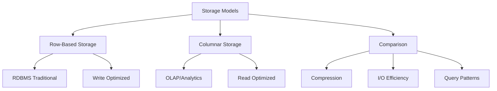
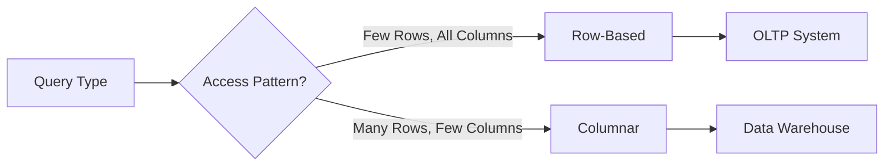

# Lesson 3: RDBMS vs. Columnar Databases

While both Relational Database Management Systems (RDBMS) and Columnar Databases store structured data, their internal storage mechanisms differ fundamentally. This difference dictates their performance characteristics and ideal use cases. This lesson explores the mechanics of row-based versus column-based storage, analyzes their trade-offs in terms of compression and query speed, and explains why modern analytics platforms favor columnar architectures.

## Row-Based Storage (Traditional RDBMS)

In traditional relational databases (like MySQL, PostgreSQL, Oracle), data is stored physically on disk row by row. All columns for a single record are stored together.

### How It Works

-   **Physical Layout**: If you have a table with `ID`, `Name`, and `Salary`, the disk stores `[1, Alice, 5000]`, then `[2, Bob, 6000]`.
-   **Retrieval**: To read one record, the system reads the entire row from disk into memory.
-   **Updates**: Updating a single field requires reading the whole row, modifying it, and writing it back.

### Advantages

-   **Fast Point Queries**: Excellent for retrieving all details of a specific entity (e.g., "Get all info for User ID 1").
-   **Efficient Writes**: Inserting a new record is a single sequential write operation.
-   **Transaction Support**: Naturally supports ACID transactions because all data for a transaction is localized.

### Disadvantages

-   **I/O Waste for Analytics**: If you only need the `Salary` column for an average calculation, the database still reads `ID` and `Name` into memory, wasting I/O bandwidth.
-   **Poor Compression**: Data in a row is heterogeneous (mixed types like integers, strings, dates), making it difficult to compress efficiently.

> [!Important]
> **Row storage is optimized for transactions**: Because all attributes of an entity are together, it is the best choice for OLTP workloads where you frequently create, update, or delete complete records.

## Columnar Storage

In columnar databases (like Amazon Redshift, Google BigQuery, Apache Cassandra, Vertica), data is stored physically by column. All values for a specific column are stored together.

### How It Works

-   **Physical Layout**: The disk stores all `IDs` together, then all `Names` together, then all `Salaries` together.
-   **Retrieval**: To calculate the average `Salary`, the system only reads the `Salary` column from disk. It ignores `ID` and `Name` entirely.
-   **Vectorized Processing**: Modern columnar engines process data in batches (vectors), leveraging CPU cache efficiency.

### Advantages

-   **I/O Efficiency**: Queries that access only a subset of columns read significantly less data from disk.
-   **High Compression**: Since each file contains data of the same type, compression algorithms (like Run-Length Encoding or Dictionary Encoding) achieve much higher ratios.
-   **Fast Aggregations**: Sum, Average, Min, Max, and Count operations are extremely fast because they scan contiguous blocks of homogeneous data.

### Disadvantages

-   **Slow Point Queries**: Retrieving all columns for a single user requires jumping across different physical locations on the disk to assemble the row.
-   **Expensive Writes**: Inserting a single row requires updating multiple column files, leading to higher write overhead.

| Feature | Row-Based (RDBMS) | Columnar (OLAP) |
|---|---|---|
| **Storage Unit** | Row | Column |
| **Best For** | OLTP (Transactions) | OLAP (Analytics) |
| **Read Pattern** | Entire Record | Specific Columns |
| **Write Performance** | High | Low/Moderate |
| **Compression** | Low | High |
| **Aggregation Speed** | Slow | Fast |
| **Example** | PostgreSQL, MySQL | Redshift, BigQuery, Snowflake |

## Compression and I/O Efficiency

The primary benefit of columnar storage comes from how it handles data redundancy and input/output operations.

### Compression Techniques

-   **Run-Length Encoding (RLE)**: Effective when many consecutive values are the same (e.g., a `Country` column with 10,000 rows of "USA"). Stores as `(Value: USA, Count: 10,000)`.
-   **Dictionary Encoding**: Replaces repeated strings with integer IDs. Useful for low-cardinality columns (e.g., `Status`: Active/Inactive).
-   **Bit-Packing**: Efficiently stores small integers by using only the necessary bits.

### I/O Impact

-   **Bandwidth Savings**: In analytics, queries often touch 5–10% of columns but 100% of rows. Columnar storage reduces I/O by ~90% compared to row storage.
-   **Memory Efficiency**: Compressed data fits better in CPU cache, speeding up processing.
-   **Cost Reduction**: In cloud environments, you pay for data scanned. Columnar storage reduces the amount of data scanned, lowering costs.

> [!Tip]
> **Sort Keys Matter**: In columnar databases, sorting data by frequently filtered columns (e.g., `Date`) improves compression and allows the engine to skip entire blocks of data that don't match the filter (Zone Maps).

## Query Pattern Suitability

Choosing between row and column storage depends entirely on how you query the data.

### When to Use Row-Based (RDBMS)

-   **CRUD Operations**: Frequent inserts, updates, and deletes of individual records.
-   **Point Lookups**: "Find the customer with email john@example.com."
-   **Small Result Sets**: Returning a few full records.
-   **High Concurrency**: Many users writing data simultaneously.

### When to Use Columnar (OLAP)

-   **Aggregations**: "What is the total sales revenue per region?"
-   **Scans**: "Find all transactions over $1000 in the last year."
-   **Wide Tables**: Tables with hundreds of columns where queries only use a few.
-   **Historical Analysis**: Querying large volumes of historical data.

## Modern Hybrid Approaches

Modern databases are blurring the lines between row and column storage.

### HTAP (Hybrid Transactional/Analytical Processing)

-   Systems like **SAP HANA**, **TiDB**, and **SingleStore** maintain both row and column copies of data.
-   Row store handles transactions; column store handles analytics.
-   Synchronization happens in real-time or near real-time.

### Cloud Data Warehouses

-   **Amazon Redshift**, **Snowflake**, and **BigQuery** are purely columnar but offer features like automatic scaling and separation of storage and compute.
-   They handle ingestion (writes) efficiently through batch loading or micro-batching, mitigating the traditional write penalty of columnar stores.

### Indexes in RDBMS

-   Traditional RDBMS can mimic some columnar benefits using **Columnstore Indexes** (e.g., in SQL Server or PostgreSQL extensions).
-   These indexes store specific columns in a columnar format for faster analytical queries while keeping the main table row-based for transactions.

## Assessment Preparation

### Practice Questions

1.  Explain the physical difference between row-based and columnar storage.
2.  Why is columnar storage more compressible than row-based storage?
3.  Which storage model is better for frequent single-row updates? Why?
4.  How does columnar storage improve I/O efficiency for analytical queries?
5.  What is Run-Length Encoding and when is it effective?
6.  Why are point queries slower in columnar databases?
7.  Give two examples of columnar database systems.
8.  How do sort keys enhance performance in columnar databases?
9.  What is HTAP and how does it solve the row vs. column dilemma?
10. Why is columnar storage preferred for Data Warehousing?

### Scenario Questions

**Scenario 1: Financial Ledger**
Bank needs to record every transaction instantly and allow users to check their balance.

-   **Choice**: Row-Based RDBMS (PostgreSQL/Oracle).
-   **Reason**: High write throughput, ACID compliance, fast point lookups for user balances.
-   **Avoid**: Columnar due to slow individual writes and point lookups.

**Scenario 2: Sales Analytics Dashboard**
Company wants to analyze 5 years of sales data to find trends by product category.

-   **Choice**: Columnar Data Warehouse (Redshift/Snowflake).
-   **Reason**: Queries scan millions of rows but only a few columns (Sales, Date, Category). High compression reduces cost. Fast aggregations.
-   **Avoid**: Row-based RDBMS would be too slow and expensive for full-table scans.

**Scenario 3: IoT Sensor Data**
Millions of sensors send temperature readings every minute.

-   **Choice**: Columnar or Time-Series Database.
-   **Reason**: Data is append-only (high write volume but batched). Queries are aggregations (avg temp per hour).
-   **Optimization**: Sort by timestamp for efficient range queries.

**Scenario 4: User Profile Management**
App needs to update user preferences (color theme, language) frequently.

-   **Choice**: Row-Based NoSQL or RDBMS.
-   **Reason**: Updates affect single records. Need fast read/write of full profile.
-   **Avoid**: Columnar storage would require updating multiple column files for one user change.

**Scenario 5: Hybrid Workload**
Startup needs real-time transactions and daily reports.

-   **Choice**: HTAP system or Separate OLTP/OLAP.
-   **Option A**: Use TiDB or SingleStore for both.
-   **Option B**: Use PostgreSQL for transactions, replicate to Redshift for reporting.
-   **Reason**: Balances operational speed with analytical power.

## Key Takeaways

-   Row-based storage keeps all columns of a record together; columnar storage keeps all values of a column together.
-   Row-based is optimized for writes and point queries (OLTP).
-   Columnar is optimized for reads, aggregations, and scanning subsets of columns (OLAP).
-   Columnar storage achieves high compression due to data homogeneity.
-   I/O efficiency is the main performance driver for columnar analytics.
-   Write operations are more expensive in columnar databases.
-   Sort keys and zone maps further optimize columnar query performance.
-   Modern cloud warehouses leverage columnar storage for cost-effective big data analytics.
-   HTAP systems attempt to combine benefits of both models.
-   Choose storage based on query patterns: transactional vs. analytical.

> [!Important]
> **Match storage to workload**: Do not use a columnar database for a high-frequency trading app, and do not use a row-based RDBMS for petabyte-scale analytics. Understanding the physical layout of data helps you predict performance bottlenecks and choose the right architecture. In cloud environments, this choice directly impacts your bill through data scanning costs.
