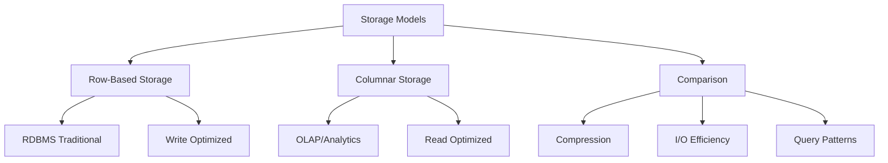

# Migration in progress
# Lesson 3: RDBMS vs. Columnar Databases

While both Relational Database Management Systems (RDBMS) and Columnar Databases store structured data, their internal storage mechanisms differ fundamentally. This difference dictates their performance characteristics and ideal use cases. This lesson explores the mechanics of row-based versus column-based storage, analyzes their trade-offs in terms of compression and query speed, and explains why modern analytics platforms favor columnar architectures.

## Row-Based Storage (Traditional RDBMS)

In traditional relational databases (like MySQL, PostgreSQL, Oracle), data is stored physically on disk row by row. All columns for a single record are stored together.

### How It Works

-   **Physical Layout**: If you have a table with `ID`, `Name`, and `Salary`, the disk stores `[1, Alice, 5000]`, then `[2, Bob, 6000]`.
-   **Retrieval**: To read one record, the system reads the entire row from disk into memory.
-   **Updates**: Updating a single field requires reading the whole row, modifying it, and writing it back.

### Advantages

-   **Fast Point Queries**: Excellent for retrieving all details of a specific entity (e.g., "Get all info for User ID 1").
-   **Efficient Writes**: Inserting a new record is a single sequential write operation.
-   **Transaction Support**: Naturally supports ACID transactions because all data for a transaction is localized.

### Disadvantages

-   **I/O Waste for Analytics**: If you only need the `Salary` column for an average calculation, the database still reads `ID` and `Name` into memory, wasting I/O bandwidth.
-   **Poor Compression**: Data in a row is heterogeneous (mixed types like integers, strings, dates), making it difficult to compress efficiently.

> [!Important]
> **Row storage is optimized for transactions**: Because all attributes of an entity are together, it is the best choice for OLTP workloads where you frequently create, update, or delete complete records.

## Columnar Storage

In columnar databases (like Amazon Redshift, Google BigQuery, Apache Cassandra, Vertica), data is stored physically by column. All values for a specific column are stored together.

### How It Works

-   **Physical Layout**: The disk stores all `IDs` together, then all `Names` together, then all `Salaries` together.
-   **Retrieval**: To calculate the average `Salary`, the system only reads the `Salary` column from disk. It ignores `ID` and `Name` entirely.
-   **Vectorized Processing**: Modern columnar engines process data in batches (vectors), leveraging CPU cache efficiency.

### Advantages

-   **I/O Efficiency**: Queries that access only a subset of columns read significantly less data from disk.
-   **High Compression**: Since each file contains data of the same type, compression algorithms (like Run-Length Encoding or Dictionary Encoding) achieve much higher ratios.
-   **Fast Aggregations**: Sum, Average, Min, Max, and Count operations are extremely fast because they scan contiguous blocks of homogeneous data.

### Disadvantages

-   **Slow Point Queries**: Retrieving all columns for a single user requires jumping across different physical locations on the disk to assemble the row.
-   **Expensive Writes**: Inserting a single row requires updating multiple column files, leading to higher write overhead.

| Feature | Row-Based (RDBMS) | Columnar (OLAP) |
|---|---|---|
| **Storage Unit** | Row | Column |
| **Best For** | OLTP (Transactions) | OLAP (Analytics) |
| **Read Pattern** | Entire Record | Specific Columns |
| **Write Performance** | High | Low/Moderate |
| **Compression** | Low | High |
| **Aggregation Speed** | Slow | Fast |
| **Example** | PostgreSQL, MySQL | Redshift, BigQuery, Snowflake |

## Compression and I/O Efficiency

The primary benefit of columnar storage comes from how it handles data redundancy and input/output operations.

### Compression Techniques

-   **Run-Length Encoding (RLE)**: Effective when many consecutive values are the same (e.g., a `Country` column with 10,000 rows of "USA"). Stores as `(Value: USA, Count: 10,000)`.
-   **Dictionary Encoding**: Replaces repeated strings with integer IDs. Useful for low-cardinality columns (e.g., `Status`: Active/Inactive).
-   **Bit-Packing**: Efficiently stores small integers by using only the necessary bits.

### I/O Impact

-   **Bandwidth Savings**: In analytics, queries often touch 5–10% of columns but 100% of rows. Columnar storage reduces I/O by ~90% compared to row storage.
-   **Memory Efficiency**: Compressed data fits better in CPU cache, speeding up processing.
-   **Cost Reduction**: In cloud environments, you pay for data scanned. Columnar storage reduces the amount of data scanned, lowering costs.

> [!Tip]
> **Sort Keys Matter**: In columnar databases, sorting data by frequently filtered columns (e.g., `Date`) improves compression and allows the engine to skip entire blocks of data that don't match the filter (Zone Maps).

## Query Pattern Suitability

Choosing between row and column storage depends entirely on how you query the data.

### When to Use Row-Based (RDBMS)

-   **CRUD Operations**: Frequent inserts, updat