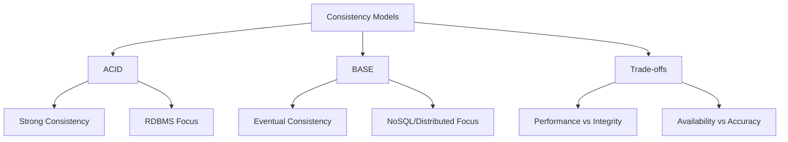

# Lesson 4: ACID vs. BASE Models

Data consistency models define how a database system handles data integrity, especially in distributed environments. The two primary models are ACID (Atomicity, Consistency, Isolation, Durability) and BASE (Basically Available, Soft state, Eventual consistency). This lesson contrasts these models, explains the trade-offs between strong consistency and high availability, and guides you on when to apply each model in modern cloud architectures.

## The ACID Model

ACID is a set of properties that guarantee database transactions are processed reliably. It is the standard for traditional relational databases where data integrity is paramount.

### Atomicity

-   **"All or Nothing"**: A transaction is treated as a single unit. Either all operations within the transaction succeed, or none do.
-   **Rollback**: If any part fails, the database reverts to its previous state.
-   **Example**: In a bank transfer, money is deducted from Account A and added to Account B. If the addition fails, the deduction is rolled back.

### Consistency

-   **Validity**: Every transaction brings the database from one valid state to another.
-   **Constraints**: All defined rules (foreign keys, unique constraints, triggers) are enforced.
-   **Example**: You cannot create an order for a non-existent customer ID if a foreign key constraint exists.

### Isolation

-   **Concurrency Control**: Concurrent transactions occur independently without interference.
-   **Visibility**: Changes made by one transaction are not visible to others until committed.
-   **Levels**: Read Uncommitted, Read Committed, Repeatable Read, Serializable.
-   **Example**: Two users buying the last ticket simultaneously; only one succeeds, the other sees "sold out."

### Durability

-   **Persistence**: Once a transaction is committed, it remains so, even in the event of power loss, crashes, or errors.
-   **Write-Ahead Logging**: Changes are written to a log before being applied to the main data store.
-   **Example**: After clicking "Confirm Order," the order exists permanently even if the server crashes immediately after.

> [!Important]
> **ACID prioritizes correctness over speed**: In distributed systems, enforcing strict ACID properties across multiple nodes requires significant coordination (locking), which can reduce performance and availability.

## The BASE Model

BASE is a consistency model used primarily in NoSQL and distributed databases. It relaxes strict consistency to achieve higher availability and partition tolerance, aligning with the CAP theorem's AP (Availability + Partition Tolerance) choice.

### Basically Available

-   **Uptime Focus**: The system guarantees availability. Every request receives a response (success or failure), but not necessarily the most recent data.
-   **Fault Tolerance**: The system remains operational even if some nodes fail.
-   **Example**: A social media feed loads even if some recent posts are missing due to node latency.

### Soft State

-   **Fluidity**: The state of the system may change over time, even without input.
-   **Replication Lag**: Due to eventual consistency, different nodes may have different versions of data temporarily.
-   **Example**: A user updates their profile picture; friends may see the old image for a few seconds while replication occurs.

### Eventual Consistency

-   **Convergence**: If no new updates are made to a given data item, eventually all accesses to that item will return the last updated value.
-   **Time Window**: There is a window of inconsistency during which reads may return stale data.
-   **Example**: DNS propagation. When you update a DNS record, it takes time for all servers globally to reflect the change.

| Property | ACID | BASE |
|---|---|---|
| **Consistency** | Strong (Immediate) | Eventual (Delayed) |
| **Availability** | Lower (due to locking) | Higher (always responsive) |
| **Partition Tolerance** | Often sacrificed | Prioritized |
| **Best For** | Financial, Inventory | Social Media, Logs, Caching |
| **Complexity** | High coordination | Low coordination |
| **Performance** | Slower under load | Faster, scalable |

## Trade-offs: Strong vs. Eventual Consistency

Choosing between ACID and BASE is a business and technical decision based on the cost of inconsistency.

### When to Choose ACID

-   **Financial Transactions**: Banking, payments, ledgers. Incorrect balances are unacceptable.
-   **Inventory Management**: Preventing overselling of limited stock.
-   **Regulatory Compliance**: Healthcare or legal records requiring strict audit trails.
-   **Complex Relationships**: Systems relying heavily on joins and referential integrity.

### When to Choose BASE

-   **Social Networks**: Likes, comments, feeds. Seeing a like count off by one is acceptable.
-   **Content Delivery**: Product catalogs, news articles. Slight delays in updates are tolerable.
-   **High-Volume Logging**: IoT sensor data, clickstreams. Losing a few duplicate entries is better than slowing down ingestion.
-   **Caching**: Session stores, temporary data. Speed is more important than perfect accuracy.

> [!Tip]
> **Tunable Consistency**: Many modern NoSQL databases (like Cassandra or DynamoDB) allow you to tune consistency levels per query. You can choose `QUORUM` for stronger consistency or `ONE` for higher availability, giving you flexibility between ACID and BASE.

## Handling Inconsistency in BASE Systems

Since BASE systems allow temporary inconsistency, applications must be designed to handle it.

### Idempotency

-   Design operations so that repeating them has the same effect as doing them once.
-   Critical for retry logic in distributed systems.
-   Example: Using a unique transaction ID to ensure a payment is only processed once, even if the client retries.

### Conflict Resolution

-   **Last Write Wins (LWW)**: The most recent timestamp overwrites older data. Simple but can lose data.
-   **Vector Clocks**: Track causal relationships between events to determine which update is newer.
-   **Application-Level Merging**: The app logic merges conflicting changes (e.g., collaborative editing tools).

### User Experience Design

-   **Optimistic UI**: Show the update to the user immediately before it is confirmed by the server.
-   **Sync Indicators**: Show "Saving..." or "Syncing..." to inform users that data is not yet final.
-   **Refresh Mechanisms**: Allow users to manually refresh to get the latest consistent state.

## Assessment Preparation

### Practice Questions

1.  What does ACID stand for and what does each letter mean?
2.  What does BASE stand for and how does it differ from ACID?
3.  Why is Atomicity critical in financial transactions?
4.  Explain Eventual Consistency with a real-world example.
5.  What is the trade-off between Availability and Consistency in the CAP theorem?
6.  Why do NoSQL databases often prefer BASE over ACID?
7.  What is Idempotency and why is it important in BASE systems?
8.  How does Isolation prevent race conditions in ACID databases?
9.  Give two examples of use cases suitable for ACID and two for BASE.
10. What is "Soft State" in the context of BASE?

### Scenario Questions

**Scenario 1: Online Banking Transfer**
User transfers $100 from Savings to Checking.

-   **Model**: ACID.
-   **Reason**: Money cannot disappear or be duplicated. Atomicity ensures both debit and credit happen or neither does. Consistency ensures balances remain valid.
-   **Risk**: BASE could lead to incorrect balances during replication lag.

**Scenario 2: Social Media Like Button**
User likes a post; millions of others view the like count.

-   **Model**: BASE.
-   **Reason**: High availability is crucial. It doesn't matter if the count is off by one for a few seconds. Eventual consistency ensures it corrects itself.
-   **Benefit**: System scales to millions of concurrent users without locking.

**Scenario 3: E-Commerce Shopping Cart**
User adds items to cart; inventory is checked at checkout.

-   **Model**: Hybrid.
-   **Cart**: BASE (high availability, eventual consistency).
-   **Checkout**: ACID (strong consistency to reserve inventory and process payment).
-   **Strategy**: Use ACID only for the critical transaction step.

**Scenario 4: Global Chat Application**
Messages sent from New York appear in Tokyo.

-   **Model**: BASE.
-   **Reason**: Low latency is preferred over perfect ordering. Messages may arrive slightly out of order or with delay.
-   **Handling**: Client-side sorting by timestamp. Last Write Wins for edits.

**Scenario 5: Hospital Patient Records**
Doctor updates patient medication list.

-   **Model**: ACID.
-   **Reason**: Patient safety depends on accurate, immediate data. Strong consistency prevents conflicting medication orders.
-   **Compliance**: Regulatory requirements demand strict audit trails and data integrity.

## Key Takeaways

-   ACID guarantees strong consistency and reliability for transactions.
-   BASE prioritizes availability and scalability, accepting eventual consistency.
-   ACID is essential for financial, legal, and inventory systems.
-   BASE is ideal for social media, caching, and high-volume logging.
-   Eventual consistency means data will become consistent over time if no new updates occur.
-   Idempotency is a key design pattern for handling retries in BASE systems.
-   Modern databases often offer tunable consistency levels.
-   The choice between ACID and BASE depends on the business cost of inconsistency.
-   Distributed systems favor BASE to maintain availability during network partitions.
-   Understand your data’s criticality before choosing a consistency model.

> [!Important]
> **Consistency is a spectrum, not a binary choice**: While ACID and BASE represent opposite ends, many systems exist in between. Evaluate the impact of stale data on your specific application. If stale data causes financial loss or safety risks, choose ACID. If it causes minor user inconvenience, BASE may offer better performance and scale. Design your application logic to handle the chosen model’s limitations.
