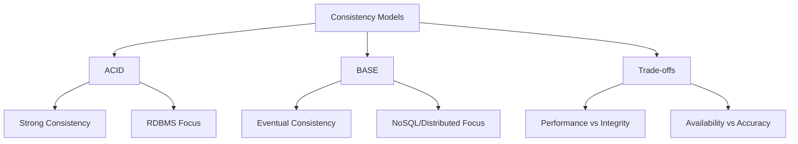

# Migration in progress
# Lesson 4: ACID vs. BASE Models

Data consistency models define how a database system handles data integrity, especially in distributed environments. The two primary models are ACID (Atomicity, Consistency, Isolation, Durability) and BASE (Basically Available, Soft state, Eventual consistency). This lesson contrasts these models, explains the trade-offs between strong consistency and high availability, and guides you on when to apply each model in modern cloud architectures.

## The ACID Model

ACID is a set of properties that guarantee database transactions are processed reliably. It is the standard for traditional relational databases where data integrity is paramount.

### Atomicity

-   **"All or Nothing"**: A transaction is treated as a single unit. Either all operations within the transaction succeed, or none do.
-   **Rollback**: If any part fails, the database reverts to its previous state.
-   **Example**: In a bank transfer, money is deducted from Account A and added to Account B. If the addition fails, the deduction is rolled back.

### Consistency

-   **Validity**: Every transaction brings the database from one valid state to another.
-   **Constraints**: All defined rules (foreign keys, unique constraints, triggers) are enforced.
-   **Example**: You cannot create an order for a non-existent customer ID if a foreign key constraint exists.

### Isolation

-   **Concurrency Control**: Concurrent transactions occur independently without interference.
-   **Visibility**: Changes made by one transaction are not visible to others until committed.
-   **Levels**: Read Uncommitted, Read Committed, Repeatable Read, Serializable.
-   **Example**: Two users buying the last ticket simultaneously; only one succeeds, the other sees "sold out."

### Durability

-   **Persistence**: Once a transaction is committed, it remains so, even in the event of power loss, crashes, or errors.
-   **Write-Ahead Logging**: Changes are written to a log before being applied to the main data store.
-   **Example**: After clicking "Confirm Order," the order exists permanently even if the server crashes immediately after.

> [!Important]
> **ACID prioritizes correctness over speed**: In distributed systems, enforcing strict ACID properties across multiple nodes requires significant coordination (locking), which can reduce performance and availability.

## The BASE Model

BASE is a consistency model used primarily in NoSQL and distributed databases. It relaxes strict consistency to achieve higher availability and partition tolerance, aligning with the CAP theorem's AP (Availability + Partition Tolerance) choice.

### Basically Available

-   **Uptime Focus**: The system guarantees availability. Every request receives a response (success or failure), but not necessarily the most recent data.
-   **Fault Tolerance**: The system remains operational even if some nodes fail.
-   **Example**: A social media feed loads even if some recent posts are missing due to node latency.

### Soft State

-   **Fluidity**: The state of the system may change over time, even without input.
-   **Replication Lag**: Due to eventual consistency, different nodes may have different versions of data temporarily.
-   **Example**: A user updates their profile picture; friends may see the old image for a few seconds while replication occurs.

### Eventual Consistency

-   **Convergence**: If no new updates are made to a given data item, eventually all accesses to that item will return the last updated value.
-   **Time Window**: There is a window of inconsistency during which reads may return stale data.
-   **Example**: DNS propagation. When you update a DNS record, it takes time for all servers globally to reflect the change.

| Property | ACID | BASE |
|---|---|---|
| **Consistency** | Strong (Immediate) | Eventual (Delayed) |
| **Availability** | Lower (due to locking) | Higher (always responsive) |
| **Partition Tolerance** | Often sacrificed | Prioritized |
| **Best For** | Financial, Inventory | Social Media, Logs, Caching |
| **Complexity** | High coordination | Low coordination |
| **Performance** | Slower under load | Faster, scalable |

## Trade-offs: Strong vs. Eventual Consistency

Choosing between ACID and BASE is a business and technical decision based on the cost of inconsistency.

### When to Choose ACID

-   **Financial Transactions**: Banking, payments, ledgers. Incorrect balances are unacceptable.
-   **Inventory Management**: Preventing overselling of limited stock.
-   **Regulatory Compliance**: Healthcare or legal records requiring strict audit trails.
-   **Complex Relationships**: Systems relying heavily on joins and referential integrity.

### When to Choose BASE

-   **Social Networks**: Likes, comments, feeds. Seeing a like count off by one is acceptable.
-   **Content Delivery**: Product catalogs, news articles. Slight delays i