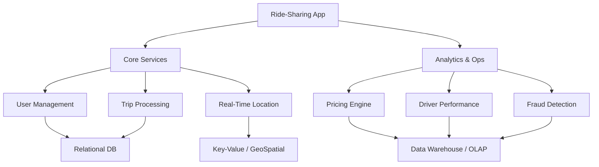
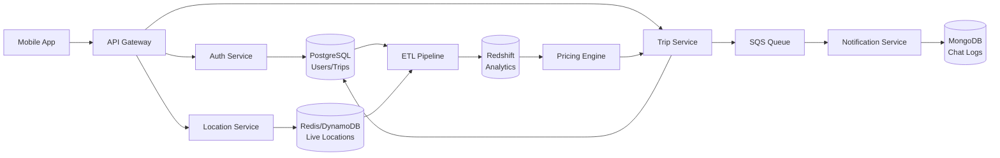

# Lesson 5: Real-World Use Case - Ride-Sharing App

This lesson applies the theoretical concepts of data storage paradigms, OLTP/OLAP architectures, and consistency models to a complex, real-world scenario: a ride-sharing application (like Uber or Lyft). You will learn how to design a polyglot persistence architecture that balances high-speed transactions, real-time location tracking, and historical analytics.

## The Challenge

A ride-sharing app has diverse data requirements:
1.  **High Concurrency**: Millions of users requesting rides simultaneously.
2.  **Real-Time Data**: Live driver locations updating every few seconds.
3.  **Strict Consistency**: Payments and trip status must be accurate.
4.  **Complex Analytics**: Dynamic pricing, route optimization, and driver incentives.
5.  **Unstructured Data**: Chat logs, support tickets, and vehicle images.

No single database can efficiently handle all these workloads. We must use **Polyglot Persistence**.

## Component 1: User and Trip Management (OLTP)

**Requirement**: Store user profiles, driver details, trip records, and payment history. Requires strong consistency and relational integrity.

### Solution: Relational Database (RDBMS)
*   **Technology**: PostgreSQL, Amazon Aurora, or MySQL.
*   **Why**:
    *   **ACID Compliance**: Ensures that when a trip is completed, the payment is recorded and the driver’s balance is updated atomically.
    *   **Structured Schema**: Users, drivers, vehicles, and trips have well-defined relationships.
    *   **Complex Queries**: Joining user data with trip history for support queries.

### Data Model
*   `Users` table: ID, Name, Email, PaymentMethodID.
*   `Drivers` table: ID, LicenseNumber, VehicleID, Status.
*   `Trips` table: ID, UserID, DriverID, StartLocation, EndLocation, Fare, Status.

> [!Important]
> **Normalize for Integrity**: Keep user and payment data normalized to avoid redundancy. Use foreign keys to enforce referential integrity between trips and users/drivers.

## Component 2: Real-Time Location Tracking

**Requirement**: Track thousands of drivers moving in real-time. Enable fast "nearest driver" searches. High write throughput, low latency reads.

### Solution: Key-Value Store with GeoSpatial Indexing
*   **Technology**: Redis (with Geo commands), Amazon DynamoDB (with Geospatial Secondary Indexes), or MongoDB.
*   **Why**:
    *   **High Write Speed**: Drivers send GPS updates every 3–5 seconds. RDBMS would choke on this volume.
    *   **GeoQueries**: Efficiently find all drivers within a 2km radius of a user.
    *   **TTL (Time-to-Live)**: Automatically expire old location data to save space.

### Data Model
*   **Key**: `driver_id`
*   **Value**: `{ latitude: 40.7128, longitude: -74.0060, timestamp: 1678886400 }`
*   **Index**: Geospatial index on lat/long for radius searches.

> [!Tip]
> **Eventual Consistency is Acceptable**: It doesn’t matter if a user sees a driver’s location from 2 seconds ago. Strict consistency is not required for live map dots. BASE model applies here.

## Component 3: Dynamic Pricing and Analytics (OLAP)

**Requirement**: Calculate surge pricing based on demand/supply ratios. Analyze historical trip data for business intelligence.

### Solution: Data Warehouse / Columnar Database
*   **Technology**: Amazon Redshift, Google BigQuery, or Snowflake.
*   **Why**:
    *   **Aggregations**: Fast calculation of average trip duration, revenue per city, or driver utilization rates.
    *   **Historical Data**: Store years of trip data for trend analysis.
    *   **Columnar Storage**: Efficiently scan millions of trips to calculate surge multipliers.

### Data Pipeline (ETL)
1.  **Extract**: Stream completed trip data from RDBMS and location data from Key-Value store.
2.  **Transform**: Clean data, join user/driver info, calculate metrics.
3.  **Load**: Insert into Data Warehouse for analysis.

## Component 4: Messaging and Notifications

**Requirement**: Send push notifications, in-app chat between driver and rider, and SMS alerts.

### Solution: Document Store + Message Queue
*   **Technology**: MongoDB (for chat history), Amazon SQS/SNS (for notifications).
*   **Why**:
    *   **Flexible Schema**: Chat messages vary in length and type (text, image, emoji).
    *   **Decoupling**: SQS decouples the trip service from the notification service, ensuring reliability even if one service is slow.

## Architecture Diagram

## Consistency Models in Action

| Feature | Consistency Model | Reason |
|---|---|---|
| **Payment Processing** | ACID (Strong) | Financial accuracy is non-negotiable. |
| **Trip Status Update** | ACID (Strong) | User and driver must see same status (e.g., "Arrived"). |
| **Driver Location** | BASE (Eventual) | Slight lag is acceptable; availability is critical. |
| **Surge Pricing** | BASE (Eventual) | Prices update every few minutes; strict real-time consistency is too expensive. |
| **Chat Messages** | BASE (Eventual) | Messages may arrive out of order; delivery is more important than order. |

## Assessment Preparation

### Practice Questions

1.  Why is a Relational Database suitable for user and trip management?
2.  What makes Key-Value stores ideal for real-time location tracking?
3.  Explain why eventual consistency is acceptable for driver locations but not for payments.
4.  How does a Data Warehouse support dynamic pricing?
5.  What role does SQS play in the ride-sharing architecture?
6.  Why is polyglot persistence necessary for this use case?
7.  How do geospatial indexes improve performance in location services?
8.  What are the risks of using a single RDBMS for all components?
9.  How does TTL help in managing location data?
10. Describe the ETL flow from operational databases to the analytics warehouse.

### Scenario Questions

**Scenario 1: Surge Pricing Failure**
During a concert, surge pricing fails to update, leading to flat fares and high demand.

*   **Cause**: Analytics pipeline latency; Data Warehouse not reflecting real-time supply/demand.
*   **Fix**: Move surge calculation closer to the edge (in-memory cache like Redis) with frequent updates from streaming data (Kinesis/Kafka).
*   **Trade-off**: Slightly less accurate global view, but faster local response.

**Scenario 2: Lost Driver Location**
Drivers complain their location disappears from the map intermittently.

*   **Cause**: Redis eviction policy or DynamoDB throttling due to high write volume.
*   **Fix**: Increase provisioned throughput for DynamoDB or scale Redis cluster. Implement client-side caching on the driver app to send updates less frequently if network is poor.
*   **Consistency**: Ensure BASE model handles temporary gaps gracefully.

**Scenario 3: Payment Discrepancy**
User charged twice for the same trip.

*   **Cause**: Lack of idempotency in payment service; network retry caused duplicate transaction.
*   **Fix**: Implement idempotency keys in the RDBMS. Check if `trip_id` already has a successful payment record before processing.
*   **Model**: Enforce ACID properties strictly.

**Scenario 4: Slow Support Queries**
Customer support takes minutes to load a user’s full trip history.

*   **Cause**: Complex joins on large RDBMS tables.
*   **Fix**: Create read replicas for support queries. Or, pre-aggregate common views in the Data Warehouse and serve them via API.
*   **Optimization**: Index frequently queried columns (UserID, Date).

**Scenario 5: Chat History Loss**
Users lose chat history with drivers after app restart.

*   **Cause**: Chat stored only in memory or ephemeral cache.
*   **Fix**: Persist chat logs in MongoDB (Document Store).
*   **Benefit**: Flexible schema supports media files; durable storage ensures history retention.

## Key Takeaways

*   Polyglot persistence uses the best database for each specific job.
*   RDBMS (ACID) is best for financial and core transactional data.
*   Key-Value/Geo stores (BASE) are best for high-speed, real-time location data.
*   Data Warehouses (OLAP) enable complex analytics and dynamic pricing.
*   Message queues decouple services for reliability and scalability.
*   Consistency models should match the business criticality of the data.
*   ETL pipelines bridge the gap between operational (OLTP) and analytical (OLAP) systems.
*   Geospatial indexing is critical for location-based services.
*   Idempotency prevents duplicate transactions in distributed systems.
*   Design for failure: assume network issues and plan for eventual consistency where appropriate.

> [!Important]
> **Context is King**: There is no "best" database. The best choice depends on the specific access pattern, consistency requirement, and scale of the data component. In a ride-sharing app, a payment error is catastrophic (use ACID), but a 2-second delay in map updates is annoying but acceptable (use BASE). Architect your system to reflect these business priorities.
