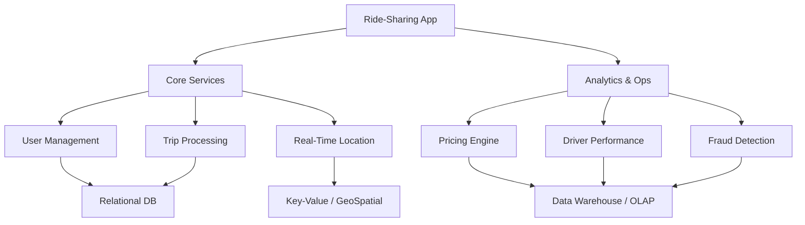

# Migration in progress
# Lesson 5: Real-World Use Case - Ride-Sharing App

This lesson applies the theoretical concepts of data storage paradigms, OLTP/OLAP architectures, and consistency models to a complex, real-world scenario: a ride-sharing application (like Uber or Lyft). You will learn how to design a polyglot persistence architecture that balances high-speed transactions, real-time location tracking, and historical analytics.



## The Challenge

A ride-sharing app has diverse data requirements:
1.  **High Concurrency**: Millions of users requesting rides simultaneously.
2.  **Real-Time Data**: Live driver locations updating every few seconds.
3.  **Strict Consistency**: Payments and trip status must be accurate.
4.  **Complex Analytics**: Dynamic pricing, route optimization, and driver incentives.
5.  **Unstructured Data**: Chat logs, support tickets, and vehicle images.

No single database can efficiently handle all these workloads. We must use **Polyglot Persistence**.

## Component 1: User and Trip Management (OLTP)

**Requirement**: Store user profiles, driver details, trip records, and payment history. Requires strong consistency and relational integrity.

### Solution: Relational Database (RDBMS)
*   **Technology**: PostgreSQL, Amazon Aurora, or MySQL.
*   **Why**:
    *   **ACID Compliance**: Ensures that when a trip is completed, the payment is recorded and the driver’s balance is updated atomically.
    *   **Structured Schema**: Users, drivers, vehicles, and trips have well-defined relationships.
    *   **Complex Queries**: Joining user data with trip history for support queries.

### Data Model
*   `Users` table: ID, Name, Email, PaymentMethodID.
*   `Drivers` table: ID, LicenseNumber, VehicleID, Status.
*   `Trips` table: ID, UserID, DriverID, StartLocation, EndLocation, Fare, Status.

> [!Important]
> **Normalize for Integrity**: Keep user and payment data normalized to avoid redundancy. Use foreign keys to enforce referential integrity between trips and users/drivers.

## Component 2: Real-Time Location Tracking

**Requirement**: Track thousands of drivers moving in real-time. Enable fast "nearest driver" searches. High write throughput, low latency reads.

### Solution: Key-Value Store with GeoSpatial Indexing
*   **Technology**: Redis (with Geo commands), Amazon DynamoDB (with Geospatial Secondary Indexes), or MongoDB.
*   **Why**:
    *   **High Write Speed**: Drivers send GPS updates every 3–5 seconds. RDBMS would choke on this volume.
    *   **GeoQueries**: Efficiently find all drivers within a 2km radius of a user.
    *   **TTL (Time-to-Live)**: Automatically expire old location data to save space.

### Data Model
*   **Key**: `driver_id`
*   **Value**: `{ latitude: 40.7128, longitude: -74.0060, timestamp: 1678886400 }`
*   **Index**: Geospatial index on lat/long for radius searches.

> [!Tip]
> **Eventual Consistency is Acceptable**: It doesn’t matter if a user sees a driver’s location from 2 seconds ago. Strict consistency is not required for live map dots. BASE model applies here.

## Component 3: Dynamic Pricing and Analytics (OLAP)

**Requirement**: Calculate surge pricing based on demand/supply ratios. Analyze historical trip data for business intelligence.

### Solution: Data Warehouse / Columnar Database
*   **Technology**: Amazon Redshift, Google BigQuery, or Snowflake.
*   **Why**:
    *   **Aggregations**: Fast calculation of average trip duration, revenue per city, or driver utilization rates.
    *   **Historical Data**: Store years of trip data for trend analysis.
    *   **Columnar Storage**: Efficiently scan millions of trips to calculate surge multipliers.

### Data Pipeline (ETL)
1.  **Extract**: Stream completed trip data from RDBMS and location data from Key-Value store.
2.  **Transform**: Clean data, join user/driver info, calculate metrics.
3.  **Load**: Insert into Data Warehouse for analysis.

## Component 4: Messaging and Notifications

**Requirement**: Send push notifications, in-app chat between driver and rider, and SMS alerts.

### Solution: Document Store + Message Queue
*   **Technology**: MongoDB (for chat history), Amazon SQS/SNS (for notifications).
*   **Why**:
    *   **Flexible Schema**: Chat messages vary in length and type (text, image, emoji).
    *   **Decoupling**: SQS decouples the trip service from the notification service, ensuring reliability even if one service is slow.

## Architecture Diagram

```mermaid
flowchart LR
    A[Mobi