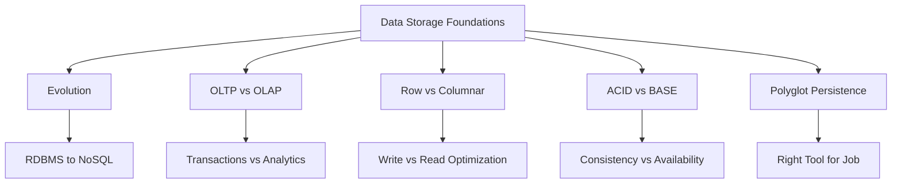

# Lesson 6: Summary and Assessment

This lesson consolidates the foundational concepts of data storage paradigms. It reviews the evolution from relational to non-relational systems, contrasts OLTP and OLAP architectures, explains row-based versus columnar storage, and clarifies ACID versus BASE consistency models. The goal is to ensure you can evaluate data requirements and select appropriate storage solutions for diverse workloads. This summary serves as a final review before the assessment.

## Module Recap

The module covered five core areas of modern data storage.

### Lesson 1: Evolution of Data Storage

-   Traced the shift from flat files and hierarchical models to relational databases.
-   Explained how Web 2.0 scale drove the NoSQL revolution.
-   Highlighted the move from vertical to horizontal scaling.
-   Introduced Data Lakes and cloud-native storage as modern standards.
-   Emphasized that history informs current architectural choices.

### Lesson 2: OLTP vs. OLAP Architectures

-   Defined OLTP as transaction-focused (short, fast, normalized).
-   Defined OLAP as analytics-focused (complex, historical, denormalized).
-   Contrasted Star/Snowflake schemas with normalized 3NF schemas.
-   Explained the role of ETL/ELT in bridging operational and analytical systems.
-   Stressed the importance of separating transactional and analytical workloads.

### Lesson 3: RDBMS vs. Columnar Databases

-   Detailed physical storage differences: row-based vs. column-based.
-   Explained why columnar storage excels at aggregations and compression.
-   Noted that row-based storage is superior for point queries and writes.
-   Discussed I/O efficiency and cost implications in cloud environments.
-   Introduced HTAP as a hybrid approach.

### Lesson 4: ACID vs. BASE Models

-   Defined ACID properties (Atomicity, Consistency, Isolation, Durability).
-   Defined BASE properties (Basically Available, Soft state, Eventual consistency).
-   Linked consistency models to the CAP theorem trade-offs.
-   Provided guidelines for choosing strong vs. eventual consistency.
-   Highlighted idempotency as a key pattern for BASE systems.

### Lesson 5: Real-World Use Case (Ride-Sharing)

-   Applied polyglot persistence to a complex system.
-   Mapped RDBMS to user/trip management (ACID).
-   Mapped Key-Value stores to real-time location tracking (BASE).
-   Mapped Data Warehouses to dynamic pricing and analytics (OLAP).
-   Demonstrated how multiple consistency models coexist in one application.

## Key Concepts Matrix

| Concept | OLTP / RDBMS / ACID | OLAP / Columnar / BASE |
| :--- | :--- | :--- |
| **Primary Goal** | Transaction integrity & speed | Analytical throughput & scale |
| **Data Structure** | Normalized, Row-based | Denormalized, Column-based |
| **Query Pattern** | Point lookups, CRUD | Aggregations, Scans |
| **Consistency** | Strong (Immediate) | Eventual (Delayed) |
| **Scaling** | Vertical (typically) | Horizontal |
| **Write Performance** | High | Moderate/Low |
| **Read Performance** | Fast for single records | Fast for bulk analysis |
| **Typical Use Case** | Banking, Orders | Reporting, BI, IoT |

## Common Pitfalls and Mitigations

Understanding where designs fail is as important as knowing best practices.

### Running Analytics on OLTP Systems

-   **Pitfall**: Heavy analytical queries lock tables and degrade transaction performance.
-   **Mitigation**: Offload analytics to a dedicated Data Warehouse or Read Replica. Use ETL/CDC to sync data.

### Forcing Relational Models on Unstructured Data

-   **Pitfall**: Trying to store JSON, logs, or social graphs in rigid RDBMS tables leads to complexity and poor performance.
-   **Mitigation**: Use Document stores for flexible schemas, Graph databases for relationships, or Data Lakes for raw unstructured data.

### Ignoring Consistency Trade-offs

-   **Pitfall**: Choosing BASE for financial ledgers or ACID for high-volume sensor ingestion.
-   **Mitigation**: Map business criticality to consistency models. Use tunable consistency where available. Design application logic to handle eventual consistency (idempotency, conflict resolution).

### Neglecting Physical Storage Layout

-   **Pitfall**: Using row-based storage for wide-table analytics or columnar storage for frequent single-row updates.
-   **Mitigation**: Understand query patterns before selecting a database engine. Test with realistic data volumes.

### Monolithic Data Architecture

-   **Pitfall**: Expecting one database to handle transactions, caching, search, and analytics.
-   **Mitigation**: Adopt polyglot persistence. Specialize components but manage integration complexity through robust pipelines and APIs.

## Assessment Preparation

### Practice Questions

1.  Explain the difference between OLTP and OLAP workloads.
2.  Why is columnar storage more efficient for analytical queries?
3.  What are the four ACID properties and why do they matter?
4.  When is eventual consistency acceptable? Give two examples.
5.  How does normalization differ between OLTP and OLAP schemas?
6.  What is polyglot persistence and why is it used?
7.  Compare row-based and columnar storage for write operations.
8.  How does the CAP theorem influence database selection?
9.  What role does ETL play in modern data architectures?
10. Why is idempotency critical in distributed BASE systems?

### Scenario Analysis

**Scenario 1: E-Commerce Platform**
Needs order processing and sales trend analysis.

-   **Orders**: RDBMS (PostgreSQL/Aurora) for ACID compliance.
-   **Analytics**: Columnar Warehouse (Redshift/Snowflake) for aggregations.
-   **Pipeline**: CDC streams completed orders to warehouse.
-   **Benefit**: Transactions never blocked by reports.

**Scenario 2: Social Media Feed**
High-volume posts, likes, and friend connections.

-   **Posts/Likes**: Key-Value or Document Store (DynamoDB/MongoDB) for scale.
-   **Friends**: Graph Database (Neptune) for relationship traversal.
-   **Consistency**: BASE model; slight delay in like counts is acceptable.
-   **Avoid**: RDBMS joins for feed generation at scale.

**Scenario 3: IoT Sensor Network**
Millions of devices sending telemetry every second.

-   **Ingestion**: Time-Series or Columnar DB (Cassandra/Keyspaces).
-   **Storage**: Optimized for high-write throughput.
-   **Analysis**: Pre-aggregate in DB or stream to Data Lake.
-   **Consistency**: Eventual; missing a few readings is better than blocking ingestion.

**Scenario 4: Financial Ledger Migration**
Moving legacy banking system to cloud.

-   **Requirement**: Strict ACID compliance, zero data loss.
-   **Solution**: Managed RDBMS (Aurora) with Multi-AZ.
-   **Avoid**: NoSQL unless NewSQL with strong consistency guarantees.
-   **Validation**: Dual-write and reconciliation during migration.

**Scenario 5: Global Content Delivery**
Product catalog accessed worldwide with low latency.

-   **Storage**: Globally distributed NoSQL (Cosmos DB/DynamoDB Global Tables).
-   **Consistency**: Tunable; local reads for speed, strong writes for inventory.
-   **Caching**: CDN + Key-Value store for hot items.
-   **Trade-off**: Accept stale reads in some regions for availability.

## Final Review Checklist

Before taking the assessment, ensure you can:

-   [ ] Differentiate OLTP and OLAP by workload characteristics.
-   [ ] Explain physical storage differences between row and columnar models.
-   [ ] Define ACID and BASE and map them to use cases.
-   [ ] Apply CAP theorem trade-offs to distributed system design.
-   [ ] Justify polyglot persistence for complex applications.
-   [ ] Identify appropriate database types for specific data patterns.
-   [ ] Describe ETL/ELT flows between operational and analytical systems.
-   [ ] Recognize when strong consistency is mandatory vs. optional.
-   [ ] Evaluate storage choices based on read/write ratios and scale.
-   [ ] Design architectures that separate conflicting workloads.

## Key Takeaways

-   Data storage has evolved from rigid relational models to diverse specialized systems.
-   OLTP handles transactions; OLAP handles analytics. Keep them separate.
-   Row storage optimizes writes and point reads; columnar optimizes scans and aggregations.
-   ACID ensures integrity; BASE ensures availability. Choose based on business impact.
-   Polyglot persistence uses the right tool for each job within one system.
-   Physical storage layout directly impacts query performance and cost.
-   Consistency is a spectrum; tune it to your application’s tolerance for stale data.
-   ETL/ELT pipelines bridge operational and analytical worlds.
-   Idempotency and conflict resolution are essential for distributed BASE systems.
-   History and theory inform practical architectural decisions.

> [!Important]
> **There is no universal best database**: Every storage paradigm involves trade-offs. Your job as an architect is to understand those trade-offs and align them with business requirements. Ask “What happens if this data is wrong?” and “What happens if this system is slow?” The answers will guide you to the right consistency model and storage engine. Embrace diversity in your data stack, but manage the complexity through clear boundaries and robust integration patterns.
