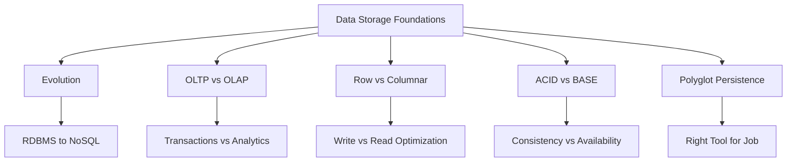

# Migration in progress
# Lesson 6: Summary and Assessment

This lesson consolidates the foundational concepts of data storage paradigms. It reviews the evolution from relational to non-relational systems, contrasts OLTP and OLAP architectures, explains row-based versus columnar storage, and clarifies ACID versus BASE consistency models. The goal is to ensure you can evaluate data requirements and select appropriate storage solutions for diverse workloads. This summary serves as a final review before the assessment.

## Module Recap

The module covered five core areas of modern data storage.

### Lesson 1: Evolution of Data Storage

-   Traced the shift from flat files and hierarchical models to relational databases.
-   Explained how Web 2.0 scale drove the NoSQL revolution.
-   Highlighted the move from vertical to horizontal scaling.
-   Introduced Data Lakes and cloud-native storage as modern standards.
-   Emphasized that history informs current architectural choices.

### Lesson 2: OLTP vs. OLAP Architectures

-   Defined OLTP as transaction-focused (short, fast, normalized).
-   Defined OLAP as analytics-focused (complex, historical, denormalized).
-   Contrasted Star/Snowflake schemas with normalized 3NF schemas.
-   Explained the role of ETL/ELT in bridging operational and analytical systems.
-   Stressed the importance of separating transactional and analytical workloads.

### Lesson 3: RDBMS vs. Columnar Databases

-   Detailed physical storage differences: row-based vs. column-based.
-   Explained why columnar storage excels at aggregations and compression.
-   Noted that row-based storage is superior for point queries and writes.
-   Discussed I/O efficiency and cost implications in cloud environments.
-   Introduced HTAP as a hybrid approach.

### Lesson 4: ACID vs. BASE Models

-   Defined ACID properties (Atomicity, Consistency, Isolation, Durability).
-   Defined BASE properties (Basically Available, Soft state, Eventual consistency).
-   Linked consistency models to the CAP theorem trade-offs.
-   Provided guidelines for choosing strong vs. eventual consistency.
-   Highlighted idempotency as a key pattern for BASE systems.

### Lesson 5: Real-World Use Case (Ride-Sharing)

-   Applied polyglot persistence to a complex system.
-   Mapped RDBMS to user/trip management (ACID).
-   Mapped Key-Value stores to real-time location tracking (BASE).
-   Mapped Data Warehouses to dynamic pricing and analytics (OLAP).
-   Demonstrated how multiple consistency models coexist in one application.

## Key Concepts Matrix

| Concept | OLTP / RDBMS / ACID | OLAP / Columnar / BASE |
| :--- | :--- | :--- |
| **Primary Goal** | Transaction integrity & speed | Analytical throughput & scale |
| **Data Structure** | Normalized, Row-based | Denormalized, Column-based |
| **Query Pattern** | Point lookups, CRUD | Aggregations, Scans |
| **Consistency** | Strong (Immediate) | Eventual (Delayed) |
| **Scaling** | Vertical (typically) | Horizontal |
| **Write Performance** | High | Moderate/Low |
| **Read Performance** | Fast for single records | Fast for bulk analysis |
| **Typical Use Case** | Banking, Orders | Reporting, BI, IoT |

## Common Pitfalls and Mitigations

Understanding where designs fail is as important as knowing best practices.

### Running Analytics on OLTP Systems

-   **Pitfall**: Heavy analytical queries lock tables and degrade transaction performance.
-   **Mitigation**: Offload analytics to a dedicated Data Warehouse or Read Replica. Use ETL/CDC to sync data.

### Forcing Relational Models on Unstructured Data

-   **Pitfall**: Trying to store JSON, logs, or social graphs in rigid RDBMS tables leads to complexity and poor performance.
-   **Mitigation**: Use Document stores for flexible schemas, Graph databases for relationships, or Data Lakes for raw unstructured data.

### Ignoring Consistency Trade-offs

-   **Pitfall**: Choosing BASE for financial ledgers or ACID for high-volume sensor ingestion.
-   **Mitigation**: Map business criticality to consistency models. Use tunable consistency where available. Design application logic to handle eventual consistency (idempotency, conflict resolution).

### Neglecting Physical Storage Layout

-   **Pitfall**: Using row-based storage for wide-table analytics or columnar storage for frequent single-row updates.
-   **Mitigation**: Understand query patterns before selecting a database engine. Test with realistic data volumes.
