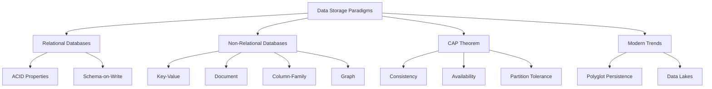

# W01 : Foundations of Data Storage Paradigms

Data storage is the foundation of any data-driven application. Choosing the right storage paradigm depends on the nature of the data, access patterns, consistency requirements, and scalability needs. This lesson explores the evolution of data storage, contrasts relational and non-relational models, introduces the CAP theorem, and outlines modern hybrid approaches. Understanding these fundamentals is critical for designing efficient data pipelines and architectures.

## Relational Databases (RDBMS)

Relational databases have been the standard for decades, organizing data into tables with rows and columns.

### Core Characteristics

-   **Structured Schema**: Data must conform to a predefined schema (tables, columns, types).
-   **SQL Interface**: Uses Structured Query Language for querying and manipulation.
-   **Relationships**: Supports foreign keys to link tables (One-to-One, One-to-Many, Many-to-Many).
-   **Normalization**: Reduces redundancy by splitting data into related tables.

### ACID Properties

Relational databases guarantee ACID transactions, ensuring reliability for critical operations.

-   **Atomicity**: Transactions are all-or-nothing. If one part fails, the entire transaction rolls back.
-   **Consistency**: Data moves from one valid state to another, enforcing constraints.
-   **Isolation**: Concurrent transactions do not interfere with each other.
-   **Durability**: Once committed, data persists even in case of system failure.

### Use Cases

-   Financial systems (banking, payments).
-   Inventory management.
-   Enterprise Resource Planning (ERP).
-   Any application requiring strong consistency and complex joins.

> [!Important]
> **Schema-on-Write**: In RDBMS, you define the structure before inserting data. This ensures data quality but reduces flexibility. Changing the schema later (e.g., adding a column) can be expensive and disruptive in large systems.

## Non-Relational Databases (NoSQL)

NoSQL databases emerged to handle big data, real-time web apps, and unstructured data. They sacrifice some relational features for scalability and flexibility.

### Key-Value Stores

-   Simplest model: Unique key maps to a value.
-   Extremely fast read/write operations.
-   Examples: Amazon DynamoDB, Redis.
-   Use Case: Session storage, caching, user profiles.

### Document Stores

-   Store data as documents (JSON, BSON, XML).
-   Schema-less or flexible schema.
-   Nested structures allow storing related data together.
-   Examples: MongoDB, Amazon DocumentDB.
-   Use Case: Content management, catalogs, user data with varying attributes.

### Column-Family Stores

-   Store data in columns rather than rows.
-   Optimized for queries over large datasets.
-   Highly scalable and distributed.
-   Examples: Apache Cassandra, Amazon Keyspaces.
-   Use Case: Time-series data, logging, analytics.

### Graph Databases

-   Store data as nodes (entities) and edges (relationships).
-   Optimized for traversing relationships.
-   Examples: Neo4j, Amazon Neptune.
-   Use Case: Social networks, recommendation engines, fraud detection.

| Type | Data Model | Best For | Example |
|---|---|---|---|
| Key-Value | Key -> Value | High-speed lookup | Redis |
| Document | JSON/BSON | Flexible schema | MongoDB |
| Column-Family | Columns | Large-scale analytics | Cassandra |
| Graph | Nodes/Edges | Complex relationships | Neo4j |

> [!Tip]
> **Schema-on-Read**: NoSQL databases often use schema-on-read, meaning structure is applied when data is queried, not when it is stored. This allows rapid ingestion of varied data formats but shifts validation responsibility to the application layer.

## The CAP Theorem

The CAP theorem states that a distributed data store can only provide two of the following three guarantees simultaneously.

### Consistency (C)

-   Every read receives the most recent write or an error.
-   All nodes see the same data at the same time.
-   Critical for financial transactions.

### Availability (A)

-   Every request receives a response, without guarantee that it contains the most recent write.
-   The system remains operational even if some nodes fail.
-   Critical for user-facing web applications.

### Partition Tolerance (P)

-   The system continues to operate despite arbitrary message loss or failure of part of the system.
-   Essential for distributed systems across networks.

### Trade-offs

-   **CP (Consistency + Partition Tolerance)**: System ensures data accuracy but may become unavailable during network partitions. Example: HBase, MongoDB (default).
-   **AP (Availability + Partition Tolerance)**: System remains available but may return stale data during partitions. Example: Cassandra, DynamoDB.
-   **CA (Consistency + Availability)**: Impossible in distributed systems with network partitions. Only possible in single-node systems.

> [!Important]
> **You cannot have it all**: In distributed systems, network failures (partitions) are inevitable. You must choose between Consistency and Availability. Modern databases often allow tuning this trade-off (e.g., configurable consistency levels in DynamoDB).

## Modern Trends in Data Storage

### Polyglot Persistence

-   Using different data stores for different parts of an application.
-   Example: RDBMS for billing, Document DB for product catalog, Graph DB for recommendations.
-   Leverages strengths of each paradigm.
-   Increases architectural complexity but optimizes performance.

### Data Lakes

-   Centralized repository for storing structured, semi-structured, and unstructured data at scale.
-   Schema-on-read approach.
-   Built on object storage (e.g., Amazon S3).
-   Enables advanced analytics, machine learning, and big data processing.

### NewSQL

-   Combines SQL interface and ACID guarantees with NoSQL scalability.
-   Examples: Google Spanner, CockroachDB, Amazon Aurora.
-   Designed for cloud-native distributed environments.

### Serverless Databases

-   Auto-scaling storage and compute.
-   Pay-per-use pricing.
-   Examples: Amazon Aurora Serverless, DynamoDB On-Demand.
-   Reduces operational overhead.

## Assessment Preparation

### Practice Questions

1.  What are the ACID properties and why are they important?
2.  Compare schema-on-write vs. schema-on-read.
3.  List four types of NoSQL databases and their primary use cases.
4.  Explain the CAP theorem and its implications for distributed systems.
5.  Why might a company choose polyglot persistence?
6.  What is the main advantage of a Key-Value store?
7.  When would you use a Graph database over a Relational database?
8.  What is a Data Lake and how does it differ from a Data Warehouse?
9.  Why is Partition Tolerance considered mandatory in distributed systems?
10. Give an example of a CP system and an AP system.

### Scenario Questions

**Scenario 1: E-Commerce Platform**
Needs to store user profiles, product catalogs, and order history.

-   **User Profiles**: Document Store (MongoDB) for flexible attributes.
-   **Product Catalog**: Document Store for nested details (sizes, colors).
-   **Order History**: Relational DB (PostgreSQL) for ACID transactions and financial integrity.
-   **Recommendations**: Graph DB (Neo4j) for "users who bought this also bought".
-   **Strategy**: Polyglot persistence.

**Scenario 2: Real-Time Gaming Leaderboard**
High write throughput, simple key-value lookups.

-   **Storage**: Key-Value Store (Redis or DynamoDB).
-   **Reason**: Extremely low latency, high scalability.
-   **Consistency**: Eventual consistency is acceptable for leaderboards.
-   **Avoid**: Relational DB due to join overhead and scaling limits.

**Scenario 3: Social Network**
Complex relationships between users (friends, followers).

-   **Storage**: Graph Database (Neo4j or Neptune).
-   **Reason**: Efficient traversal of relationships (e.g., friends of friends).
-   **Avoid**: Relational DB due to expensive recursive joins.
-   **Profile Data**: Document Store for user details.

**Scenario 4: IoT Sensor Data**
Millions of devices sending temperature readings every second.

-   **Storage**: Column-Family Store (Cassandra) or Time-Series DB.
-   **Reason**: Optimized for high-write throughput and time-based queries.
-   **Scalability**: Horizontal scaling to handle volume.
-   **Avoid**: Relational DB due to write bottlenecks.

**Scenario 5: Corporate Analytics**
Need to analyze historical sales, logs, and customer feedback.

-   **Storage**: Data Lake on S3.
-   **Reason**: Stores structured (sales), semi-structured (logs), and unstructured (feedback) data.
-   **Processing**: Use Spark or Athena for schema-on-read analysis.
-   **Benefit**: Cost-effective storage for massive volumes.

## Key Takeaways

-   Relational databases offer ACID compliance and structured schemas, ideal for transactional systems.
-   NoSQL databases provide flexibility and scalability for unstructured or big data workloads.
-   Key-Value stores are fastest for simple lookups; Document stores handle flexible schemas.
-   Column-family stores excel at large-scale analytics; Graph databases manage complex relationships.
-   The CAP theorem forces a trade-off between Consistency and Availability in distributed systems.
-   Polyglot persistence uses the best tool for each job within a single application.
-   Data Lakes enable storage of diverse data types for advanced analytics.
-   Schema-on-write ensures quality; schema-on-read enables agility.
-   Choose storage based on access patterns, consistency needs, and scale.
-   Modern architectures often combine multiple storage paradigms.

> [!Important]
> **There is no silver bullet**: No single database solves every problem. Understand your data’s characteristics (structure, volume, velocity) and your application’s requirements (consistency, latency, queries). Start with the simplest model that meets your needs, and evolve to polyglot persistence as complexity grows. Always consider the operational cost and scalability of your chosen paradigm.
